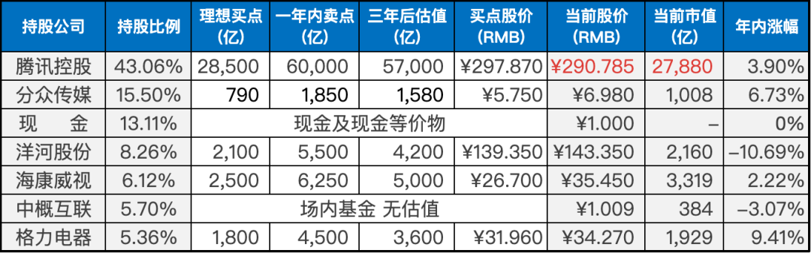

__微信公众号文章地址：[老罗实盘周记-20230520](https://mp.weixin.qq.com/s/SBz2pVoZha9gGy-HG7mS8Q)__

```
老罗实盘周记，每周六更新。专注于股权投资、阅读、学习与个人成长，知行合一、日拱一卒、投资人生。微信公众号【老罗投资】，文章均首发于公众号。
```

### 1. 本周交易

+ 周五买入1%仓位的洋河股份，买入价格为140.00元人民币。

### 2. 目前持仓

目前持仓：腾讯控股43.97%，分众传媒14.70%，现金11.98%，洋河股份9.28%，海康微视6.11%，中概互联5.66%，格力电器5.40%。

其他还有少量万科A、恒瑞医药、宋城演义、京沪高铁，份额较少，作为观察仓不记录。

**注：港股已换算为人民币**


### 3. 上周数据



### 4. 持仓收益

本周：上证指数 +0.34%，深证成指 +0.78%，沪深300指数 +0.17%，中证500指数 +0.42%，恒生指数 -0.90%，恒生科技 -1.35%，老罗的持仓 <span class="red">+0.95%</span>。

截止到今日，老罗实盘今年收益率为 <span class="red">+1.96%</span>，沪深300指数今年收益率为 <span class="red">+1.88%</span>，略胜沪深300指数。

### 5. 重要事项

#### 5.1 腾讯2023年Q1财报

17日腾讯发布了一季报，腾讯的表现还算不错，业绩在慢慢复苏中。
根据2023年一季度的财报数据，腾讯公司实现了营收1500亿元，同比增长10%。在非国际财务报告准则下，腾讯公司的归母净利润达到325亿元，同比增长27%。

这标志着自2022年第三季度以来，腾讯公司的非国际净利润已连续三个月呈现正向增长的趋势，同时也是自2021年第三季度以来营收首次实现两位数的增长。

非国际报告准则利润和国际报告准则利润有什么差别呢？非国际财务报告准则=国际财务报告准则+股份酬金+减值及无形资产摊销-投资收益-所得税影响。

对腾讯来说，影响比较大的是投资收益部分，所以我们也可以简单一些的理解为，非国际报告会计准则就是不考虑投资这部分变动。腾讯的投资部分对业绩的影响还是比较大的，排除这部分影响，能比较客观地持续观察企业经营状况。

**1. 用户数据**

微信用户：13.19亿，同比增长2%。

QQ的移动终端月活跃账户数：5.79亿，同比增长6%，环比增长4%。

收费增值服务注册账户数：2.26亿，同比下降5%。

长视频付费会员数同比下降9%至1.13亿。

音乐订阅收入同比增长 30%。

**2. 游戏业务**

国际游戏收入增长了25%，达到了132亿人民币，排除汇率因素，实际增长了18%。国内游戏收入增长了6%，为351亿人民币。游戏收入比预期略高。

今年游戏行业明显转向，去年底开始恢复游戏版号发放后，主流媒体也有了不少正面的报道。

**3. 广告业务**

网络广告业务一季度的收入同比增长17%，至210亿人民币。

和去年相比，微信的流量入口地位依然没有改变，并且又多了小程序与视频号。特别是视频号，无疑是成功的，已经是稳稳坐稳短视频平台第三的位置。

只要腾讯的流量入口地位没有变化，广告业务都是一个比较稳定能带来现金流的业务。

**4. 金融技科服务**

一季度的收入同比增长14%至487亿人民币，其中商业支付的增速明显改善，随着疫情的结束，线下商业支付活动增长明显高于线上商业支付。

总体来说金融技科服务今年应该比较稳健，保持增长问题不大。

**5. 其他**

降本增效方面，对比去年一季度，员工数减少一万名。雇员薪酬福利开支58.44亿人民币，去年同期是81.36亿人民币，减少近23亿。

现金流518亿人民币，有充足的资金回购股票。

投资方面，截止到一季度，投资的上市公司公允价值为4728亿人民币，非上市公司账面价值为3325亿人民币，合计超过8000亿人民币。

**6. 总结**

腾讯当前市值2.86万亿人民币，排除掉投资公司的8000亿，市值2万亿出头。去年净利润是1156亿人民币，今年按15%的增速计算(保守方式，随着经济复苏，净利润增速有可能超过15%)，23年的净利润可能是1330亿人民币左右。

如果到年底股价保持现状，腾讯的实际PE在15左右，对互联网公司来说已经非常的便宜了。如果到年底PE达到20，加上投资公司的实际价值8000亿(假设这一年投资一毛钱不赚，水平连老罗都不如)，对应市值是3.4万亿。当前的价格就能赚一部分业绩增长，加上部分估值提升的钱。

以当前的价格买下腾讯，很难成为一笔失败的投资，当然这一切的前提，是腾讯能保持收入的持续增长。

#### 5.2 1-4月份证券交易印花税同比下降42.7%

本周财政部发布数据，1-4月累计全国一般公共预算收入83171亿元，同比增长11.9%。印花税1637亿元，同比下降14.2%。其中，证券交易印花税716亿元，同比下降42.7%。

印花税收下降表明，今年股市的交易活跃度比去年更低。证券交易印花税，是在股票卖出时进行征收的，短线交易和趋势交易是主要的贡献力量。也就是说，今年大批做短线交易的人都不太活跃了。

这个结果也很正常，从22年初起，股市都没有什么行情，很难吸引新的投资者进入股市。而目前在股市中做短线交易的人，辛辛苦苦操作一轮下来，发现根本赚不到什么钱，甚至可能会亏损，所以干脆就躺平了。

在中国股市中，90%以上的人还是想赚短期的钱，长期价值投资百分之十几的年化收益率，对大多数人并没有太大的吸引力，慢慢的变富，哪有短期做T来的刺激。

当然，短期交易与长期价值投资并没有优劣之分，只有适合自己的投资方式，短期交易博运气的概率相对会更大一些。

#### 5.3 下一步计划

本周海康威视22年年度分红到账，加上已有资金，按照先前的计划，在140元人民币买入了1%仓位的洋河股份，下一步会在130元区间，继续买入2%仓位，120元区间买入4%仓位，以此类推，洋河股份仓位上限为25%。

### 6. 本周读书

#### 6.1《新摄影笔记》

这本书是作者在《摄影笔记》基础上精心编辑整理而成的作品。通过作者亲身的拍摄经历，以通俗易懂的语言向读者介绍摄影技术，让他们深刻地感受到学习摄影并不难。

全书共分为4章，涵盖了取景、曝光、摄影中的虚实和构图等内容。作者总结了自己的拍摄经验，创造出一套系统的摄影教程，采用思维导图的形式引导摄影爱好者学习。

作者的讲解方式深入浅出，使读者能够快速掌握摄影技法，并通过实践不断检验和提升自己的摄影水平，适合初学者和摄影爱好者作为学习参考。

老罗评分四颗星⭐️⭐️⭐️⭐️，摄影初学者值得一读。

#### 6.2《留德十年》

本书记录了季羡林为追求人生出路而离乡留学，在战乱纷扰中度过了异国的十年。书中描述了哥廷根迷人的秋景、勤奋求学的学子们、正直善良的房东夫妇，以及饥肠辘辘、生命危急的担忧。这十年的留德经历不仅为季羡林的学术研究奠定了深厚的基础，也为他找到了人生的方向。

在阅读中，老罗感受到世事变迁、人情百态。这本书没有华丽的文字，没有繁复的文学手法，只是以真实的故事和情感呈现，静静地回忆着逝去的梦想。它浅显明了，却又引人入胜，用作者耄耋之年的智慧为那些站在人生十字路口的年轻人讲述了如何抉择人生的道理。

老罗评分四颗星⭐️⭐️⭐️⭐️，值得一读。

#### 6.3《我是你的小狗》

作者以拟人的手法，从狗狗的视角出发，展示了它有趣的日常生活，记录了狗狗的点点滴滴，向读者展示了狗狗有趣的世界。

狗狗就像我们的家人一样，时刻陪伴在我们身边。它的眼神、行为，甚至呼吸都蕴含着无数故事。

对于喜欢狗狗的朋友们来说，是否想知道自己的狗狗每天都在做些什么，想些什么呢？这本书将为你揭开这个谜底，让你更深入了解你的狗狗。

老罗评分三颗星⭐️⭐️⭐️，纯漫画，十分钟就能翻完，闲暇时可以一看。

#### 6.4《胖虎下山》

翻开这本书的页面，你会立刻被一幅幅灵动活泼、有趣的画作所吸引。作者不二马用他的笔勾勒出的虎，颠覆了老罗对老虎的传统认知。

不再是威猛的猛虎出山，也没有虎啸龙吟的气势……相反，这些画作中的虎却与这些形象毫不相关。它们可能是吃过节日美食后有些发福，形体管理不足，胖嘟嘟的，更像是一只大肥猫。

老罗评分三颗星⭐️⭐️⭐️，闲暇时可以一看。

### 7. 本周运动

本周跳绳7次，徒步快走2次，下周继续。

祝大家周末愉快！

```
老罗实盘周记，每周六更新。专注于股权投资、阅读、学习与个人成长，知行合一、日拱一卒、投资人生。微信公众号【老罗投资】，文章均首发于公众号。
免责声明：本公众号只作为本人的投资日志记录，本文中提及的个股都有腰斩或血本无归的风险，本人不做任何投资建议，投资请坚持独立思考。
```

__微信公众号文章地址：[老罗实盘周记-20230520](https://mp.weixin.qq.com/s/SBz2pVoZha9gGy-HG7mS8Q)__