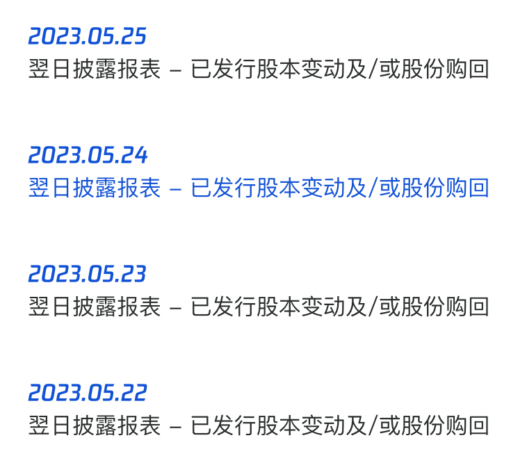

__微信公众号文章地址：[老罗实盘周记-20230527](https://mp.weixin.qq.com/s/WmS8e6jFfdayts_jmps-EQ)__

```
老罗实盘周记，每周六更新。专注于股权投资、阅读、学习与个人成长，知行合一、日拱一卒、投资人生。微信公众号【老罗投资】，文章均首发于公众号。
```

### 1. 本周交易

+ 无

### 2. 目前持仓

目前持仓：腾讯控股43.65%，分众传媒14.61%，现金12.25%，洋河股份9.25%，海康微视6.21%，中概互联5.68%，格力电器5.45%。

其他还有少量万科A、恒瑞医药、宋城演义、京沪高铁，份额较少，作为观察仓不记录。

**注：港股已换算为人民币**


### 3. 上周数据


### 4. 持仓收益

本周：上证指数 -2.16%，深证成指 -1.64%，沪深300指数 -2.37%，中证500指数 -1.34%，恒生指数 -3.62%，恒生科技 -3.42%，老罗的持仓 <span class="green">-2.55%</span>。

截止到今日，老罗实盘今年收益率为 <span class="green">-0.59%</span>，沪深300指数今年收益率为 <span class="green">-0.53%</span>，略输沪深300指数，今年收益首次为负。

### 5. 重要事项

#### 5.1 腾讯恢复回购

腾讯在上周发布了23年一季报，并且本周恢复了股票回购计划，连续四天，每天回购金额为3.5亿港币。周五没有回购是因为当天佛诞(农历四月初八)，港交所休市。



由于某个西南省会城市城投债的谣言，A股和港股市场本周出现普遍下跌。在这样的市场环境下，腾讯每天以约105万股的数量回购股票，相比之前能多回购约10万股。

下周股价如果依然下跌，老罗还是比较看好腾六亿重出江湖的。

#### 5.2 下一步计划

目前腾讯、洋河都到了低估的价格，但腾讯仓位已达43%，后续交易还是以买入洋河，增加白酒行业持仓比例为主。

根据上周的计划，洋河股价跌到130元区间，会继续买入2%仓位，120元区间买入4%仓位，以此类推，洋河股份仓位上限为25%。

### 6. 本周读书

#### 6.1《啊呜一口吃掉烦恼》

这本书以漫画的形式展现了一个以鸡蛋为视角的人类世界，为读者提供了一个逃离复杂成人社会的避难所。在这个世界里，所有的情感都被直截了当地表达出来，纯真而直接。

老罗评分三颗星 ⭐️⭐️⭐️。

#### 6.2《小林漫画-人间烟火气》

小林是一个富有洞察力的画家，通过作品描绘出了我们所处的现代社会。

他的创作充满了新意，因为他时刻细心观察这个变化中的世界。他的画作揭示了生活中常常存在的虚假，当我们翻开他的画卷时，迎面而来的是真实而亲切的人间烟火气息。

小林笔下的人物栩栩如生，代表着广大的普通人，他们有着各种各样的命运和经历。通过描绘这些人物，展现了现代社会中的普遍存在的情感和价值观。

老罗评分四颗星 ⭐️⭐️⭐️⭐️。

#### 6.3《千字文》

这部流传了1400多年的蒙学读物，以其独特的形式和内容而闻名。它采用四字一句的结构，每个字都不重复（其实“洁”字重复了，作者使用了洁字两种不同的写法），共计一千字。这种形式整齐，押韵韵律流畅，读起来十分便捷。

现在我们更倾向于将这部作品视为一部小百科全书，它包含了广泛的知识，涵盖了天文、地理、自然科学、社会历史等各个领域。这部蒙学读物以简洁明了的语言，向读者传递知识，并培养他们的思维能力和求知欲。

它涉及了广泛的主题，从宇宙的奥秘到大地的特征，从自然界的规律到人类社会的历史，无所不包。尽管这部蒙学读物已经存在了几个世纪，但它的价值和影响依然不减。

老罗评分三星半 ⭐️⭐️⭐️❤️。

#### 6.4《半小时漫画世界名著2》

像追剧一样追完《大卫·科比菲尔》《简·爱》《呼啸山庄》《瓦尔登湖》《汤姆·索亚历险记》《猎人笔记》《战争与和平》《海底两万里》八篇名著，但半小时真的读不完。

老罗评分三星半 ⭐️⭐️⭐️❤️。

#### 6.5《半小时漫画世界名著3》

包括《我是猫》《变形记》《名人传》《童年》《钢铁是怎样炼成的》《老人与海》《小王子》《泰戈尔诗选》八篇名著。

本周阅读偏轻松向，偶尔也要做做大脑按摩，阅读不应该是一个艰苦的活儿。

老罗评分三星半 ⭐️⭐️⭐️❤️。

### 7. 本周运动

本周跳绳7次，下周继续。

祝大家周末愉快！

```
老罗实盘周记，每周六更新。专注于股权投资、阅读、学习与个人成长，知行合一、日拱一卒、投资人生。微信公众号【老罗投资】，文章均首发于公众号。
免责声明：本公众号只作为本人的投资日志记录，本文中提及的个股都有腰斩或血本无归的风险，本人不做任何投资建议，投资请坚持独立思考。
```

__微信公众号文章地址：[老罗实盘周记-20230527](https://mp.weixin.qq.com/s/WmS8e6jFfdayts_jmps-EQ)__