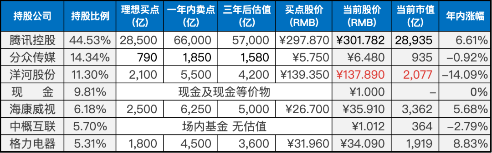
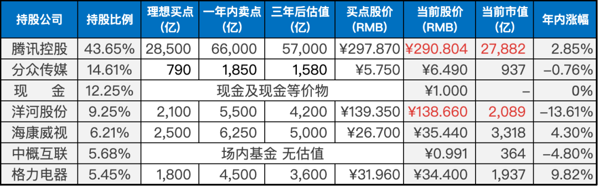

__微信公众号文章地址：[老罗实盘周记-20230603](https://mp.weixin.qq.com/s/O2Ben4_6RTzc7dBGAmd-_Q)__

```
老罗实盘周记，每周六更新。专注于股权投资、阅读、学习与个人成长，知行合一、日拱一卒、投资人生。微信公众号【老罗投资】，文章均首发于公众号。
```

### 1. 本周交易

+ 本周二卖出部分银华日利货币基金，买入2%仓位的洋河股份，买入价格为135.92元人民币。

### 2. 目前持仓

当前持有的股票包括：腾讯控股占44.53%、分众传媒占14.34%、洋河股份占11.30%、海康微视占6.18%、中概互联占5.70%、格力电器占5.31%。

此外，还有少量的万科A、恒瑞医药、宋城演义、京沪高铁等股票，其份额较少，仅作为观察仓不进行记录。

**注：港股已换算为人民币**



### 3. 上周数据



### 4. 持仓收益

本周：上证指数 +0.55%，深证成指 +0.81%，沪深300指数 +0.28%，中证500指数 +1.16%，恒生指数 +1.08%，恒生科技 +3.61%，老罗的持仓 <span class="red">+4.32%</span>。

截止到今日，老罗实盘今年收益率为 <span class="red">+1.77%</span>，沪深300指数今年收益率为 <span class="green">-0.25%</span>，略胜沪深300指数。

### 5. 重要事项

#### 5.1 腾讯分红下周到账

下周一，腾讯将会发放股息，每股2.5港币。对于港股通账户，股息会先折算成人民币，然后再扣除20%的红利税后到账，大部分券商会在周二晚上到账。境外券商账户则会全额以港币到账，不扣税，周一晚上就能到账。

本周，腾讯五个交易日都在回购，其中周三和周四的回购金额达到了四亿港币。老罗希望腾讯股价能够在300港币左右多维持一段时间，一方面，这样腾讯就能多回购一些股份。另一方面，老罗打算300港币再买入腾讯，本周卖出了银华日利，已经准备好了买入的资金，可惜到310港币就涨上去了。

#### 5.2 下一步买入计划

洋河股份本周没有到目标买入价130人民币，就买了2%的仓位，下周会在130元时再买入2%仓位，120元时买入4%仓位，如果股价继续下跌，将会逐步加仓，直到仓位上限达到25%。

对于腾讯股票，如果其股价下跌至300港币，还会逐步买入，直到仓位上限达到50%。

### 6. 本周读书

#### 6.1 《一生的远行》

本书是作者的游记集合，记述了各地的一些特色事物，如曼谷的乌鸦、延吉的出租车和加德满都的狗等。

在序言中，季老先生说本想成为一个像他的老师陈寅恪先生那样淡泊明志、宁静致远的人，但事实却与他的愿望相悖，他的尘根难以割舍，转眼之间他已经年老，只能在下一世等待机会。

在跋文中，有人问季老先生说，你所学的东西，像吐火罗文一样，到现在还有用吗？季老先生说回答说：学问不问有用无用，只问精为精。

老罗评分四颗星 ⭐️⭐️⭐️⭐️。

#### 6.2 《王蓝莓的幸福生活》

这本漫画书让老罗感到十分亲切，仿佛回到了小时候的生活中。

每一个情节都让我想起了自己曾经经历过的事情，王蓝莓这个扎着羊角辫的小女孩就像是我们的同龄人(八零九零后)，她的生活中充满了无忧无虑的童年趣事。

每一幅画面都让我感到十分真实，仿佛就在我眼前发生。每一个角色都有自己的特点和个性，让人印象深刻。

虽然王蓝莓的生活中也有不如意的事情，但她总是能够积极应对，让人感到十分欣慰。

这本书不仅让我回忆起了自己的童年，也让我重新认识了那个时代的生活。

老罗评分三星半 ⭐️⭐️⭐️❤️。

#### 6.3 《多余的话》

这本书透露出了瞿秋白个人的遭遇和感受，与时代的洪流形成了强烈的反差和冲突。这些独特的遭遇和感受，反映出社会、历史和文化的渊源，具有历史和现实的双重意义。

书的结尾：中国的豆腐也是很好吃的东西，世界第一。作者的生活情趣，对生活的热爱尽在其中。书成后的20余天，瞿秋白慷慨就义。

老罗评分四星半 ⭐️⭐️⭐️⭐️❤️。

### 7. 本周运动

本周跳绳7次，下周继续。

祝大家周末愉快！

```
老罗实盘周记，每周六更新。专注于股权投资、阅读、学习与个人成长，知行合一、日拱一卒、投资人生。微信公众号【老罗投资】，文章均首发于公众号。
免责声明：本公众号只作为本人的投资日志记录，本文中提及的个股都有腰斩或血本无归的风险，本人不做任何投资建议，投资请坚持独立思考。
```

__微信公众号文章地址：[老罗实盘周记-20230603](https://mp.weixin.qq.com/s/O2Ben4_6RTzc7dBGAmd-_Q)__