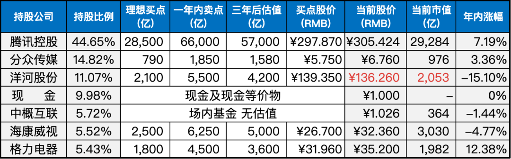

__微信公众号文章地址：[老罗实盘周记-20230610](https://mp.weixin.qq.com/s/6ftLksV9fuhb594LPhmuCA)__

```
老罗实盘周记，每周六更新。专注于股权投资、阅读、学习与个人成长，知行合一、日拱一卒、投资人生。微信公众号【老罗投资】，文章均首发于公众号。
```

### 1. 本周交易

无

### 2. 目前持仓

当前持有的股票包括：腾讯控股44.65%、分众传媒14.82%、洋河股份11.07%、现金及现金等价物9.98%、中概互联5.72%、海康微视5.52%、格力电器5.43%。

此外，还有少量的万科A、恒瑞医药、宋城演义、京沪高铁等股票，其份额较少，仅作为观察仓不进行记录。

**注：港股已换算为人民币**



### 3. 上周数据


### 4. 持仓收益

本周：上证指数 +0.04%，深证成指 -1.86%，沪深300指数 -0.65%，中证500指数 -1.57%，恒生指数 +2.32%，恒生科技 +2.87%，老罗的持仓 <span class="red">+0.76%</span>。

截止到今日，老罗实盘今年收益率为 <span class="red">+2.53%</span>，沪深300指数今年收益率为 <span class="green">-0.90%</span>，略胜沪深300指数。

### 5. 重要事项

#### 5.1 部分银行下调存款利率

6月8日，工商银行、农业银行、建设银行、中国银行、交通银行、邮储银行六大国有银行共同下调存款挂牌利率。

其中，活期存款利率从此前的0.25%下调至0.2%。2年期定期存款利率下调至2.05%，3年期定存利率下调至2.45%，5年定期存款利率下调至2.5%。下调幅度分别为5到15个基点不等。三个月、六个月、一年定期存款利率不变。

而其他银行是否跟进也成为市场关注热点，目前已有股份行有调整动作，北京一家股份行就提及本周已做了挂牌利率向下调整。也有部分股份行会在下周一行动，有在东部的一家股份行就提及，下周一会下调部分期限存款利率，幅度在10-15个基点不等。

降息通常被视为对股市的利好因素，然而这周股市并没有表现出明显的正向反应，几大股指依然出现了一些下跌。在熊市中，即使有多个利好因素存在，市场可能也会对其视而不见。因此，我们需要耐心等待量变引起质变的时机。

#### 5.2 腾讯分红到账

本周二腾讯的分红到账，每股2.5港币。这部分红加上原有资金，原计划是130元买入2%仓位的洋河股份，但洋河一直在135左右波动，未能成交。

下周继续观察洋河股份的表现，以便在适当的时机进行买入。

### 6. 本周读书

#### 6.1 《边城》

《边城》是沈从文的代表作之一，创作于1933年至1934年初。和沈从文的其他湘西作品一样，它关注着普通人、善良人的命运起伏，描绘了湘西女子翠翠因为种种偶然事件而经历的悲剧人生。正如作者所言：“一切充满了善，然而到处是不凑巧。既然是不凑巧，因之素朴的善终难免产生悲剧。”

小说中的翠翠是一个具有坚强意志的女性形象，她面对命运的挑战和种种困境，展现出坚韧的生命力和对爱的执着。然而，由于各种不幸的事件和局限的环境，她的善良和纯洁最终导致了悲剧的结局。

总的来说，《边城》是沈从文的一部杰作，通过描绘湘西山村的善良人物和命运的无常，展现了一个充满善与悲剧的世界。它引发了人们对人性、命运和社会环境的深入思考，使读者感受到作者对生活和人性的深情厚意。

老罗评分四颗星 ⭐️⭐️⭐️⭐️。

#### 6.2 《半小时漫画红楼梦》

这本书是以《红楼梦》的前半部分进行简述的，目的是让读者留下一些依稀的印象，以便日后阅读原著时有所帮助。

然而，这种简述类的书籍可能相对鸡肋，因为它们更适合作为搞笑漫画来阅读，而不是作为深入了解原著的重要来源。

老罗评分三颗星 ⭐️⭐️⭐️。

### 7. 本周运动

本周跳绳7次，下周继续。

祝大家周末愉快！

```
老罗实盘周记，每周六更新。专注于股权投资、阅读、学习与个人成长，知行合一、日拱一卒、投资人生。微信公众号【老罗投资】，文章均首发于公众号。
免责声明：本公众号只作为本人的投资日志记录，本文中提及的个股都有腰斩或血本无归的风险，本人不做任何投资建议，投资请坚持独立思考。
```

__微信公众号文章地址：[老罗实盘周记-20230610](https://mp.weixin.qq.com/s/6ftLksV9fuhb594LPhmuCA)__