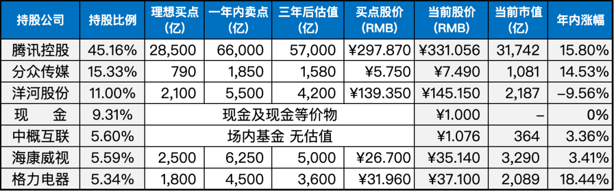

__微信公众号文章地址：[老罗实盘周记-20230617](https://mp.weixin.qq.com/s/ARbvM09D_NR3IgroJL5haw)__

```
老罗实盘周记，每周六更新。专注于股权投资、阅读、学习与个人成长，知行合一、日拱一卒、投资人生。微信公众号【老罗投资】，文章均首发于公众号。
```

### 1. 本周交易

无

### 2. 目前持仓

当前持有的股票包括：腾讯控股45.16%、分众传媒15.33%、洋河股份11.00%、现金及现金等价物9.31%、中概互联5.60%、海康微视5.59%、格力电器5.34%。

此外，还有少量的万科A、恒瑞医药、宋城演义、京沪高铁等股票，其份额较少，仅作为观察仓不进行记录。

**注：港股已换算为人民币**



### 3. 上周数据


### 4. 持仓收益

本周：上证指数 +1.30%，深证成指 +4.75%，沪深300指数 +3.30%，中证500指数 +2.30%，恒生指数 +3.35%，恒生科技 +7.61%，老罗的持仓 <span class="red">+7.88%</span>。

截止到今日，老罗实盘今年收益率为 <span class="red">+10.41%</span>，沪深300指数今年收益率为 <span class="red">+2.37%</span>，继续跑赢沪深300指数。

### 5. 重要事项

#### 5.1 洋河分红

洋河股份6月13日公告，公司拟每10股派37.4元，股权登记日为6月20日，除权除息日为6月21日，派息日为6月21日，合计派发现金红利56.34亿元。

应该在6月20日收盘就能收到分红，21日就可以使用这部分资金了。不过最近一周大盘涨得有些多，前一阵那些便宜的标的已经不再便宜了，老罗收到分红后应该不会进行任何操作，继续等待时机。

#### 5.2 布林肯访华

美国国务卿安东尼·布林肯将于6月18日至19日访华，应该能缓和一下双边关系。

中美之间的贸易“合则两利,分则两弊”，脱钩的后果谁也承受不起。

#### 5.3 其他

本周身体不适，码字也不在状态，就简单写几句。还是健康最重要啊，提前祝大家端午安康。

### 6. 本周读书

#### 6.1 《埃隆马斯克传》

本书主要讲述了埃隆·马斯克的生平故事，包括他的出生、求学和早年创业经历，以及他在创业过程中所面临的困难和挑战。

故事时间跨度从1971年到2021年，涵盖了他成功创办SpaceX、特斯拉等知名企业的经历。

通过这些故事，可以了解到埃隆·马斯克坚持梦想、追求梦想，并为之不断奋斗的精神。尽管他曾经历挫折，但他始终坚持向前，启发着读者，只要追求梦想，并为之不懈努力，最终就能实现那些看似遥不可及的梦想。

老罗评分三颗星 ⭐️⭐️⭐️。

### 7. 本周运动

本周跳绳7次，下周继续。

祝大家周末愉快！

```
老罗实盘周记，每周六更新。专注于股权投资、阅读、学习与个人成长，知行合一、日拱一卒、投资人生。微信公众号【老罗投资】，文章均首发于公众号。
免责声明：本公众号只作为本人的投资日志记录，本文中提及的个股都有腰斩或血本无归的风险，本人不做任何投资建议，投资请坚持独立思考。
```

__微信公众号文章地址：[老罗实盘周记-20230617](https://mp.weixin.qq.com/s/ARbvM09D_NR3IgroJL5haw)__