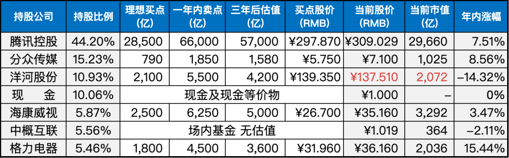
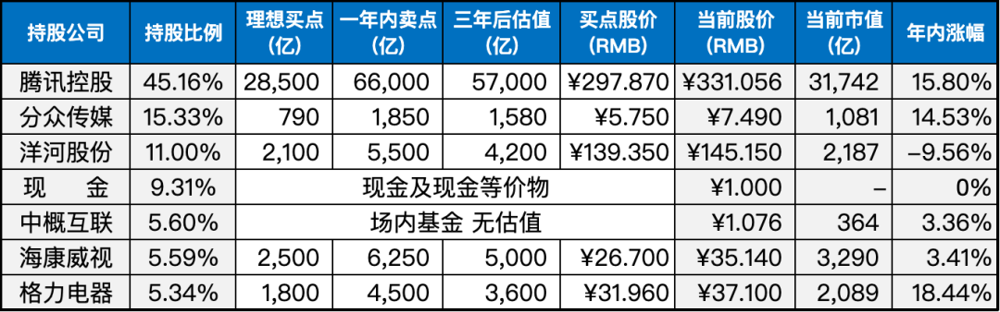

__微信公众号文章地址：[老罗实盘周记-20230624](https://mp.weixin.qq.com/s/ZVYG0UyAOYGCk5s8sf6w6w)__

```
老罗实盘周记，每周六更新。专注于股权投资、阅读、学习与个人成长，知行合一、日拱一卒、投资人生。微信公众号【老罗投资】，文章均首发于公众号。
```

### 1. 本周交易

无

### 2. 目前持仓

当前持有的股票包括：腾讯控股44.20%、分众传媒15.23%、洋河股份10.93%、现金及现金等价物10.06%、海康微视5.87%、中概互联5.56%、格力电器5.46%。

此外，还有少量的万科A、恒瑞医药、宋城演义、京沪高铁等股票，其份额较少，仅作为观察仓不进行记录。

**注：港股已换算为人民币**



### 3. 上周数据



### 4. 持仓收益

本周：上证指数 -2.30%，深证成指 -2.19%，沪深300指数 -2.51%，中证500指数 -2.56%，恒生指数 -5.74%，恒生科技 -8.37%，老罗的持仓 <span class="green">-5.56%</span>。

截止到今日，老罗实盘今年收益率为 <span class="red">+4.85%</span>，沪深300指数今年收益率为 <span class="green">-0.20%</span>，继续跑赢沪深300指数。

### 5. 重要事项

#### 5.1 腾讯股票回购与游戏版号发放

本周除了周四端午节休市，腾讯在其余的四个交易日内保持着四亿港币的回购额度，这意味着腾讯将继续实施回购计划，以进一步提升股东价值。

腾讯在Q1财报发布之后已经持续回购了23天，累计投放资金超过85亿港币，回购注销(或待注销)2500万股。

这意味着腾讯对自身发展前景的信心十足，并希望在当前市场波动大的背景下，通过回购来提高公司的估值，并为未来的发展提供更多的资金支持。

另外，本周三发布了6月份的游戏版号，89款国产游戏成功获得批准，创下今年最高纪录。

其中，腾讯成功获得了新游戏版号《星之破晓》，该游戏是《王者荣耀》IP的新作品。虽然《王者荣耀》一直是腾讯的赚钱担当，但随着时间的推移，新游戏的推出仍然是必要的，以分担增收压力。

#### 5.2 港交所港币-人民币双柜台模式

港交所于19日推出“港币-人民币双柜台模式”，开拓了人民币的投资渠道，促进了离岸人民币市场的流通，推动了人民币国际化进程。

当天有24只证券，包括腾讯控股、小米集团、美团、京东、百度、阿里巴巴、比亚迪、中国平安、恒生银行和新鸿基等公司，成为了双柜台证券。

此外，9个交易所参与者，如中银国际证券有限公司和中国国际金融香港证券有限公司，已经获授做市商（也称庄家）执照。

但从第一周的情况来看，首批24只双柜台的表现不佳。在19日当天，成交量仅为1.63亿元，占当天港股成交额不到0.2%。

在这种低成交量的情况下，难以吸引离岸人民币直接配置，同时庄家也难以利用套利机制快速抹平二者之间的差价。

#### 5.3 幸福公式

整理自《纳瓦尔宝典》这本书，健康、爱和使命，以此为序，其他的事都不重要。


#### 5.4 其他

本周股市回撤较大，上周涨幅近8个点，但本周却莫名其妙又回撤近6个点。尽管外部因素不断干扰，作为聪明的投资者，我们应该坚信买股票就是买公司，而公司稳定的利润增长才是最重要的。

北京本周高温不断，甚至达到了41度，希望股市也能尽快能像这天气一样火热起来吧。

### 6. 本周读书

#### 6.1 《谏逐客书》

李斯所写的《谏逐客书》是一份奏议，旨在向秦王嬴政陈述自秦穆公以来，秦国一直依赖客卿助力才能强大的历史，并通过列举各种珍贵的女乐珠玉虽非产自秦地，但仍备受珍视的例子，说明秦王不应重视物质而忽略人才。

文章的立意高远，始终围绕“大一统”的目标展开，通过正反论证，利害并举，着重说明用客卿强国的重要性。

整篇文章语言精炼，逻辑严密，深得秦王嬴政的赞赏，使他撤回了逐客令，恢复了李斯的官职。

老罗评分四颗星 ⭐️⭐️⭐️⭐️。

#### 6.2 《半小时漫画-史记3-5》

《半小时漫画-史记》一共有5本，1-2册很早之前就看完了，本周抽时间一口气读完了剩下的3本。这3本讲述了从春秋到西汉汉武帝这一段时期的历史故事，读起来轻松愉快。

老罗评分三颗星 ⭐️⭐️⭐️。

### 7. 本周运动

本周跳绳7次，下周继续。

祝大家端午安康！

```
老罗实盘周记，每周六更新。专注于股权投资、阅读、学习与个人成长，知行合一、日拱一卒、投资人生。微信公众号【老罗投资】，文章均首发于公众号。
免责声明：本公众号只作为本人的投资日志记录，本文中提及的个股都有腰斩或血本无归的风险，本人不做任何投资建议，投资请坚持独立思考。
```

__微信公众号文章地址：[老罗实盘周记-20230624](https://mp.weixin.qq.com/s/ZVYG0UyAOYGCk5s8sf6w6w)__