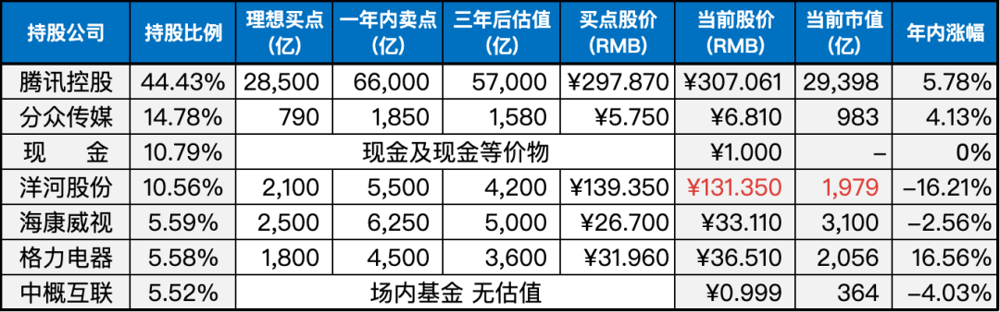

__微信公众号文章地址：[老罗实盘周记-20230701](https://mp.weixin.qq.com/s/MuxLuPjq6cbpkFnooGGSAQ)__

```
老罗实盘周记，每周六更新。专注于股权投资、阅读、学习与个人成长，知行合一、日拱一卒、投资人生。微信公众号【老罗投资】，文章均首发于公众号。
```

### 1. 本周交易

无

### 2. 目前持仓

当前持有的股票包括：

+ 腾讯控股 44.43%
+ 分众传媒 14.78%
+ 现金及现金等价物 10.79%
+ 洋河股份 10.56%
+ 海康微视 5.59%
+ 格力电器 5.58%
+ 中概互联 5.52%

此外，还有少量的万科A、恒瑞医药、宋城演义、京沪高铁等股票，其份额较少，仅作为观察仓不进行记录。

**注：港股已换算为人民币**



### 3. 上周数据


### 4. 持仓收益

本周：上证指数 +0.13%，深证成指 -0.29%，沪深300指数 -0.56%，中证500指数 +0.13%，恒生指数 +0.14%，恒生科技 +0.82%，老罗的持仓 <strong style="color:green;">-1.35%</strong>。

截止到今日，老罗实盘今年收益率为 <strong style="color:red;">+3.50%</strong>，沪深300指数今年收益率为 <strong style="color:green;">-0.75%</strong>，继续跑赢沪深300指数。

### 5. 重要事项

#### 5.1 腾讯因微信支付收取手续费道歉

近期，多家高校发布公告称，从 7 月 1 日起暂停使用微信支付，因为微信支付收取了 0.6% 的手续费。

对此微信支付官方回应称，自 2015 年起，微信支付在校园内等非盈利性质的支付场景，一直给予零费率的优惠政策，并表示会继续保持这一政策。

并且微信支付启动了针对校园行业费率的精细化管理，将只对电商、酒旅等小部分盈利性场景提供低于市场平均水平的优惠费率。

腾讯微信团队官微转发了微信支付的回应，并发布了致歉声明，向广大学校及师生致以歉意，承认在处理高校生活服务场景支付费率问题上存在不周之处，给大家带来了困扰。

这次腾讯闪电认怂，公司也知道支付这块市场巨大，切不可因为小小的手续费丢了这块大蛋糕。

#### 5.2 腾讯大股东股权结构变更

腾讯的大股东Prosus发布了2023年年报，同时宣布将解除和南非报业Naspers现有的交叉结构，成为其子公司。之前N与P交叉持股，互为对方最大股东，一直为外界诟病。

N和P都是通过P的全资子公司MIH间接持有腾讯股权的，从去年6月份Naspers宣布减持腾讯回购自家股票以来，累计减持套现127.5亿美元，约1000亿港币。

而从去年6月30日到今年6月30日，一整年腾讯累计下跌了不到4%，这还是未算入分掉的美团股票和腾讯年度分红收益，如果这两项纳入计算，基本等于没有下跌。

如果不是Naspers和Prosus会定期公布减持情况，恐怕很多人都会忘了这档子事，比如说老罗就不记得了。XD

所以说大股东减持并不是天塌了，优秀公司的股权永远都是稀缺品，张三不要了，自有李四抢着要。

#### 5.3 腾讯本轮回购结束时间

本周腾讯发布了公告，半年报将于8月16日发布，按照交易所规则，业绩公布前一个月不能进行回购交易，因此，腾讯的回购将在7月15日前停止。

最多还有10个交易日可以回购，理想情况下，还能回购40亿港币股票，希望后续腾讯的股价能下跌点，可以回购更多的份额。

#### 5.4 分众传媒分红到账

周五晚上分众传媒的分红到账，加上年初的特别分红，分众本年度的分红已经占到今年分红总额的26.5%。以不到15%的仓位贡献了26.5%的分红，分众确实是一家不错的公司。

到账的资金，打算下周全部丢给洋河股份，本周老罗都是设的130元限价买入，一直没能成交，希望下周洋河给点力，能成功跌到130元以下。

### 6. 本周读书

#### 6.1 《一定要告诉孩子的18堂商业思维课》

《一定要告诉孩子的18堂商业思维课》是一本旨在向孩子传授实用商业思维的书籍。由财务课程讲师林明樟先生撰写，该书通过真实案例和生动插图，以互动启发性的方式呈现商业思维的概念。

这本书的特点是简单易懂，以孩子们容易理解的语言和情景来阐述商业思维的原则和应用。它的目的是引导孩子们从小学会运用商业思维，培养他们的创新能力和决策能力，为未来的成长和发展奠定基础。

《一定要告诉孩子的18堂商业思维课》透过日常生活中的小事例子，向孩子们传递商业思维的重要性，让他们在思考问题、做决策和解决困难时能够灵活运用商业思维的思维方式。通过阅读这本书，孩子们可以培养出发现商机、创造价值和把握机会的能力。

总之，这本书旨在向孩子们传授实用商业思维的知识和技巧，以帮助他们在成长过程中具备商业思维的优势，为未来的发展打下坚实的基础。

其中作者的一个理念，老罗比较认同：我们家通常不管小朋友的课业，我们只要求他们的功课能保持在平均水平即可，因为我们不想为了多20分，让小朋友花全部的年少时间学习在Google就找得到的基础知识。但我们很重视一些与世界接轨的能力，例如做人做事与应对进退礼仪、挫折容忍度、问题解决能力、基本的英文表达能力等等。

在当前的教育环境中，很多学生在追求高分和应试能力的过程中，缺乏对学习的真正兴趣和动力。这种情况对孩子们的终身学习和发展都会带来负面影响，作为家长，培养孩子对学习的兴趣和动力是非常重要的任务。

本书老罗评分四颗星 ⭐️⭐️⭐️⭐️。

### 7. 本周运动

本周跳绳7次，快走3次，下周继续。

祝大家周末愉快！

```
老罗实盘周记，每周六更新。专注于股权投资、阅读、学习与个人成长，知行合一、日拱一卒、投资人生。微信公众号【老罗投资】，文章均首发于公众号。
免责声明：本公众号只作为本人的投资日志记录，本文中提及的个股都有腰斩或血本无归的风险，本人不做任何投资建议，投资请坚持独立思考。
```

__微信公众号文章地址：[老罗实盘周记-20230701](https://mp.weixin.qq.com/s/MuxLuPjq6cbpkFnooGGSAQ)__