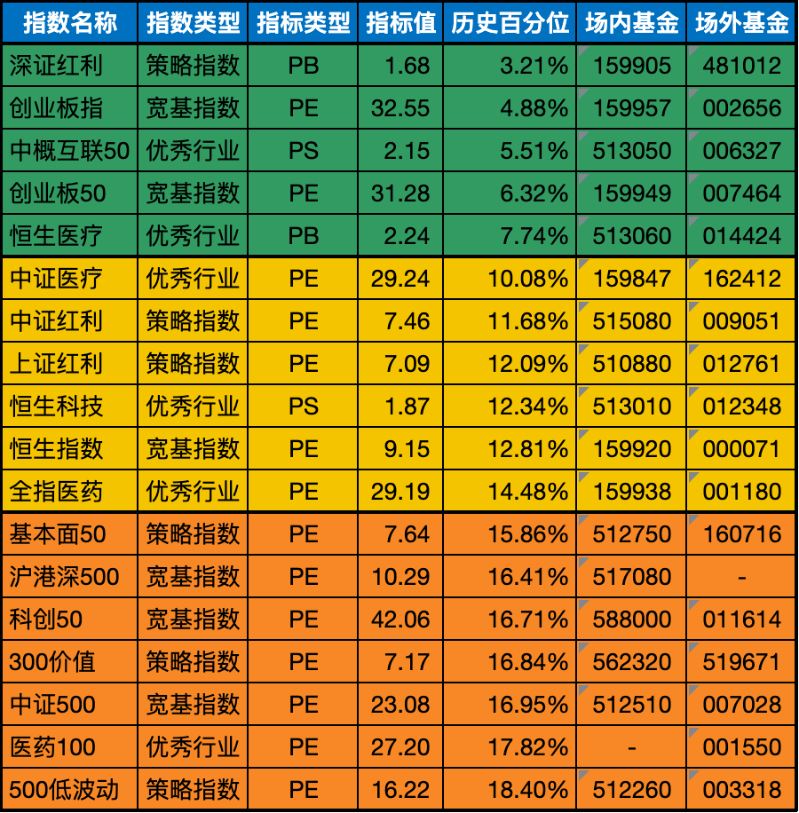

__微信公众号文章地址：[老罗基金估值-20230703](https://mp.weixin.qq.com/s/mdqbzhntkEMIKp_dGrR_Hw)__

```
老罗基金估值，每周一、四更新。专注于股权投资、阅读、学习与个人成长，知行合一、日拱一卒、投资人生。微信公众号【老罗投资】，文章均首发于公众号。
```

### 1. 近期操作

今日定投1000元：

+ (481012) 工银深证红利ETF联接A，固定金额定投500元。
+ (162412) 华宝中证医疗ETF联接(LOF)A，固定金额定投500元。

### 2. 基金估值



<p class="smile_curve_notice">
    提醒：指数基金定投，一定是3-5年不会使用的闲钱，长期坚持定投，才有可能获得较好收益。
</p>


### 3. 名词说明

+ PE：市盈率（Price Earnings Ratio），市盈率=股价/每股收益=市值/利润（意思是投资需要多少年才能够收回成本）。市盈率大于0的情况，理论上是越小越好，越小代表投资收回成本的时间越短，那么说明该公司的利润就越高。市盈率主要跟公司的利润挂钩，所以市盈率只适合盈利稳定的公司。而盈利稳定的公司一般是各行各业的龙头、白马蓝筹股和弱周期行业公司等。
+ PB：市净率（Price Book Ratio），市净率=每股价格÷每股净资产=总市值÷净资产，通过这个公式可以得出，市净率是通过净资产来估算该公司价值的。意思就是买到一个单位的净资产需要付出多少价格成本。市净率在大于0的情况下，市净率越低，表示可以花更少的钱买一个单净资产，所以在大于0的情况下，市净率越小越好。
+ PS：市销率（Price to Sales），市销率=每股价格/每股销售额=总市值/销售额。从公式中可以得出，市销率是基于公司销售额而出现的估值法。它建立的理论是：即使亏损公司的净利润是负的，但是公司到底是因为不赚钱而变负，还是因为快速扩张发展而变负，可以通过它的销售额来判断。销售额越大，营业收入就越高，在股票总市值一定的情况下，市销率PS的倍数就越小。
+ 历史百分位：所谓历史百分位，就是把指数历史上最低估值和最高估值从0到100排序，看现在的估值在什么位置，位置低说明未来上升空间大，目前指数被低估。
+ 场内基金：场内基金就是指在交易所内进行买卖的基金。
+ 场外基金：而场外基金的申购赎回渠道就较多了，可以在银行、券商、也可以在第三方理财平台购买，比如：支付宝、微信。

```
老罗基金估值，每周一、四更新。专注于股权投资、阅读、学习与个人成长，知行合一、日拱一卒、投资人生。微信公众号【老罗投资】，文章均首发于公众号。
免责声明：本文中提及的基金都有较大波动风险，投资需谨慎。
```

__微信公众号文章地址：[老罗基金估值-20230703](https://mp.weixin.qq.com/s/mdqbzhntkEMIKp_dGrR_Hw)__