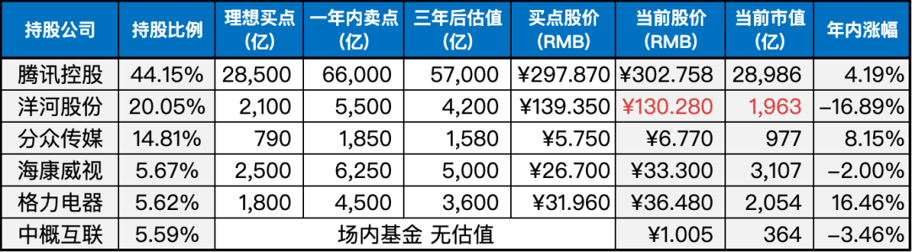

__微信公众号文章地址：[老罗实盘周记-20230708](https://mp.weixin.qq.com/s/M1y2XpgNcmV2raap0TXz3w)__

```
老罗实盘周记，每周六更新。专注于股权投资、阅读、学习与个人成长，知行合一、日拱一卒、投资人生。微信公众号【老罗投资】，文章均首发于公众号。
```

### 1. 本周交易

+ 本周清仓了银华日利货币基金。
+ 用卖出的资金和上周分众的分红，分三批买入了近10%仓位的洋河股份，成交价格分别为132元、130.7元和130元。

### 2. 目前持仓

当前持有的股票包括：

+ 腾讯控股 44.15%
+ 洋河股份 20.05%
+ 分众传媒 14.81%
+ 海康微视 5.67%
+ 格力电器 5.62%
+ 中概互联 5.59%

此外，还有少量的万科A、恒瑞医药、宋城演义、京沪高铁等股票，其份额较少，仅作为观察仓不进行记录。

**注：港股已换算为人民币**



### 3. 上周数据


### 4. 持仓收益

本周：上证指数 -0.17%，深证成指 -1.25%，沪深300指数 -0.44%，中证500指数 -0.62%，恒生指数 -2.91%，恒生科技 -0.26%，老罗的持仓 <strong style="color:green;">-0.80%</strong>。

截止到今日，老罗实盘今年收益率为 <strong style="color:red;">+2.70%</strong>，沪深300指数今年收益率为 <strong style="color:green;">-1.19%</strong>，继续跑赢沪深300指数。

### 5. 重要事项

#### 5.1 腾讯连续第32日出手回购股票

7月7日回购124万股，每股价格在320.2至330.6港币，耗资约4亿港币。除了在6月2日和6月5日没有回购到足够的份额，基本都是每天3.5-4亿港币的回购额度。

下表是近期的回购明细：


#### 5.2 关于洋河

本周洋河继续下跌，老罗启动了买买买模式，洋河的仓位也由10%升到了20%，如果后续跌到120元，还会继续买入，一直到仓位25%的上限。

这周是买舒服了，终于能理解巴神所说的：『如果你在未来是股票净买入者，你应该希望股价更低。我更愿意看到市场下跌，大跌的时候更容易买到好货。』

#### 5.3 其他

老罗周六要出趟远门，这篇文章也是提前写成的。

暑假期间出行火爆，景区人挤人，大家消费的欲望还是很强烈的。只是三年疫情结束后，并没有出现想象中的行情井喷，信心有些动摇。

大家目前都在持币观望，不敢消费，扎堆提前还贷。这种时候，真的是信心比金子更重要。

### 6. 本周读书

#### 6.1 《半小时漫画-三国演义》

对于那些对三国历史不太了解的人来说，通过诙谐幽默的方式了解三国历史是一种有趣的方式。

这本书能够在碎片时间内让人理清三国的时间脉络和事件，对于忙碌的现代人来说非常方便。

本书老罗评分三颗星 ⭐️⭐️⭐️。

#### 6.2 《肖星的财务思维课》

这是续《一本书读懂财报》后，读的第二本肖星撰写的财务书籍。

财务在工作中的重要性远不止于会计，它涵盖了更广泛的内容。财务可以帮助我们透过数据洞察经营的本质和管理的真相，实现资源的最大效益。

无论是成本控制、采购管理、资产管理，还是薪酬激励、并购、投融资、财务报表等，都需要考验我们的工作智慧。

无论是普通员工的项目审核评估，还是公司的IPO上市，无论是老板还是员工，与财务打交道都是不可避免的。

拥有财务思维能力决定了我们在职场上的发展高度和商业格局的大小。

作者认为财务是职场的通用语言，财务数据充满着趣味和启发，而且浅显易懂。本书将帮助培养“大财务思维”，能够读懂数据，深入剖析经营的秘密，更好地在工作和投资中取得成功。

本书老罗评分四颗星 ⭐️⭐️⭐️⭐️。

### 7. 本周运动

本周跳绳7次，快走5次，下周继续。

祝大家周末愉快！

```
老罗实盘周记，每周六更新。专注于股权投资、阅读、学习与个人成长，知行合一、日拱一卒、投资人生。微信公众号【老罗投资】，文章均首发于公众号。
免责声明：本公众号只作为本人的投资日志记录，本文中提及的个股都有腰斩或血本无归的风险，本人不做任何投资建议，投资请坚持独立思考。
```

__微信公众号文章地址：[老罗实盘周记-20230708](https://mp.weixin.qq.com/s/M1y2XpgNcmV2raap0TXz3w)__