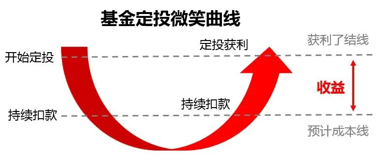

__微信公众号文章地址：[老罗基金估值-20230713](https://mp.weixin.qq.com/s/Ec-W9KFKBd_f7eGVWoTwzg)__

```
老罗基金估值，每周一、四更新。专注于股权投资、阅读、学习与个人成长，知行合一、日拱一卒、投资人生。微信公众号【老罗投资】，文章均首发于公众号。
```

### 1. 近期操作

周二定投2000元：

+ (002656) 南方创业板ETF联接A，固定金额定投500元。
+ (007464) 交银施罗德创业板50指数A，固定金额定投500元。
+ (014424) 博时恒生医疗保健ETF联接(QDII)A，固定金额定投500元。
+ (006327) 易方达中证海外中国互联网50ETF联接(QDII)A，固定金额定投500元。

### 2. 基金估值


<p class="smile_curve_notice">
    提醒：指数基金定投，一定是3-5年不会使用的闲钱，长期坚持定投，才有可能获得较好收益。
</p>



### 3. 近期收获

#### 3.1 掌握所有重要理论

一个人，必须学习所有重要的学科，掌握其中的所有重要理论。遇到特别复杂的问题，必须把所有重要的理论都用上，不能只用几个理论。

否则就是手里拿着锤子，看什么都像钉子。

#### 3.2 以短期的痛苦换取长期的收益

很多人总是一味地逃避，不愿承受短期的痛苦。自找苦吃，主动吃眼前的苦，这才是正确的处世态度。

投资是同样的道理，以短期的痛苦换取长期的收益。有很多好东西，你都想买，但你就是不花这个钱。你甚至会放弃眼前的一些东西，为的是将来能有更大的收获。

#### 3.3 财富是认知的变现

有知识储备，才能看得见机会。不具备相关知识，黄金奉上，你也会当做狗屎避之不及的。

### 4. 名词说明

+ PE：市盈率（Price Earnings Ratio），市盈率=股价/每股收益=市值/利润（意思是投资需要多少年才能够收回成本）。市盈率大于0的情况，理论上是越小越好，越小代表投资收回成本的时间越短，那么说明该公司的利润就越高。市盈率主要跟公司的利润挂钩，所以市盈率只适合盈利稳定的公司。而盈利稳定的公司一般是各行各业的龙头、白马蓝筹股和弱周期行业公司等。
+ PB：市净率（Price Book Ratio），市净率=每股价格÷每股净资产=总市值÷净资产，通过这个公式可以得出，市净率是通过净资产来估算该公司价值的。意思就是买到一个单位的净资产需要付出多少价格成本。市净率在大于0的情况下，市净率越低，表示可以花更少的钱买一个单净资产，所以在大于0的情况下，市净率越小越好。
+ PS：市销率（Price to Sales），市销率=每股价格/每股销售额=总市值/销售额。从公式中可以得出，市销率是基于公司销售额而出现的估值法。它建立的理论是：即使亏损公司的净利润是负的，但是公司到底是因为不赚钱而变负，还是因为快速扩张发展而变负，可以通过它的销售额来判断。销售额越大，营业收入就越高，在股票总市值一定的情况下，市销率PS的倍数就越小。
+ 历史百分位：所谓历史百分位，就是把指数历史上最低估值和最高估值从0到100排序，看现在的估值在什么位置，位置低说明未来上升空间大，目前指数被低估。
+ 场内基金：场内基金就是指在交易所内进行买卖的基金。
+ 场外基金：而场外基金的申购赎回渠道就较多了，可以在银行、券商、也可以在第三方理财平台购买，比如：支付宝、微信。

```
老罗基金估值，每周一、四更新。专注于股权投资、阅读、学习与个人成长，知行合一、日拱一卒、投资人生。微信公众号【老罗投资】，文章均首发于公众号。
免责声明：本文中提及的基金都有较大波动风险，投资需谨慎。
```

__微信公众号文章地址：[老罗基金估值-20230713](https://mp.weixin.qq.com/s/Ec-W9KFKBd_f7eGVWoTwzg)__