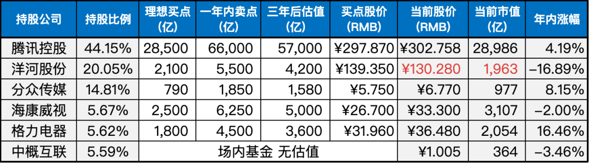

__微信公众号文章地址：[老罗实盘周记-20230715](https://mp.weixin.qq.com/s/0E5vno-uHU0rxZYe7mt8JQ)__

```
老罗实盘周记，每周六更新。专注于股权投资、阅读、学习与个人成长，知行合一、日拱一卒、投资人生。微信公众号【老罗投资】，文章均首发于公众号。
```

### 1. 本周交易

无

### 2. 目前持仓

当前持有的股票包括：

+ 腾讯控股 44.65%
+ 洋河股份 19.73%
+ 分众传媒 15.22%
+ 海康微视 5.59%
+ 中概互联 5.57%
+ 格力电器 5.37%

此外，还有少量的万科A、恒瑞医药、宋城演义、京沪高铁等股票，其份额较少，仅作为观察仓不进行记录。

**注：港股已换算为人民币**


### 3. 上周数据



### 4. 持仓收益

本周：上证指数 +1.29%，深证成指 +1.76%，沪深300指数 +1.92%，中证500指数 +1.16%，恒生指数 +5.71%，恒生科技 +8.39%，老罗的持仓 <strong style="color:red;">+5.84%</strong>。

截止到今日，老罗实盘今年收益率为 <strong style="color:red;">+8.54%</strong>，沪深300指数今年收益率为 <strong style="color:red;">+0.71%</strong>，继续跑赢沪深300指数。

### 5. 重要事项

#### 5.1 平台企业座谈会

7月12日举行的平台企业座谈会确定了平台经济新的主战场。

在之前，监管部门对蚂蚁集团等企业进行了处罚，表示平台企业金融业务存在的大部分突出问题已得到整改，金融管理部门的工作重点由推动平台企业金融业务的集中整改转变为常态化监管，这被市场解读为平台经济将再次启动的明确信号。

平台经济的重要性毋庸置疑。据统计数据显示，平台经济所处的数字经济领域已经连续11年增速显著高于GDP增速，持续发挥经济稳定器和加速器的作用。

预计到2030年，中国平台经济规模有望突破100万亿元。这一数据显示了平台经济在中国经济中的巨大潜力和重要地位。

平台经济的发展在全球范围内都备受关注，它不仅影响着各行各业的发展和变革，还在推动着数字化时代的进程。

对于企业和监管部门来说，了解平台经济的新主战场并适应其发展是至关重要的，这将有助于推动我国经济的可持续发展和创造更多的机遇与价值。

A4纸没有了，后续应该会出台政策扶持，平台经济已经触底反弹。

#### 5.2 美国加息进入尾声

7月12日，美国劳工部公布的数据显示，美国6月CPI同比增长3%，低于之前的4%和市场预期的3.1%，通胀涨幅降至2021年3月以来的最低水平。

紧接着的13日，美国再次公布了6月PPI（生产者价格指数）数据，同比增长0.1%，较之前的1.1%大幅放缓，低于预期的0.4%，创下近三年新低。

美国6月通胀数据的降幅超出市场预期，为市场带来希望，也加剧了对美联储停止加息政策的讨论。

在这种乐观情绪下，全球股市、贵金属等市场普遍上涨，美国标普500指数上涨0.85%，纳斯达克指数上涨1.58%，两者均创下2022年4月以来新高，现货黄金价格升破1960美元/盎司。

美元走弱也整体利好人民币等非美货币的走势。7月14日，银行间外汇市场人民币对美元汇率中间价报7.1318元，较之前的水平调升209个基点。本周人民币对美元汇率中间价已累计调升736个基点。

然而，一些机构指出，考虑到2022年同期CPI和PPI数据的高基数，仍需要关注未来通胀数据的回弹可能性。

例如，美国6月PPI数据环比上涨0.1%，而5月份该数据已经呈现环比下降的趋势，重新上升显示出不利的迹象。

由于当前通胀水平仍高于美联储2%的政策目标，美联储的加息政策可能不会立即结束。市场认为美联储在7月份将基准利率上调25个基点的可能性仍然高达93%，而9月份再次加息的可能性为11.2%。

美国加息周期结束，对中国经济的复苏无疑是大利好，这半年真的是太困难了。

### 6. 本周读书

无

### 7. 本周运动

本周跳绳3次，快走3次，下周继续。

祝大家周末愉快！

```
老罗实盘周记，每周六更新。专注于股权投资、阅读、学习与个人成长，知行合一、日拱一卒、投资人生。微信公众号【老罗投资】，文章均首发于公众号。
免责声明：本公众号只作为本人的投资日志记录，本文中提及的个股都有腰斩或血本无归的风险，本人不做任何投资建议，投资请坚持独立思考。
```

__微信公众号文章地址：[老罗实盘周记-20230715](https://mp.weixin.qq.com/s/0E5vno-uHU0rxZYe7mt8JQ)__