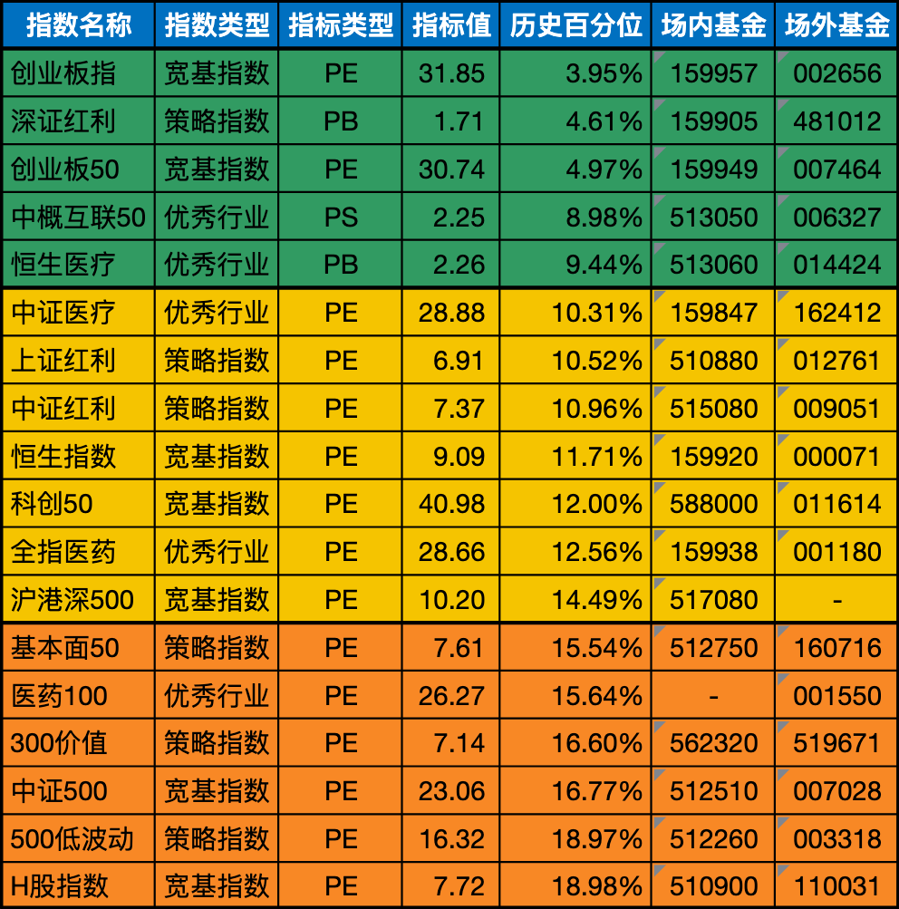

__微信公众号文章地址：[老罗基金估值-20230720](https://mp.weixin.qq.com/s/9rUZtof36wrwTQbVeziGHg)__

```
老罗基金估值，每周一、四更新。专注于股权投资、阅读、学习与个人成长，知行合一、日拱一卒、投资人生。微信公众号【老罗投资】，文章均首发于公众号。
```

### 1. 近期操作

周二定投2000元：

+ (002656) 南方创业板ETF联接A，固定金额定投500元。
+ (007464) 交银施罗德创业板50指数A，固定金额定投500元。
+ (006327) 易方达中证海外中国互联网50ETF联接(QDII)A，固定金额定投500元。
+ (014424) 博时恒生医疗保健ETF联接(QDII)A，固定金额定投500元。

### 2. 基金估值



<p class="smile_curve_notice">
    提醒：指数基金定投，一定是3-5年不会使用的闲钱，长期坚持定投，才有可能获得较好收益。
</p>


### 3. 近期收获

#### 3.1 能力圈边界

答案在于，我们找到了正确的方法。其中很关键的一点是，我们非常清楚自己的能力圈的边界。知道自己的能力圈大小，甚至可以弥补智商的不足。

“知之为知之，不知为不知，是知也。”我非常清楚自己几斤几两，非常清楚什么事是自己不该做的。

#### 3.2 降低预期

幸运的秘诀不是雄心壮志，而是降低预期。特别是在寻找另一半的时候，一定要找个对你预期比较低的。

#### 3.3 一尺跨栏

沃伦说过：“我们没本事跳过三米高的栏杆，我们的做法是，轻轻地迈过小水坑，然后捡起大块大块的金子。

#### 3.4 慢慢变富

变富是一个很享受的过程，慢慢变富，才能细细体会到其中的美妙滋味。我建议你们像我一样慢慢变富。一夜暴富有什么好的呢？

暴富之后，很可能不是被自己败了，就是被别人骗了。慢慢变富，一辈子都乐趣无穷，有滋有味。我建议你们慢慢变富。

#### 3.5 最重要的客户是自己

我最重要的那位客户是我自己，我确实用那个时间阅读和思考了。大量阅读和思考的好处在于，把阅读和思考做好了，别的什么都不用做了。

#### 3.6 如何成为人生赢家

在获得金钱方面，没什么轻而易举的秘诀。做一个诚实正直的人，每天早起，每天坚持学习，一辈子奉行延迟满足的理念，最后，你一定是人生赢家。

你赚的钱可能没有自己想要的那么多，但是你肯定会拥有成功的人生。

### 4. 名词说明

+ PE：市盈率（Price Earnings Ratio），市盈率=股价/每股收益=市值/利润（意思是投资需要多少年才能够收回成本）。市盈率大于0的情况，理论上是越小越好，越小代表投资收回成本的时间越短，那么说明该公司的利润就越高。市盈率主要跟公司的利润挂钩，所以市盈率只适合盈利稳定的公司。而盈利稳定的公司一般是各行各业的龙头、白马蓝筹股和弱周期行业公司等。
+ PB：市净率（Price Book Ratio），市净率=每股价格÷每股净资产=总市值÷净资产，通过这个公式可以得出，市净率是通过净资产来估算该公司价值的。意思就是买到一个单位的净资产需要付出多少价格成本。市净率在大于0的情况下，市净率越低，表示可以花更少的钱买一个单净资产，所以在大于0的情况下，市净率越小越好。
+ PS：市销率（Price to Sales），市销率=每股价格/每股销售额=总市值/销售额。从公式中可以得出，市销率是基于公司销售额而出现的估值法。它建立的理论是：即使亏损公司的净利润是负的，但是公司到底是因为不赚钱而变负，还是因为快速扩张发展而变负，可以通过它的销售额来判断。销售额越大，营业收入就越高，在股票总市值一定的情况下，市销率PS的倍数就越小。
+ 历史百分位：所谓历史百分位，就是把指数历史上最低估值和最高估值从0到100排序，看现在的估值在什么位置，位置低说明未来上升空间大，目前指数被低估。
+ 场内基金：场内基金就是指在交易所内进行买卖的基金。
+ 场外基金：而场外基金的申购赎回渠道就较多了，可以在银行、券商、也可以在第三方理财平台购买，比如：支付宝、微信。

```
老罗基金估值，每周一、四更新。专注于股权投资、阅读、学习与个人成长，知行合一、日拱一卒、投资人生。微信公众号【老罗投资】，文章均首发于公众号。
免责声明：本文中提及的基金都有较大波动风险，投资需谨慎。
```

__微信公众号文章地址：[老罗基金估值-20230720](https://mp.weixin.qq.com/s/9rUZtof36wrwTQbVeziGHg)__