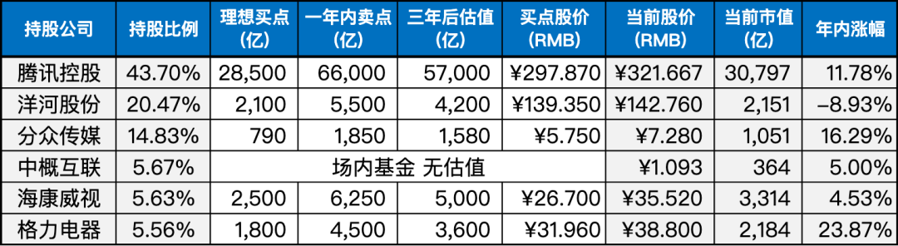
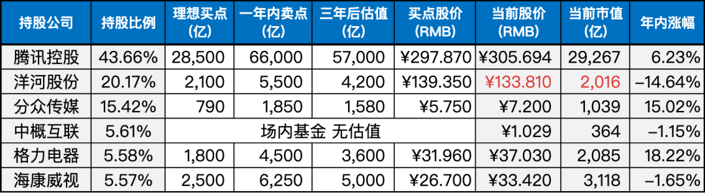

__微信公众号文章地址：[老罗实盘周记-20230729](https://mp.weixin.qq.com/s/4eXfRfb-JEndptgwvptNEQ)__

```
老罗实盘周记，每周六更新。专注于股权投资、阅读、学习与个人成长，知行合一、日拱一卒、投资人生。微信公众号【老罗投资】，文章均首发于公众号。
```

### 1. 本周交易

无

### 2. 目前持仓

当前持有的股票包括：

+ 腾讯控股 43.70%
+ 洋河股份 20.47%
+ 分众传媒 14.83%
+ 中概互联 5.67%
+ 海康微视 5.63%
+ 格力电器 5.56%

此外，还有少量的万科A、恒瑞医药、宋城演义、京沪高铁等股票，其份额较少，仅作为观察仓不进行记录。

**注：港股已换算为人民币**



### 3. 上周数据



### 4. 持仓收益

本周：老罗的持仓 <strong style="color:red;">+5.27%</strong>，沪深300指数 <strong style="color:red;">+4.47%</strong>。

截止到今日，老罗实盘今年收益率为 <strong style="color:red;">+10.27%</strong>，沪深300指数今年收益率为 <strong style="color:red;">+3.13%</strong>，继续跑赢沪深300指数。

### 5. 重要事项

#### 5.1 楼市利好认房不认贷

7月28日的夜晚对于楼市来说是一个不眠夜。住建部宣布稳固房地产市场企稳回升态势，并将落实降低首套房首付比例和贷款利率、个人贷款“认房不认贷”等措施。

此外，7月24日政治局会议提出了适时优化调整房地产政策，鼓励因城施策，充分利用政策工具箱。可以预见，后续会有更多城市对限制性政策进行优化。

由于经济形势确实较为困难，政府决定再次采取房地产来刺激经济。住建部发布的“认房不认贷”措施，对那些在老家用商贷买房，但在一线城市需要支付高额首付的刚需购房者来说，可以说是个福音。

预计今后，可能只需支付3-4成的首付款就能购房，再加上利率下行的助力，当前是一个比较不错的入手房产的窗口期。

然而，房地产市场依然需要谨慎对待，在政策的刺激下，房价可能会有一定程度的反弹，但经济下行的压力和房价波动依然存在。

购房者仍需审慎考虑自己的购房需求和负担能力，避免盲目跟风。同时，政府对楼市的政策调控仍将密切关注，未来可能会出现更多的政策变化，需要随时关注市场动态。

#### 5.2 又没便宜公司了

本周新投入了少量资金，原计划是购买130元的洋河股份，但本周涨幅较大，短期内可能错过了入场时机。

不过没关系，既然没有适合的机会，就暂时保持观望态度，让闲散资金继续在账户里获得货币资金收益吧。

### 6. 本周读书

#### 6.1《芒格之道-查理芒格股东会讲话1987-2022》

本书收录了查理·芒格自1987年至2010年在西科金融，以及2014年至2022年在每日期刊股东会上的讲话和问答。

这些讲话涵盖了长达35年的时间跨度，涉及许多当年国际或全美大事件，如美国储贷行业危机、日本泡沫破裂、互联网泡沫、2008年次贷危机、比特币及加密货币的兴起、新冠疫情等。

此外，书中还揭示了查理·芒格思想的发展和其投资生涯中的重要动向，包括格雷厄姆和费雪对他的影响、多模型思维、早期经历的失败、所罗门事件、投资可口可乐、航空业遇挫、投资中国尤其是比亚迪等。

通过这些内容，读者可以用年鉴回顾的视角，更全面地了解他的思想和行动，深入探索他在商业和为人方面的智慧。

总之，这本书老罗强烈推荐，价值投资者必看书籍，五星⭐️⭐️⭐️⭐️⭐️推荐。

#### 6.2《渔樵问对》

《渔樵问对》是由北宋儒家五子之一邵雍所著，通过渔樵对话的形式，探讨古今兴亡等重要话题。

邵雍学贯易理，儒道兼通，致力于将天与人统一于一心，试图将儒家的人本思想与道家的天道哲学贯通起来。本书着重阐述天地万物、阴阳化育和生命道德的奥妙和哲理。

樵子的问题与渔父的回答将天地、万物、人事和社会归纳于易理，并进行解读，旨在让樵者明白“天地之道备于人，万物之道备于身，众妙之道备于神，天下之能事毕矣”的道理。

渔父在《渔樵问对》中被塑造成了“道”的化身，成为玄理的传递者。

老罗评分四星⭐️⭐️⭐️⭐️，值得一看。

### 7. 本周运动

本周健身房锻炼两次，主要是练跑步机和椭圆机，下周继续。

祝大家周末愉快！

```
老罗实盘周记，每周六更新。专注于股权投资、阅读、学习与个人成长，知行合一、日拱一卒、投资人生。微信公众号【老罗投资】，文章均首发于公众号。
免责声明：本公众号只作为本人的投资日志记录，本文中提及的个股都有腰斩或血本无归的风险，本人不做任何投资建议，投资请坚持独立思考。
```

__微信公众号文章地址：[老罗实盘周记-20230729](https://mp.weixin.qq.com/s/4eXfRfb-JEndptgwvptNEQ)__