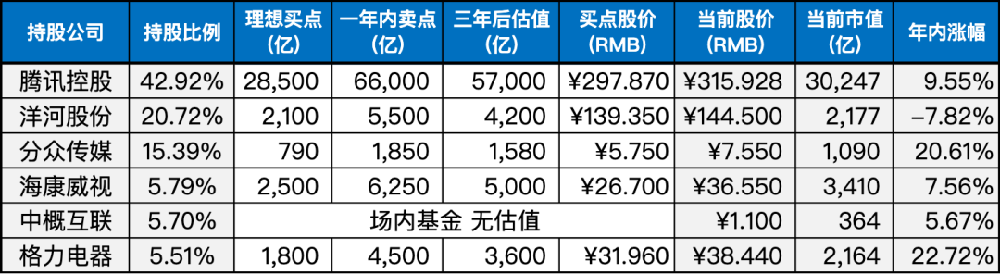
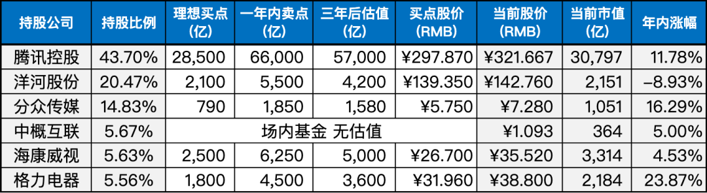

__微信公众号文章地址：[老罗实盘周记-20230805](https://mp.weixin.qq.com/s/g9YKbWHyfuUP_Mchpf6zCQ)__

```
老罗实盘周记，每周六更新。专注于股权投资、阅读、学习与个人成长，知行合一、日拱一卒、投资人生。微信公众号【老罗投资】，文章均首发于公众号。
```

### 1. 本周交易

无

### 2. 目前持仓

当前持有的股票包括：

+ 腾讯控股 42.92%
+ 洋河股份 20.72%
+ 分众传媒 15.39%
+ 海康微视 5.79%
+ 中概互联 5.70%
+ 格力电器 5.51%

此外，还有少量的万科A、恒瑞医药、宋城演义、京沪高铁等股票，其份额较少，仅作为观察仓不进行记录。

**注：港股已换算为人民币**



### 3. 上周数据



### 4. 持仓收益

本周：老罗的持仓 <strong style="color:red;">+0.22%</strong>，沪深300指数 <strong style="color:red;">+0.70%</strong>。

截止到今日，老罗实盘今年收益率为 <strong style="color:red;">+10.49%</strong>，沪深300指数今年收益率为 <strong style="color:red;">+3.85%</strong>，继续跑赢沪深300指数。


### 5. 重要事项

#### 5.1 腾讯捐赠灾区1.07亿元

通过腾讯基金会捐赠，这也是互联网行业的第一家公益基金会。捐赠资金将用于响应受灾地区紧急援助需求、过渡安置、灾后重建、复工复产、困难群众保障等工作。

希望所有捐款都能用在刀刃上，受灾地区群众都能平平安安。

#### 5.2 茅台发布半年报

茅台半年报披露的数据比预期还要好一点，营收同比增长20.8%，基酒产量比同期增加2100吨。大A的赚钱BUG依然存在，称它为核动力印钞机也不为过。

然而，目前茅台的股价并不太美丽，如果茅台股价能跌到1200元左右，老罗肯定会毫不犹豫地买入。

### 6. 本周读书

#### 6.1《低风险创业》

一直以来我们可能误解了创业这件事，认为高风险才有高收益，但事实上，成功的企业家不是善于冒风险，而是善于控制风险。

书中提出了7个可复制的方法，这些方法能显著降低创业风险：寻找社会问题、用秘密筑造护城河、建立反脆弱的商业结构、组建生物态团队、有效沟通凝聚团队、让客户带来客户、构造指数型增长。

创业不是一胜九败，也不是长期在焦虑中度过。只要掌握相关技术、原则和方法，通过刻意练习，在实践中学以致用，就能大大降低创业风险。

老罗评分三星半⭐️⭐️⭐️❤️。

#### 6.2《价值投资》

克里斯托弗·布朗是一位拥有37年身体力行的价值投资专家，其战绩辉煌。

他通过自身的实战经验告诉我们，价值投资其实很简单，本质上就是寻找被低估的股票。

在书中，布朗指导我们如何找到优质的公司，同时也提醒我们要远离哪些公司。虽然价值投资的基本理论并不复杂，更多的挑战在于考验我们的人性。

需要注意的是，书中可能存在一些互相矛盾的地方，阅读时要谨慎甄别。老罗评分三颗星⭐️⭐️⭐️。

### 7. 本周运动

本周健身房锻炼两次，主要是练跑步机和椭圆机，下周继续。

祝大家周末愉快！

```
老罗实盘周记，每周六更新。专注于股权投资、阅读、学习与个人成长，知行合一、日拱一卒、投资人生。微信公众号【老罗投资】，文章均首发于公众号。
免责声明：本公众号只作为本人的投资日志记录，本文中提及的个股都有腰斩或血本无归的风险，本人不做任何投资建议，投资请坚持独立思考。
```

__微信公众号文章地址：[老罗实盘周记-20230805](https://mp.weixin.qq.com/s/g9YKbWHyfuUP_Mchpf6zCQ)__