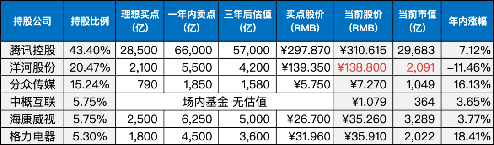

__微信公众号文章地址：[老罗实盘周记-20230812](https://mp.weixin.qq.com/s/fj-7fcwJ13_j_EMffwL9ng)__

```
老罗实盘周记，每周六更新。专注于股权投资、阅读、学习与个人成长，知行合一、日拱一卒、投资人生。微信公众号【老罗投资】，文章均首发于公众号。
```

### 1. 本周交易

无

### 2. 目前持仓

当前持有的股票包括：

+ 腾讯控股 43.40%
+ 洋河股份 20.47%
+ 分众传媒 15.24%
+ 中概互联 5.75%
+ 海康微视 5.75%
+ 格力电器 5.30%

此外，还有少量的万科A、恒瑞医药、宋城演义、京沪高铁等股票，其份额较少，仅作为观察仓不进行记录。

**注：港股已换算为人民币**



### 3. 上周数据


### 4. 持仓收益

本周：老罗的持仓 <strong style="color:green;">-3.39%</strong>，沪深300指数 <strong style="color:green;">-3.39%</strong>，本周的跌幅都同步了。

截止到今日，老罗实盘今年收益率为 <strong style="color:red;">+7.10%</strong>，沪深300指数今年收益率为 <strong style="color:red;">+0.33%</strong>，继续跑赢沪深300指数。

### 5. 重要事项

本周有事耽误了一天，实盘周记改为周日发布。

#### 5.1 分众传媒发布半年报

8月9日，分众传媒公布了2023年度半年报。在上半年，分众实现营收55.17亿，同比增长13.69%，归母净利润22.31亿，同比增长59%，归母扣非净利润19.72亿，同比增长82.62%。基本都落在7月份的预告范围之内，没有任何的惊喜。

财报展望2023年下半年，外部环境仍有挑战，但随着经济恢复基础的不断夯实、稳经济举措的不断落地，消费市场复苏前景持续向好。

分众目前属于合理价格，一年内卖出点是1850亿元，现在1000亿出头的市值，继续持有即可。

#### 5.2 大A优化交易制度，100+1要来了

8月10日，上交所、深交所官网发文，允许主板股票、基金等证券申报数量可以以1股（份）为单位递增。目前两市主板股票、基金等证券的申报数量应为100股（份）或其整数倍，拟调整为100股（份）起、以1股（份）为单位递增。

老罗觉得意义并不太大，如贵州茅台，现在买一手(100股)需要18万+元。原以为新规实施后，可以1股买入，到时只需要1800多元便可买入大A发钱的bug。了解具体细则后，像这种公司的股权，买入门槛依然没有降低。

#### 5.3 格力分红

8月8日晚格力分红到账，每股分红1元，比前两年直接腰斩，虽然少了很多，但格力依然是大A分红率较高的公司。

到账后的分红加上之前的剩余现金，打算在130元以下分批买入洋河，看能不能有机会，买进到25%仓位的上限。

顺带一提，有时间还得工作日去开下B股账号，B股现在折价的股票很多，可以看看有没有烟蒂值得一捡。

### 6. 本周读书

#### 6.1《陪孩子终身成长》

父母们一直期望找到家庭教育的根本逻辑：在孩子遇到问题之前，应该进行哪种教育？日常教育中应该渗透哪些原则？

在《陪孩子终身成长》一书中，作者构建了亲子教育的三大支柱：无条件的爱、价值观、终身成长的心态。

无条件的爱为孩子提供幸福与勇气；价值观培养内在动力，助孩子创造成就；终身成长的心态则贯穿一切美德之后的价值。

这本书致敬所有渴望与孩子共同成长的父母：每个孩子的提问都是彼此成长的机会。

老罗评分三星半⭐️⭐️⭐️❤️。

#### 6.2《云朵面包》

《云朵面包》以图画书的形式展现童话故事，别具一格的新魅力。

它将多种艺术手法融合在一起，不仅运用绘画，还巧妙地运用摄影、剪纸和布艺等技艺，通过精心拼贴构图，并辅以温馨灯光，赋予画面丰富的质感，呈现出浓厚的生活氛围。

老罗评分四颗星⭐️⭐️⭐️⭐️。

#### 6.3《少年发声》

在当今社会，关于各种教育议题的讨论愈演愈烈，然而我们很少有机会聆听教育对象的真实声音。

中国教育的现状究竟如何？在这个信息爆炸的时代，孩子们的成长期望是什么？这两者之间是否相互契合？孩子们的思考和情感应当得到倾听和尊重。

本书以青少年为主角，收录了作者与16位少年的真实访谈，旨在在家长和孩子之间架起一座桥梁，让孩子们的内心之声被真正聆听，被深切理解。

老罗评分五颗星⭐️⭐️⭐️⭐️⭐️。

### 7. 本周运动

本周健身房锻炼三次，主要是练跑步机和划船机，下周继续。

祝大家周末愉快！

```
老罗实盘周记，每周六更新。专注于股权投资、阅读、学习与个人成长，知行合一、日拱一卒、投资人生。微信公众号【老罗投资】，文章均首发于公众号。
免责声明：本公众号只作为本人的投资日志记录，本文中提及的个股都有腰斩或血本无归的风险，本人不做任何投资建议，投资请坚持独立思考。
```

__微信公众号文章地址：[老罗实盘周记-20230812](https://mp.weixin.qq.com/s/fj-7fcwJ13_j_EMffwL9ng)__