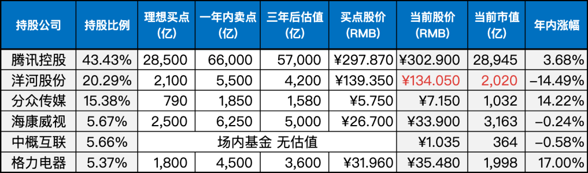

__微信公众号文章地址：[老罗实盘周记-20230819](https://mp.weixin.qq.com/s/IEYUseUpLrrea5Ac9BReFQ)__

```
老罗实盘周记，每周六更新。专注于股权投资、阅读、学习与个人成长，知行合一、日拱一卒、投资人生。微信公众号【老罗投资】，文章均首发于公众号。
```

### 1. 本周交易

无

### 2. 目前持仓

当前持有的股票包括：

+ 腾讯控股 43.43%
+ 洋河股份 20.29%
+ 分众传媒 15.38%
+ 海康微视 5.67%
+ 中概互联 5.66%
+ 格力电器 5.37%


此外，还有少量的万科A、恒瑞医药、宋城演义、京沪高铁等股票，其份额较少，仅作为观察仓不进行记录。

**注：港股已换算为人民币**



### 3. 上周数据


### 4. 持仓收益

本周：老罗的持仓 <strong style="color:green;">-2.53%</strong>，沪深300指数 <strong style="color:green;">-2.58%</strong>，本周跌幅基本同步。

截止到今日，老罗实盘今年收益率为 <strong style="color:red;">+4.57%</strong>，沪深300指数今年收益率为 <strong style="color:green;">-2.26%</strong>，继续跑赢沪深300指数。

### 5. 重要事项

#### 5.1 腾讯发布中报

8月16日，腾讯公布了2023年度中报。

Q2营收1492亿人民币，同比增长11%；归母净利润262亿人民币，同比增长41%；非国际准则下归母净利润375亿人民币，同比增长33%。

整个上半年，实现营收2292亿人民币，同比增长11.02%；归母净利润520亿人民币，同比增长24%；非国际准则下归母净利润701亿人民币，同比增长31%。

互联网行业最主要的成本是人力投入，自从去年降本增效(裁员)之后，成本控制明显见效，今年的利润增速超过了收入增速。

用户数据：微信+WeChat合并月活13.27亿，小程序月活11亿+，QQ移动端月活5.71亿，视频号用户使用时长接近翻倍。

各大业务板块中，广告业务有较明显的增长，同比增长达到了35%，主要得益于视频号商业化，以及在广告平台上应用了机器学习能力。

游戏业务表现一般，只有3.5%的增长。老罗原本认为放开游戏版号限制，加上Q2发布几款重磅游戏，游戏业务会有不错的进展。结果几款游戏表现平平，造成国内游戏业务增长缓慢。反观国际市场增长还不错，达到了19%。

老罗身边几位同事以前午休或下班总要王者几把，这大半年基本看不到TIMI了。也许是近两年赚钱不易，大家的精力更多的放在提升自己上，玩游戏的时间明显减少。

还有一项需要关注的是Q2的研发投入，达到了160.1亿人民币，日均花掉1.78亿。自2020年到23年Q2，这两年半研发开支累计超过1800人民币。这些钱主要都花到了AI、数字文化产业、自动驾驶、刷掌支付、碳中和等方向。

像这种明星公司，分析它的人实在是太多了，也没有太多细节好讲，只要对公司业务有基本的理解，再看看各APP的财报数据，也不会错得太离谱。当前股价300人民币，离买点非常接近了。

BTW：在财报发布后两天，腾讯于8月18日开始恢复股票回购，依然是熟悉的4亿港币。

#### 5.2 央行降息

8月15日，人民银行发布声明，为应对税期高峰等因素对市场的影响，确保银行体系的流动性保持合理充足，采取了积极行动。

人民银行进行了总额为2040亿元的公开市场逆回购操作，同时进行了4010亿元的中期借贷便利MLF（麻辣粉）操作，有效满足了金融机构的资金需求。

在此次操作中，MLF利率下调了15个基点，降至2.5%；而7天期逆回购利率也下调了10个基点，降至1.80%。

这次降息属于意料之外，老罗觉得应该是7月份的数据实在太拉夸了，央妈不得不出台更多的经济刺激政策。好在美元加息最多也就1~2回了，刺激经济的工具，提前使用的风险不会那么大了。

#### 5.3 证监会发布活跃资本市场25条

8月18日，证监会发布了包含25条具体措施在内的综合性计划，旨在全面改善市场状况，采取了远近结合、标本兼治的方式来应对问题。

以下是25条细则：

+ 降低发基金的难度。
+ 推动公募基金费率降低。
+ 引导公募基金多发股票类基金。
+ 引导公募基金加大自购股票类基金。
+ 引导公募基金建立“逆周期布局”激励约束机制。
+ 拓宽公募基金投资范围和策略限制。
+ 给科技型企业建立融资绿色通道。
+ 推动上市公司提升分红的稳定性、持续增长性和可预期性。
+ 从规则上推动上市公司回购。
+ 降低并购重组的限制条件。
+ 破发或破净公司，限制融资，推动市值提升。
+ 放缓新股上市节奏。
+ 降低证券交易经手费，同步降低证券公司佣金费率。
+ 扩大融资融券标的，降低融资融券费率。
+ 严惩大股东及董高监违规减持。
+ 优化交易监管，增强便利性和畅通性，提升透明度。
+ 研究适当延长交易时间。
+ 适当放宽对优质券商的资本约束，提升加杠杆的能力。
+ 适度降低场内融资保证金比率。
+ 研究推出更多金融衍生品。
+ 简化私募创投基金备案手续和退出方式。
+ 鼓励各类资金通过指数化投资入市。
+ 加强和香港的互联互通。
+ 在香港推出国债期货及相关A股指数期权。
+ 支持在美上市中概股回香港双重上市。

25条措施现阶段基本上都是指导性的，何时落地还不得而知（降低证券交易经手费同日已经落实，下降了30%，不过这个让利是针对券商的）。

近期提得较多的降低或取消印花税，可能真的会落实。去年证券印花税征收总额是2759亿人民币，如果能对股民让利，对盘活融资市场肯定会有极大的推动作用。

### 6. 本周读书

#### 6.1《生活即禅，笑看平凡》

起初这本书中的画我觉得不太吸引人，画得很一般，然而令人惊讶的是，随着时间的推移，我竟然逐渐喜欢上了它的风格。

吸引我继续阅读的是其中蕴含的深刻启示，一篇篇的毒鸡汤，以及作者对生活的独特领悟。在这本书中，烟火的气息与禅意似乎融为一体，营造出一种宁静而舒适的感觉。

老罗评分三星半⭐️⭐️⭐️❤️。

### 7. 本周运动

本周未去健身房，出游三天，接近40度的高温在室外徒步，强度比健身房还大。下周将恢复健身房锻炼。

祝大家周末愉快！

```
老罗实盘周记，每周六更新。专注于股权投资、阅读、学习与个人成长，知行合一、日拱一卒、投资人生。微信公众号【老罗投资】，文章均首发于公众号。
免责声明：本公众号只作为本人的投资日志记录，本文中提及的个股都有腰斩或血本无归的风险，本人不做任何投资建议，投资请坚持独立思考。
```

__微信公众号文章地址：[老罗实盘周记-20230819](https://mp.weixin.qq.com/s/IEYUseUpLrrea5Ac9BReFQ)__