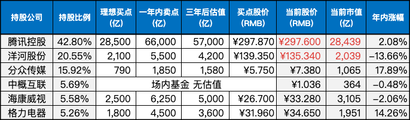

__微信公众号文章地址：[老罗实盘周记-20230826](https://mp.weixin.qq.com/s/c6SyM_drSe1quHkWXsuEOQ)__

```
老罗实盘周记，每周六更新。专注于股权投资、阅读、学习与个人成长，知行合一、日拱一卒、投资人生。微信公众号【老罗投资】，文章均首发于公众号。
```

### 1. 本周交易

+ 周四买入少量上海机场(600009)，买入价格39.07元人民币。上海机场买点为750亿人民币(对应股价30.14元)，当前市值为972亿，提前买入，加观察仓。

### 2. 目前持仓

当前持有的股票包括：

+ 腾讯控股 42.80%
+ 洋河股份 20.55%
+ 分众传媒 15.92%
+ 中概互联 5.69%
+ 海康微视 5.58%
+ 格力电器 5.26%

此外，还有少量的万科A、恒瑞医药、上海机场、宋城演义、京沪高铁等股票，其份额较少，仅作为观察仓不进行记录。

**注：港股已换算为人民币**



### 3. 上周数据


### 4. 持仓收益

本周：老罗的持仓 <strong style="color:green;">-0.70%</strong>，沪深300指数 <strong style="color:green;">-1.98%</strong>，本周终于止跌。

截止到今日，老罗实盘今年收益率为 <strong style="color:red;">+3.87%</strong>，沪深300指数今年收益率为 <strong style="color:green;">-4.20%</strong>，继续跑赢沪深300指数。

### 5. 重要事项

#### 5.1 SOHO中国暴雷

最近，中国房地产市场再次发生了动荡，SOHO中国公司也因经济困境而成为爆雷公司之一。

最新披露的2023年上半年报显示，SOHO中国旗下的子公司之一，北京望京搜候房地产有限公司，在去年2022年8月就已收到相关税务机关的通知，要求在2022年9月1日前支付望京SOHO项目塔1和塔2的土地增值税，总额高达17.33亿元人民币。

然而，截至2023年6月30日，该公司只支付了其中的3060万元人民币，远远低于应缴金额。据计算，根据逾期税款的计算方式，该公司目前需要支付的税费及滞纳金高达19.86亿元人民币。

问题不仅仅限于此，据SOHO中国公告，这笔高额的滞纳金可能导致总计42.32亿元人民币的银行借款本金出现交叉违约情况，其中包括原合同约定的在2024年6月30日后到期的借款。由于借款人可能要求立即偿还这部分借款，因此这部分借款已被报告重新划分为流动负债，相关的利息达到1057.6万元人民币。

眼见他起高楼，眼见他宴宾客，眼见他楼塌了。看了眼SOHO市值，目前只有50亿港币，曾经的明星企业，现在却债台高筑。

房地产确实属于苦生意，房企为了扩张，不得不陷入买地->盖楼->卖房->以更高的价格买地->再盖楼的循环，买地过程中往往得举债加杠杆，房地产繁荣时期，这种击鼓传花的游戏还能玩得下去，一但大环境不好，资金链很快就会断裂，企业就陷入了危机。

杠杆消灭的就是容错性，作为投资人一定要牢记：珍爱生命，远离杠杆。

#### 5.2 万科分红

另一家房企万科A本周分红了，每股派发0.68元，比起前几年分红1元左右确实是少了不少。

房地产行业不景气，万科的毛利率由37%大幅下降到了19.1%，好在万科的负债率在房企中算是控制得比较好的。

老罗认为万科大概率能活到最后，大环境不好的情况下，活着是最重要的，赚钱反倒其次，等行业周期的钟摆到达另一端，活下来的企业可能还会有机会。

#### 5.3 情绪驱使我们的行为

情绪驱使着我们的行为，赋予我们的世界多姿多彩的色彩。能够驾驭情绪的人能够掌握自身行为，而控制行为的人也能主宰更多未来的局面。

生活的本质是轻盈如鸿毛，也可能沉甸如泰山，关键在于我们抱持何种心态，如何举起那根名为生活的杠杆。若能得当地举起，即便是重担也变得轻松；如果不当心举起，泰山压顶也成常态。

智者深谙，应避免被泰山压顶，而是应像举重若轻一样应对。只有如此，人生的前景才会一片明朗。而拥有稳定情绪状态，乃是对自己最大的责任。

正如段永平所说：有人说投资改变了我的一生，这个说法其实完全不着边际，因为投资没有改变我任何东西，但我确实找到了一件很有趣的事情做而已，就像学会打高尔夫球一样。投资并没有让我觉得自己更有钱，不然很难拿得住一只涨了100多倍的股票。要想拿得住一只涨了很多的股票必须要有很好的平常心（芒格叫理性），平常人是很难有平常心的。

平常心，既不是一种纯粹的理想主义之心，也不是一种纯粹的功利主义之心，而是一种务实的理想主义之心。

市场大环境不好的情况下，投资者更应该保持一颗平常心，不要被时不时拿出来调侃的庄家阴谋论，割韭菜论，A股十年3000点等言论所影响。

因为老罗坚信不管怎么样，人总要消费，总要住房，总要坐飞机，总会去追求更好的生活。这也是优秀的企业能一直走下去的原因，也是老罗坚持长期投资优秀企业的底层逻辑。

### 6. 本周读书

#### 6.1《猫先生的情绪自救》

每逢周一，是否都对上班产生无法言喻的厌烦？驾车出行时，是否常常一触即发，容易情绪失控？明明已经锁好门，却总觉得需要再次检查？

很多时候，因为微不足道的小事而愤怒不已，不时地陷入情绪低谷？ 情绪问题的影响使我们难以高效行事，也限制了个人发展。

当你感到束手无策时，不妨翻开这本书。它以心理学为视角，深度剖析情绪，特别是负面情绪的本质和价值，专注于日常生活中普遍存在的情绪问题和场景，助你洞察情绪的关键，更好地与自己的情绪和谐相处。

老罗评分三星半⭐️⭐️⭐️❤️。

#### 6.2《罐头里的小孩》

我们对孩子的期望往往是根据我们自身的理解塑造的。多数人都希望孩子能够守规矩、懂事乖巧，不越界，成为乖宝宝。因为这种孩子看似较易教育。然而，这类孩子可能更加胆怯、依赖，缺乏决策和创造力，成长后更容易受挫。

长久以来，内卷现象极为盛行，甚至幼小的孩子也不得不在家长的催促下追求各种学习。这或许最终造就了外表上优秀却内心痛苦的个体。

想一想，孩子每天都得绷紧神经，努力将每一件事做到最好，这种状态究竟有多么累！孩子还能享受快乐吗？他们的本性被抑制了！同时，作为家长，也没有放松的机会，幸福感又何在？

因此，在孩子应该玩耍的年纪，让他们尽情发挥本性，多花些时间玩乐和创造。人类的进步不正是依靠一步步地创新吗？作为成年人，也应适度松手，减少控制欲望，自己也会更加轻松。

老罗评分四颗星⭐️⭐️⭐️⭐️。

### 7. 本周运动

本周健身房锻炼两次，每次40分钟+，主要是跑步机+划船机+椭圆机，下周继续。

祝大家周末愉快！

```
老罗实盘周记，每周六更新。专注于股权投资、阅读、学习与个人成长，知行合一、日拱一卒、投资人生。微信公众号【老罗投资】，文章均首发于公众号。
免责声明：本公众号只作为本人的投资日志记录，本文中提及的个股都有腰斩或血本无归的风险，本人不做任何投资建议，投资请坚持独立思考。
```

__微信公众号文章地址：[老罗实盘周记-20230826](https://mp.weixin.qq.com/s/c6SyM_drSe1quHkWXsuEOQ)__