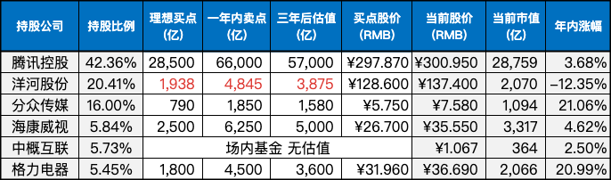

__微信公众号文章地址：[老罗实盘周记-20230902](https://mp.weixin.qq.com/s/tIVw3eOXipH0om3ja02t3A)__

```
老罗实盘周记，每周六更新。专注于股权投资、阅读、学习与个人成长，知行合一、日拱一卒、投资人生。微信公众号【老罗投资】，文章均首发于公众号。
```

### 1. 本周交易

无

### 2. 目前持仓

当前持有的股票包括：

+ 腾讯控股 42.36%
+ 洋河股份 20.41%
+ 分众传媒 16.00%
+ 海康微视 5.84%
+ 中概互联 5.73%
+ 格力电器 5.45%

此外，还有少量的万科A、恒瑞医药、上海机场、宋城演义、京沪高铁等股票，其份额较少，仅作为观察仓不进行记录。

**注：港股已换算为人民币**



### 3. 上周数据


### 4. 持仓收益

本周：老罗的持仓 <strong style="color:red;">+2.64%</strong>，沪深300指数 <strong style="color:red;">+2.22%</strong>，本周终于止跌。

截止到今日，老罗实盘今年收益率为 <strong style="color:red;">+6.51%</strong>，沪深300指数今年收益率为 <strong style="color:green;">-2.07%</strong>，继续跑赢沪深300指数。

### 5. 重要事项

#### 5.1 证券交易印花税减半征收

上周日财政部、税务总局发布公告，为活跃资本市场、提振投资者信心，自2023年8月28日起，证券交易印花税实施减半征收。这次证券交易印花税由单边征收1‰下调至0.5‰，如果按照10万元交易金额计算，证券交易印花税费用由100元下降至50元。

本周大盘四涨一跌，成交额在周一达到了1.13万亿，然后逐天下降，到周五，成交额回落到7000亿。只是政策刺激，短期内还是无法恢复投资者的信心，股市的赚钱效应也不明显，大部分人还是持币观望。

可以肯定的是政策底已经确定，市场底对政策底往往有滞后性，还需要耐心等待一些时间，静待市场复苏。

老罗一直认为，市场悲观时才是买入的好时机，这时有大量便宜的好公司可以买入，不要等到这些公司变贵了，看到别人赚钱眼红了才杀入市场，盲目跟风，结果往往不会太好。

#### 5.2 洋河股份半年报

先看业绩，洋河上半年营收218.7亿，同比增长15.7%，归母净利润78.6亿，同比增长14.1%；其中Q2营收68.3亿，同比增长16.1%，归母净利润21亿，同比增长9.9%。

业绩乍一看还不错，相较于大A的几千家公司，赚钱能力算是出众。不过如果对比白酒同行业的友商泸州老窖(营收+25.11%，净利+28.17%)、古井贡(营收+25.64%，净利+33.85%)、今世缘(营收+28.46%，净利+26.70%)等中报，确实是有点拿不出手。

有两个比较明显的负面，一个是在江苏省内的占有率，都比不过今世缘了，老家被抄。二是合同负债大降32.69%，经销商的打款意愿下降。

白酒行业上半年营收占大头，占比一般在六成以上。粗估洋河全年营收在350±5亿，全年归母净利润110亿±5亿，按每年利润增长12%计算(白酒竞争激烈，保守点估算)，三年后利润在155亿区间。

按25倍PE估值，三年后市值下调为3875亿，目前理想买点下调为1938亿(对应股价128.6元)，一年内卖点下调为4845亿。持仓上限保持不变，依然为25%。目前137.4元的股价还不算贵，大概率还能赚到业绩增长的钱。

#### 5.3 格力电器半年报

格力上半年营收997.9亿，同比增长4.16%，归母净利润126.73亿，同比增长10.52%。主要营收来源依然是空调业务，占比达到七成以上。

格力的上半年的增长没有达到同行业平均值，在空调销量上也已经落后于美的。但基本盘还在，好空调格力造这句口号依然深入人心，加上还算不错的分红(今年分红腰斩)，老罗还是会5%小仓位持有，估值也暂不调整。

### 6. 本周读书

本周读完三本书：

+ 《赛雷三分钟漫画孙子兵法》评分三星半 ⭐️⭐️⭐️❤️
+ 《从文自传》评分四星 ⭐️⭐️⭐️⭐️
+ 《月亮冰淇淋》评分三星半 ⭐️⭐️⭐️❤️

今后觉得非常值得一读的书籍才会写推荐，尝试不断的做减法中。

### 7. 本周运动

本周健身房锻炼两次，每次40分钟+，主要是跑步机+划船机，下周继续。

祝大家周末愉快！

```
老罗实盘周记，每周六更新。专注于股权投资、阅读、学习与个人成长，知行合一、日拱一卒、投资人生。微信公众号【老罗投资】，文章均首发于公众号。
免责声明：本公众号只作为本人的投资日志记录，本文中提及的个股都有腰斩或血本无归的风险，本人不做任何投资建议，投资请坚持独立思考。
```

__微信公众号文章地址：[老罗实盘周记-20230902](https://mp.weixin.qq.com/s/tIVw3eOXipH0om3ja02t3A)__