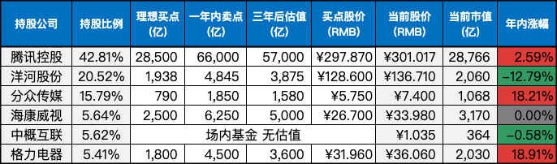

__微信公众号文章地址：[老罗实盘周记-20230909](https://mp.weixin.qq.com/s/dn-80oF9jO2PJill2hcwNA)__

```
老罗实盘周记，每周六更新。专注于股权投资、阅读、学习与个人成长，知行合一、日拱一卒、投资人生。微信公众号【老罗投资】，文章均首发于公众号。
```

### 1. 本周交易

无

### 2. 目前持仓

当前持有的股票包括：腾讯控股 42.81%、洋河股份 20.52%、分众传媒 15.79%、海康微视 5.64%、中概互联 5.62%、格力电器 5.41%。

此外，还有少量的万科A、恒瑞医药、上海机场、宋城演义、京沪高铁等股票，其份额较少，仅作为观察仓不进行记录。

**注：港股已换算为人民币**



### 3. 上周数据


### 4. 持仓收益

本周：老罗的持仓 <strong style="color:green;">-1.40%</strong>，沪深300指数 <strong style="color:green;">-1.36%</strong>，本周又开始下跌。

截止到今日，老罗实盘今年收益率为 <strong style="color:red;">+5.11%</strong>，沪深300指数今年收益率为 <strong style="color:green;">-3.40%</strong>，继续跑赢沪深300指数。

### 5. 重要事项

#### 5.1 八月份经济数据

八月份经济数据本周出炉，8月份CPI同比上涨0.1%，环比上涨0.3%，CPI同比如期转正了。PPI同比下降3.0% 环比上涨0.2%。货币开闸放水还是很有作用的，有效地延缓了经济继续下滑。

今年8月份进出口、出口以及进口数据(以美元计价)分别同比-8.2%、-8.8%和-7.3%，但是比7月的-13.6%、-14.5%和-12.4%的降幅已经好上了不少，当然，去年8月的基数比7月要低也占一部分原因，不过总体情况还是有所改善。国外通涨严重，需求下降造成出口不振也是正常，出口恢复，估计得熬到加息周期结束了。

本周，房地产行业继续松绑，公布了包括首套存量住房利率调整，南京取消楼市限购等消息，取消楼市限购大概率其他非一线城市也会很快跟进。房地产行业影响的范围巨大，现在泡沫基本被挤干净了，普通人也意识到房是用来住，不是用来炒的。也不能一味的抑制正常的居住需求，健康的楼市对中国经济更为有利。

#### 5.2 酱香拿铁

这妥妥地算强强联合了，一边是A股BUG，核动力印钞机，比门捷列夫元素周期表多800种元素，茅酱香科技之王-台酒；一边是国货之光，美利坚韭菜收割机，纳斯达克泥石流，美国投资者绕不开的噩梦，世界烧钱大赛的无冕之王，瑞民族之光-幸咖啡。

9月4号发售当天就销售额过亿，老罗也好奇喝了一杯。总的来说味道很奇怪，可能是因为白酒含量只有2毫升，浓度不够，并没有茅台的那种酱香味道，反而类似于清香白酒的口味。入口有点发涩，回味也有点发苦，并不是很好喝。

当代年轻人越来越少喝白酒，茅台集团从茅台冰淇淋到酱香拿铁，通过咖啡、冰淇淋这种年轻人容易接受的方式，推出联名款，让年轻人可以低门槛地品尝到高端白酒，这也算一种很不错的思路。从销量和反馈上来看，这次茅台和瑞幸的“强强联合”，效果非常不错。

#### 5.3 胡主编与股民互怼

本周还有一个有意思的事，胡主编在微博和股民怼起来了，一个月前初入股市时胡主编还信心满满，认为A股这么便宜，买入后赚钱还不是洒洒水。短短一个月，就被大A教做人，搞得心态都快崩了。


老罗认为(胡主编体)，投资股市最重要的是心态，买股票其实买的是股票背后公司的股权，要赚的钱是公司盈利自然增涨的钱，而不是搏傻游戏，零和博弈。

股市短期是投票机，长期是称重器，股市短期的波动并不是风险，却往往是以便宜价格买入优质股权的良机。这也是股权纯买入方(喜欢下跌买入好公司股权)与股票纯卖出方(喜欢股票上涨卖出获取资本利得)，看同一个问题的不同视角。

在整体行情不景气的情况下，多看书，多学习，离股市远一点，心态放平和，收获的季节迟早会到来的。

### 6. 本周读书

本周读完五本书：

+ 《小房子》评分三星半 ⭐️⭐️⭐️❤️
+ 《灶王爷》评分三星半 ⭐️⭐️⭐️❤️
+ 《天使时代》评分四星半 ⭐️⭐️⭐️⭐️❤️
+ 《糖球》评分四星 ⭐️⭐️⭐️⭐️
+ 《出逃的煎蛋》评分三星半 ⭐️⭐️⭐️❤️

《天使时代》是刘慈欣的两个短篇科幻合集，并针对小朋友做了优化，删除了一些偏暴力的部分。大刘的作品质量一直有保障，值得一看。

其他四本书都是1000字左右的小绘本，能非常轻松地看完。

### 7. 本周运动

本周健身房锻炼三次，每次40分钟+，主要是跑步机+划船机，下周继续。人生下半场，最终拼的还是健康和长寿。

祝大家周末愉快！

```
老罗实盘周记，每周六更新。专注于股权投资、阅读、学习与个人成长，知行合一、日拱一卒、投资人生。微信公众号【老罗投资】，文章均首发于公众号。
免责声明：本公众号只作为本人的投资日志记录，本文中提及的个股都有腰斩或血本无归的风险，本人不做任何投资建议，投资请坚持独立思考。
```

__微信公众号文章地址：[老罗实盘周记-20230909](https://mp.weixin.qq.com/s/dn-80oF9jO2PJill2hcwNA)__