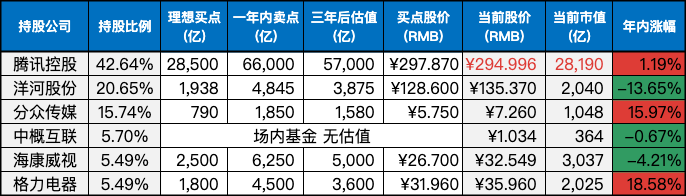
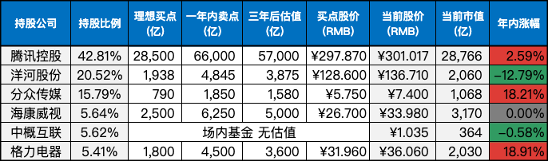

__微信公众号文章地址：[老罗实盘周记-20230916](https://mp.weixin.qq.com/s/vIRJ55qv9w4wVpbWqIujuw)__

```
老罗实盘周记，每周六更新。专注于股权投资、阅读、学习与个人成长，知行合一、日拱一卒、投资人生。微信公众号【老罗投资】，文章均首发于公众号。
```

### 1. 本周交易

无

### 2. 目前持仓

当前持有的股票包括：腾讯控股 42.64%、洋河股份 20.65%、分众传媒 15.74%、中概互联 5.70%、海康微视 5.49%、格力电器 5.49%。

此外，还有少量的万科A、恒瑞医药、上海机场、宋城演义、京沪高铁等股票，其份额较少，仅作为观察仓不进行记录。

**注：港股已换算为人民币**



### 3. 上周数据



### 4. 持仓收益

本周：老罗的持仓 <strong style="color:green;">-1.72%</strong>，沪深300指数 <strong style="color:green;">-0.83%</strong>，连续两周下跌。

截止到今日，老罗实盘今年收益率为 <strong style="color:red;">+3.39%</strong>，沪深300指数今年收益率为 <strong style="color:green;">-4.21%</strong>，继续跑赢沪深300指数。

### 5. 重要事项

#### 5.1 今年第二次降准

央妈周四宣布降准0.25个百分点，这是年内第二次降准，预计释放中长期流动性超过5000亿元。

周五的股市表现还是一般，中午挣扎了一下，到下午又是一路下跌，收盘上证跌0.28%，深证跌0.52%，一点没利好释放的样子。

现在流动性非常宽裕，问题主要在民营企业维持不易，不敢轻易地扩大生产，大量资金在金融系统空转。普通人也都不敢贷款和消费，消费集中在小打小闹的餐饮或是旅游上，对整体经济的拉动十分有限。

A股价值要回归到正常，还需要美国加息周期明确结束，整体经济可能明年才会好起来吧。

近期除了腾讯也没有达到买点的公司，因为腾讯持仓过高，所以目前还是躺平不动，只定投一些便宜的基金，股市还是耐心等待，慢慢寻找机会。

#### 5.2 茅台德芙联名巧克力

贵州茅台继携手瑞幸推出酱香拿铁后，又在微博和德芙官宣，于9月16日推出跨界新品酒心巧克力。此款巧克力命名为“茅小凌酒心巧克力”，每颗巧克力都添加2%的53度贵州茅台酒，包括经典、减糖两种口味，规格分别是2粒20g，12粒120g。

今天下午15:30时开始抢购，一分钟内没货，老罗晚了5分钟才想起这事，打开i茅台已经发现售罄，只能遗憾等下轮预售了。酒心巧克力确实比雪糕、咖啡和白酒的匹配度更高，消费者的接受度也会更高。

还有一件有意思的事，十几年前，茅台就和上海某食品公司合作推出过茅台酒心巧克力，这家食品公司目前属于冠生园集团，小时候吃的大白兔奶糖就是冠生园的。

#### 5.3 投资最重要的十八件事

《投资最重要的事》这本书中的十八件要事，老罗觉得非常值得记录一下：

1. 最重要的不是盲目相信股市总是有效或者总是无效，而是清醒认识到股市相当高效而且相当难以击败，只有真正的高手才能长期战胜市场。

2. 最重要的投资决策不是以价格为本而是以价值为本。

3. 最重要的不是买好的而是买得好。

4. 最重要的不是波动性风险而是永久损失的可能性风险。

5. 最重要的巨大风险不是人人恐惧而是人人都觉得风险很小。

6. 最重要的不是追求高风险高收益而是追求低风险高收益。

7. 最重要的不是趋势而是周期。

8. 最重要的不是市场心理钟摆的中点而是终点的反转。

9. 最重要的不是顺势而为而是逆势而为。

10. 最重要的不是想到而是做到逆向投资。

11. 最重要的不是价格、价值而是相对的性价比，即安全边际。

12. 最重要的不是主动寻找机会而是耐心等待机会上门。

13. 最重要的不是预测未来而是认识到未来无法预测但可以做好准备。

14. 最重要的不是关注未来而是关注现在。

15. 最重要的是认识短期业绩靠运气、长期业绩靠技术。

16. 最重要的不是进攻而是防守。

17. 最重要的不是追求伟大成功而是避免重大错误。

18. 最重要的不是牛市跑赢市场而是熊市跑赢市场。

### 6. 本周读书

本周读完三本书：

+ 《我是狗》评分三星半 ⭐️⭐️⭐️❤️
+ 《澡堂里的仙女》评分三星半 ⭐️⭐️⭐️❤️
+ 《陪伴式成长：和孩子一起成为更好的自己》评分四颗星 ⭐️⭐️⭐️⭐️。作为最具挑战，最重要的工作之一：育儿，却完全不需要父母接受任何培训或取得什么资格。育儿更重要是自我成长，成为更好的父母。

### 7. 本周运动

本周健身房锻炼三次，每次40分钟+，主要是跑步机+划船机，下周继续。

祝大家周末愉快！

```
老罗实盘周记，每周六更新。专注于股权投资、阅读、学习与个人成长，知行合一、日拱一卒、投资人生。微信公众号【老罗投资】，文章均首发于公众号。
免责声明：本公众号只作为本人的投资日志记录，本文中提及的个股都有腰斩或血本无归的风险，本人不做任何投资建议，投资请坚持独立思考。
```

__微信公众号文章地址：[老罗实盘周记-20230916](https://mp.weixin.qq.com/s/vIRJ55qv9w4wVpbWqIujuw)__