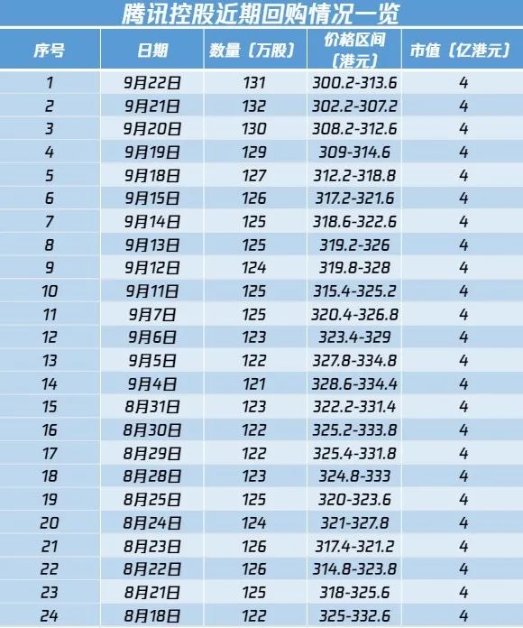

__微信公众号文章地址：[老罗实盘周记-20230923](https://mp.weixin.qq.com/s/cy4DWDdRRU9ubsSAkgdZBQ)__

```
老罗实盘周记，每周六更新。专注于股权投资、阅读、学习与个人成长，知行合一、日拱一卒、投资人生。微信公众号【老罗投资】，文章均首发于公众号。
```

### 1. 本周交易

无

### 2. 目前持仓

当前持有的股票包括：腾讯控股 42.64%、洋河股份 20.46%、分众传媒 15.95%、中概互联 5.63%、格力电器 5.61%、海康微视 5.61%。

此外，还有少量的万科A、恒瑞医药、上海机场、宋城演义、京沪高铁等股票，其份额较少，仅作为观察仓不进行记录。

**注：港股已换算为人民币**


### 3. 上周数据


### 4. 持仓收益

本周：老罗的持仓 <strong style="color:green;">-0.23%</strong>，沪深300指数 <strong style="color:red;">+0.81%</strong>，实盘连续三周下跌。

截止到今日，老罗实盘今年收益率为 <strong style="color:red;">+3.16%</strong>，沪深300指数今年收益率为 <strong style="color:green;">-3.43%</strong>，继续跑赢沪深300指数。

### 5. 重要事项

#### 5.1 证监会将完善优化现金分红监管制度

证监会近期计划对上市市现金分红规则进行修改，对不分红或分红少的公司加强制度上的约束，督促进行分红。

其实在8月底已经出台过分红与减持挂钩的政策，上市公司如果最近三年没有进行现金分红，或者是累计现金分红的金额低于最近三年年平均利润30%，控股股东和实际控股人不能通过二级市场减持本公司的股份。

在A股分红还是非常重要的，如果企业闲置资金无需投放再生产，或者没有像伯克希尔哈撒韦那种投资能力，赚到的利润与其存在银行里吃利息，不如分红回馈给股东。分红一方面能表明企业有稳健的盈利能力，另一方面通过现金分红来回馈股东能证明企业的社会责任感。

证监会此举主要是为了提振投资者对上市公司的信心，这两个月虽然利好不断，但上证依然在3100点左右徘徊，同时市场上还存在着一些乱象。

上个月就有一个离谱的公司，募资200多亿上市，不光是上市当天就破发，转头还就拿着募集来的钱拿去买理财，真是把股民当提款机，当韭菜来收割，长此以往谁还敢投资A股？

股市应该起到融资、投资、资源配置优化的功能。好企业能以低成本拿到社会资金，实现扩展大再生产；投资者能有机会参股优秀企业，实现资产保值增值；市场资金会向那些具有前瞻性、开拓性、有优秀发展前景的好企业自然流动，实现社会资源优化配置。

#### 5.2 腾讯回购情况

腾讯中报发布后，已经连续24个交易日回购，每日耗资4亿港币，回购120-130万股不等。



近期港股又大幅回调，恒生指数估值回到了06年的水平，内在价值严重低估，港股公司爆发了回购潮。

截止到9月15日，港股年内回购的金额已经达到了735亿港币，已经是2022年全年的70%，预计港股今年的回购金额能突破千亿港币，是之前五年平均水平的近4倍。

其中腾讯一家公司的回购金额就达到了297亿港币，占比超过四成，每天回购四亿，正好是腾讯一天的利润。

#### 5.3 美联储暂停加息

本周迎来了超级央行周，全球多国央行将发布重要利率决策，其中备受关注的是美联储是否继续加息。

自去年3月开始加息以来，美联储已经连续加息了11次，将联邦基金利率区间提高至5.25%-5.5%，达到了过去22年来的最高水平，加息累计幅度超过525个基点。

然而，美国劳工部公布的8月通胀率已经从去年的高峰9.1%下降至3.7%。此外，联邦基金利率期货合约的定价显示，未来进一步加息的概率仅维持在40%左右，这可能意味着美联储即将结束近40年来最激进的紧缩政策周期。

尽管通胀从高位回落，但美国财政部长耶伦最近表示，她越来越相信美国能够在不对就业市场造成严重破坏的情况下控制通胀。然而，消费者对美国通胀和经济前景的看法并不乐观。

根据美联储的调查，8月份美国消费者的一年期通胀预期从3.5%略微上升至3.6%，而三年期通胀预期从2.9%略微下降至2.8%，五年期通胀展望从2.9%略微上升至3.0%。

这表明通胀水平可能会在相当长的一段时间内超过美联储的政策目标，因此美联储可能需要将货币政策利率保持在相对高位以应对通胀压力。

美国较高的利率水平可能一直会延续到24年，这两年的经济压力可能依旧很大。

### 6. 本周读书

本周读完三本书：

+ 《诗云》大刘的作品依然品质有保证，评分四星半 ⭐️⭐️⭐️⭐️❤️
+ 《星际移民》由几个科幻小短篇组成，其中几篇让人印象深刻，评分四星 ⭐️⭐️⭐️⭐️
+ 《我的理想》评分三星 ⭐️⭐️⭐️

### 7. 本周运动

本周健身房锻炼两次，每次40分钟+，主要是跑步机+划船机，下周继续。

祝大家周末愉快！

```
老罗实盘周记，每周六更新。专注于股权投资、阅读、学习与个人成长，知行合一、日拱一卒、投资人生。微信公众号【老罗投资】，文章均首发于公众号。
免责声明：本公众号只作为本人的投资日志记录，本文中提及的个股都有腰斩或血本无归的风险，本人不做任何投资建议，投资请坚持独立思考。
```

__微信公众号文章地址：[老罗实盘周记-20230923](https://mp.weixin.qq.com/s/cy4DWDdRRU9ubsSAkgdZBQ)__