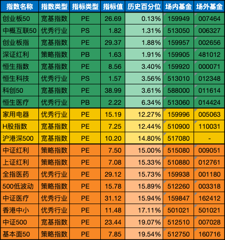

__微信公众号文章地址：[老罗基金估值-20231010](https://mp.weixin.qq.com/s/cc8t1L3o_tD7SgUgEEgyvA)__

```
老罗基金估值，每周二更新。专注于股权投资、阅读、学习与个人成长，知行合一、日拱一卒、投资人生。微信公众号【老罗投资】，文章均首发于公众号。
```

### 1. 近期操作

#### 1.1 周一清仓卖出

+ (160716) 嘉实中证锐联基本面50指数(LOF)A
+ (519671) 银河沪深300价值指数A

这两只基金目前都不算太高估，只是最近有更好的机会，投资最重要的是不断的比较，永远把资金放在胜率更高的资产上。

卖出的资金，计划一部分用来买入腾讯控股(300港币以内)或洋河股份(128.6人民币以内)，一部分用来定投估值更便宜的基金。

#### 1.2 周二定投3500元

+ (007464) 交银施罗德创业板50指数A，固定金额买入500元。
+ (006327) 易方达中证海外中国互联网50ETF联接(QDII)A，固定金额买入500元。
+ (002656) 南方创业板ETF联接A，固定金额买入500元。
+ (481012) 工银深证红利ETF联接A，固定金额买入500元。
+ (000071) 华夏恒生ETF联接(QDII)A，固定金额买入500元。
+ (012348) 天宏恒生科技指数(QDII)A，固定金额买入500元。
+ (011614) 工银科创50联接A，固定金额买入500元。

### 2. 相关数据

#### 2.1 巴菲特指数

股票市价总值/GDP：64.05%，股票流通市值/GDP：55.65%。

中国巴菲特指数计算公式：年末境内上市股票市价总值 / 国内生产总值(GDP)。

巴菲特指数在70%水平以下买入胜率会很高，为100%时表明估值合理，114％至134％的区间为略微高估，超过134％即为严重高估，在200%左右购买股票等同于玩火自焚。

#### 2.2 格雷厄姆指数

上交所：3.03，深交所：1.67，全市场：2.16。

格雷厄姆指数计算公式：盈利收益率 / 无风险利率(10年期国债利率)。当格雷厄姆指数大于2时，代表股票市场出现了比较好的投资机会。

#### 2.3 全市场趋势

上交所股票平均市盈率：12.31，深交所股票平均市盈率：22.33，沪深300滚动市盈率：11.51，10年期国债收益率：2.6811%。

当前全市场处于 <strong style="color:green;">低估</strong> 状态，非常适合基金定投。

### 3. 基金估值



```
老罗基金估值，每周二更新。专注于股权投资、阅读、学习与个人成长，知行合一、日拱一卒、投资人生。微信公众号【老罗投资】，文章均首发于公众号。
免责声明：本文中提及的基金都有较大波动风险，投资需谨慎。
```

__微信公众号文章地址：[老罗基金估值-20231010](https://mp.weixin.qq.com/s/cc8t1L3o_tD7SgUgEEgyvA)__