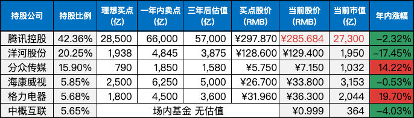

__微信公众号文章地址：[老罗实盘周记-20231014](https://mp.weixin.qq.com/s/ackxjKRGTTU6f-3ERhD3SA)__

```
老罗实盘周记，每周六更新。专注于股权投资、阅读、学习与个人成长，知行合一、日拱一卒、投资人生。微信公众号【老罗投资】，文章均首发于公众号。
```

### 1. 本周交易

+ 本周分两次买入洋河股份(002304)，买入价格分别为 128.6 元和 125.1 元。

### 2. 目前持仓

当前持有的股票包括：腾讯控股 41.03%、洋河股份 20.34%、分众传媒 15.51%、海康微视 5.74%、中概互联 5.52%、格力电器 5.26%。

此外，还有少量的万科A、恒瑞医药、上海机场、宋城演义、京沪高铁等股票，其份额较少，仅作为观察仓不进行记录。

**注：港股已换算为人民币**


### 3. 上周数据



### 4. 持仓收益

本周：老罗的持仓 <strong style="color:green;">-1.31%</strong>，沪深300指数 <strong style="color:green;">-0.71%</strong>，实盘连续六周下跌。

截止到今日，老罗实盘今年收益率为 <strong style="color:green;">-0.45%</strong>，今年收益再次为负。沪深300指数今年收益率为 <strong style="color:green;">-5.38%</strong>，继续跑赢沪深300指数。

### 5. 重要事项

#### 5.1 腾讯下周起暂停回购

因为腾讯在11月15日将会发布三季报，按照港交所的规定财报发布前一个月不得回购，所以企鹅的回购从下周起将停止。

半年报发布之后的三个月，已经有38个交易日进行了回购，每天回购金额达到了4亿港币，累计耗资达150+亿港币，明细见下表：


本周少量资金到位，腾讯如果跌到300港币以内，会逐步进行买入操作。

#### 5.2 洋河负面造成股价大跌

本周洋河跌幅达到了5.82%，仅『黑色星期五』当天，就下跌了3.52%，现在总市值已经跌到了1835亿，对于一家年利润过百亿的白酒企业来说，现在这个市值怎么看也不算贵了。

造成下跌的主要原因，应该是市场有小道消息，洋河在06年进行改制时，可能涉及到了国有资产的流失，正在被相关部门大力追缴，据说监管部门要查封蓝色同盟账面的资金达10多亿元。

但消息目前不知道真假，即使是真的，这件事对洋河这个企业本身的价值影响也不会太大。如果市场先生因为负面消息，给出更便宜的报价，老罗还会进一步的买入。

本周两次操作都是在开盘前限价买入的，基本买到了当天的『山顶』，老罗没有能力也没有意愿去预测短期股价走势，下周会继续在120.10元限价买入。

#### 5.3 如何做决策

在一件事情上要做决策的时候，一般会碰到两种情况：一种是不可逆的决策，它就像是一扇单向门，你穿过了就不能再回来了；另一种是可逆的决策，就像是双向门，穿过了还可以再回来。

怎么区分它们呢？你可以看这个决策的撤销成本，撤销成本越高，决策就越不可逆，撤销成本越低，决策就越可逆。这里要说的窍门是，做可逆的决策要快，做不可逆的决策要慢。

当决策是可逆的，就要快速做出决定，最大的风险是拖拖拉拉、犹豫不决而错过机会。当决策是不可逆的，就要放慢速度，设法获取更多的决策信息，最大的风险是做出错误的决策而无法挽回。

亚马逊的老板贝佐斯认为，不可逆决策如果有70%的把握能确定结果，就是采取行动的时候，如果不是那么有把握，那就不妨再观察一下。

总之，可逆决策的最大风险是拖到了最后一分钟，不可逆决策的最大风险是在真正需要决策的时刻来临之前，就做出了决定。

#### 5.4 理解芒格的思维格栅理论

思维格栅就像是一个多层筛选装置，与『财报用于排除企业』的逻辑类似。通过多个维度，比如商业模式、财务数据、管理层素质及人品等，都无法剔除掉某个企业，那表明它很可能是一个优秀的投资标的。

查理芒格的思维格栅，也是这样的多维筛选（排除）装置。他主张，如果涵盖多个学科领域的知识都无法排除某个决策（不限于投资），那么这个决策很可能是高概率的正确决策。

​做任何事，包括投资一家企业时要多用排除法，总是反过去想。

### 6. 近期读书

十一假期时间比较多，两周读完了九本书，主要是阅读起来比较轻松的科幻短篇：

+ 《百万富翁快车道》本书讲述了作者的致富思维和创业理念，与巴菲特慢慢致富的思路完全不同，作者更看重的是走上快车道，年轻时就变得富有。老罗评分三星半 ⭐️⭐️⭐️❤️
+ 《地球大炮》老罗评分四颗星 ⭐️⭐️⭐️⭐️
+ 《地火》老罗评分三星半 ⭐️⭐️⭐️❤️
+ 《超新星纪元》老罗评分三星半 ⭐️⭐️⭐️❤️
+ 《金瓜儿银豆儿》很有意思的绘本，适合小朋友观看。老罗评分三星半 ⭐️⭐️⭐️❤️
+ 《长期投资》在牛市中尽量追上市场，在熊市中要战胜市场。老罗评分三颗星 ⭐️⭐️⭐️️
+ 《朝闻道》老罗评分四颗星 ⭐️⭐️⭐️⭐️
+ 《烧火工》老罗评分三星半 ⭐️⭐️⭐️❤️
+ 《中国太阳》老罗评分三星半 ⭐️⭐️⭐️❤️

### 7. 本周运动

本周户外徒步四次，因腿部受了点伤，下周暂停运动，休养一段时间。

祝大家周末愉快，愿世界和平！

```
老罗实盘周记，每周六更新。专注于股权投资、阅读、学习与个人成长，知行合一、日拱一卒、投资人生。微信公众号【老罗投资】，文章均首发于公众号。
免责声明：本公众号只作为本人的投资日志记录，本文中提及的个股都有腰斩或血本无归的风险，本人不做任何投资建议，投资请坚持独立思考。
```

__微信公众号文章地址：[老罗实盘周记-20231014](https://mp.weixin.qq.com/s/ackxjKRGTTU6f-3ERhD3SA)__