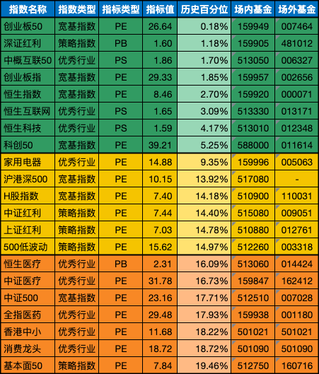

__微信公众号文章地址：[老罗基金估值-20231017](https://mp.weixin.qq.com/s/tJhRqBFtuxMYBYsE93YX2Q)__

```
老罗基金估值，每周二更新。专注于股权投资、阅读、学习与个人成长，知行合一、日拱一卒、投资人生。微信公众号【老罗投资】，文章均首发于公众号。
```

### 1. 近期操作

最近几个月市场冷淡，收益普遍较差。拿沪深300指数举例，近三年收益情况：21年 -5.20%，22年 -21.63%，23年到今天为止 -6.00%。

沪深300指数自2005年4月8日发布以来，从来没有过连续3年下跌，如果今年到年底还没有起色，这也是创造历史记录的一件事，不过历史记录就是用来被打破的。

市场下行，对于指数定投来说反而是件好事，可以用同样的金额买到更多的份额，指数基金低估时买入，当作未知年化收益的定期存款，长期持有肯定会有不错的收益。

**今日定投2500元**

+ (007464) 交银施罗德创业板50指数A，固定金额买入500元。
+ (481012) 工银深证红利ETF联接A，固定金额买入500元。
+ (006327) 易方达中证海外中国互联网50ETF联接(QDII)A，固定金额买入500元。
+ (002656) 南方创业板ETF联接A，固定金额买入500元。
+ (000071) 华夏恒生ETF联接(QDII)A，固定金额买入500元。

### 2. 相关数据

#### 2.1 巴菲特指数

股票市价总值/GDP：63.94%<span class="green">↘</span> (上周：64.05%)，
股票流通市值/GDP：55.61%<span class="green">↘</span> (上周：55.65%)。

中国巴菲特指数计算公式：年末境内上市股票市价总值 / 国内生产总值(GDP)。

巴菲特指数在70%水平以下买入胜率会很高，为100%时表明估值合理，114％至134％的区间为略微高估，超过134％即为严重高估，在200%左右购买股票等同于玩火自焚。

#### 2.2 格雷厄姆指数

上交所：3.01<span class="green">↘</span> (上周：3.03)，
深交所：1.68<span class="red">↗</span> (上周：1.67)，
全市场：2.17<span class="red">↗</span> (上周：2.16)。

格雷厄姆指数计算公式：盈利收益率 / 无风险利率(10年期国债利率)。当格雷厄姆指数大于 2 时，代表股票市场出现了比较好的投资机会。

#### 2.3 全市场趋势

上交所股票平均市盈率：12.35<span class="red">↗</span> (上周：12.31)，
深交所股票平均市盈率：22.11<span class="green">↘</span> (上周：22.33)，
沪深300滚动市盈率：11.45<span class="green">↘</span> (上周：11.51)，
10年期国债收益率：2.6882%<span class="red">↗</span> (上周：2.6811%)。

当前全市场处于 <strong style="color:green;">低估</strong> 状态，非常适合基金定投。

### 3. 基金估值



```
老罗基金估值，每周二更新。专注于股权投资、阅读、学习与个人成长，知行合一、日拱一卒、投资人生。微信公众号【老罗投资】，文章均首发于公众号。
免责声明：本文中提及的基金都有较大波动风险，投资需谨慎。
```

__微信公众号文章地址：[老罗基金估值-20231017](https://mp.weixin.qq.com/s/tJhRqBFtuxMYBYsE93YX2Q)__