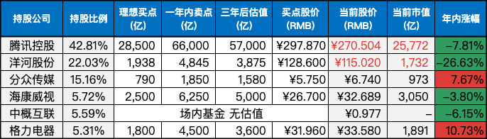

__微信公众号文章地址：[老罗实盘周记-20231021](https://mp.weixin.qq.com/s/XVIrjIkCY7r9NpBB7EPq_Q)__

```
老罗实盘周记，每周六更新。专注于股权投资、阅读、学习与个人成长，知行合一、日拱一卒、投资人生。微信公众号【老罗投资】，文章均首发于公众号。
```

### 1. 本周交易

+ 本周分两次买入洋河股份(002304)，周一买入价格 120.1 元人民币，周五买入价格 115.1 元人民币。
+ 周五买入腾讯控股(00700)，买入价格为 298 元港币。

### 2. 目前持仓

当前持有的股票包括：腾讯控股 42.81%、洋河股份 22.03%、分众传媒 15.16%、海康微视 5.72%、中概互联 5.59%、格力电器 5.31%。

此外，还有少量的万科A、恒瑞医药、上海机场、宋城演义、京沪高铁等股票，其份额较少，仅作为观察仓不进行记录。

**注：港股已换算为人民币**



### 3. 上周数据


### 4. 持仓收益

本周：老罗的持仓 <span class="green">-5.77%</span>，沪深300指数 <span class="green">-4.17%</span>。本周回撤较多，老罗实盘连续七周下跌。

截止到今日，老罗实盘今年收益率为 <span class="green">-6.22%</span>，今年收益再次为负。沪深300指数今年收益率为 <span class="green">-9.33%</span>，继续跑赢沪深300指数。

### 5. 重要事项

#### 5.1 3000点保卫战

周五下午三点收盘后，上证指数定格在了2983.06点，跌幅为0.74%，时隔一年之后，上证指数再次失守3000点大关。

老罗对历史上的3000点保卫战也比较好奇，找了些资料进行了回顾：

**第1轮：2008年4月至6月**

时间长度近2个月，未成功。

在当年全球金融危机的背景下，仅持续了不到两个月就『缴械投降』，最后一路跌到10月份的1664点才最后到底。从跌破3000点到触底，最大跌幅达到了-44.5%。

后来大A稳步回升，到09年的8月初，又累计反弹了75%。

**第2轮：2009年8月至2011年4月**

时间长度近20个月，未成功。

09年之后全球金融危机逐步缓解，A股也迎来了一轮强势的反弹行情，到7月份一路上涨到3500点附近，但8月份转为快速下跌，一直到13年6月的1849点才最终见底。从跌破3000点到触底，最大跌幅达到了-38.3%。

**第3轮：2015年8月至2016年初**

时间长度近5个月，保卫成功。

15年8月25日，上证跌破3000点，一度下探到2850点，随后展开大批弹到了3700点附近，但在16年初再度跌破3000点，到16年1月27日见底2638点。从跌破3000点到触底，最大跌幅-12%。

**第4轮：2018年2月至6月**

时间长度近4个月，未成功。

受国际贸易摩擦等因素影响，2018年初沪指从3500点退守至3000点附近，但始终没有跌破3000点。一直到6月19日，上证击穿3000点，然后一路下行，到19年的1月份见底2440点。从跌破3000点到触底，最大跌幅-18.6%。

**第5轮：2019年5月至2020年6月**

时间长度近13个月，保卫成功。

2019年5月至2020年6月，沪指在3000点附近展开拉锯，期间多次突破也多次突破3000点，也曾多次跌破。不过到2020年7月1日，沪指突破3000点后便一直稳健运行其上。从跌破3000点到触底，最大跌幅-11.8%。

**第6轮：2022年4月末5月初**

时间长度近半个月，保卫成功。

受国际和国内重大事件的影响，4月25日沪指时隔近两年再度击穿3000点大关，但4月27日就见底2863点，不到两周时间重新站稳了3000点。从跌破3000点到触底，最大跌幅-4.5%。

**第7轮：2022年10月至2022年11月**

时间长度近1个月，保卫成功。

距离前次3000点时隔半年左右，国内外因素夹击下，10月10日沪指再次收出长阴线，击穿3000点大关，10月31日即见底2893.48点，后逐渐反弹重新站稳3000点。从跌破3000点到触底，最大跌幅-4.33%。

**第8轮：2023年10月20日至？**

然后就是现在这轮3000点保卫战了，不知道持续多久才会结束。

**总结：**

从历史数据来看，2015年后3000点保卫战的胜率就已经很高了(近5次保卫战4胜1负，胜率高达80%)，并且最大跌幅也越来越小。

我想这种表现，一方面是指数慢慢正确反映了中国的经济实际情况，不存在上古时期的那种泡沫与水分，企业股权偏离了内在价值，会很快做出自我修正。

另一方面也表现了投资者的逐渐成熟，在股市大跌，市场环境充满悲观的情况下，越来越多的投资者能沉住气，不再追涨杀跌，随波逐流。『波动不是风险，本金的永久损失才是』，如果这个时候割肉止损了，才是最大的风险。

当然看历史数据总有些看后视镜的感觉，历史经验总是用来打脸的。投资者如果真正想做好投资，应该减少外部信息对决策的干扰，少看新闻，多读财报！

#### 5.2 分众发布Q3业绩预告

分众10月17日发布了前三季度的业绩预告：

+ 预计前3季度归母净利润同比增长64.8%-69.5%，至35.1-36.1亿元。
+ 扣非归母净利同比增长62.6%-67.7%，至31.7-32.7亿元。
+ 对应第三季度归母净利同比增长76.0%-89.9%，至12.8-13.8亿元。
+ 扣非归母净利同比增长37.7%-49.2%，至12.0-13.0亿元。

这份业绩预告算是超出预期了，分众目前保持着持仓上限，老罗继续呆坐不动。

都说广告行业是国民经济的晴雨表，作为电梯广告的龙头企业，分众的表现说明国民经济其实并没有人们说的那么差？

#### 5.3 前三季度的GDP初步核算数据

本周国家统计局发布了前三季度的GDP初步核算数据，前三季度国内生产总值91.3万亿元，同比增长5.2%。分季度看：一季度增长4.5%，二季度增长6.3%，三季度增长4.9%。

三季度的增长超出预期，今年全年的经济增长目标达成有望。

#### 5.4 永远弄清楚什么是有效的，然后去做

『永远弄清楚什么是有效的，然后去做』这是新加坡国父李光耀的座右铭，查理芒格对李光耀一直赞赏有加，曾多次公开表示崇拜的人有本杰明·富兰克林和李光耀。

芒格评价李光耀可能是历史上最好的建国者，他是个务实主义者，就如同他赞赏的邓小平也是彻头彻尾的务实主义者，他认为『不管黑猫白猫，抓到老鼠就是好猫』这句话最能代表邓小平。务实的邓小平借鉴了李光耀的新加坡模式，于是中国有了改革开放。

不管想要做些什么事情，首先都要独立思考并搞清楚什么是有效的，找到有效的方法，然后勇敢去做。这其实就是实现目标的方法论，段永平还把这句话阐释为『做对的事情，把事情做对』。

持续做有效的事情复利巨大，资质平庸的乌龟如果学习他人的有效经验，并避免犯下常见的错误，最终就可能跑赢天赋异禀的兔子。

大道理大都是浅显的，依据常识便能辨别正确和错误，但因为人性的非理性和难以抗拒的短期诱惑，人们很容易犯糊涂，重复犯糊涂就会导致落后，道理人人都懂，却极少人能够做到。

关于如何找到有效的的方法，第一种路径是可以通过去看其他人是怎么做事的，然后去复制它。第二种路径是发现什么是无效的，然后去规避它。并且第二种路径可能更为重要。

在投资中如果想要取得成功，一方面要学习投资成功者的经验，另一方面也要经常思考如果我想破产应该做哪些事，并努力去避免。『反过来想，总是反过来想』。

### 6. 近期读书

本周读完一本书：

#### 6.1《走出戈壁》

这是阅读的第二本单伟建先生的书了，第一本是《金钱博弈》，两本书的质量都很高，推荐都要看一看，先后顺序对阅读体验并没有什么影响。

这是单伟建先生的英文回忆录的中文重写版，并不是简单的翻译，是用中文重新撰写了一遍，更符合中文读者的习惯，可见作者的严谨态度。

书中作者以第一人称的方式讲述了其个人的成长经历，从仅有小学文化，到常春藤教授，回顾了作者艰难的求学之路。

这本书说明教育对个人和整个社会都至关重要，历史上有很多人生不逢时，怀才不遇，乃至一辈子都一事无成，这是命运使然，没有什么好遗憾的。但是如果哪一天机会来临了，因为自己没有准备好而错失良机，那么只能责怪自己。所以要不断地学习，随时准备着，不辜负自己。

老罗评分五颗星：⭐️⭐⭐⭐⭐

### 7. 本周运动

本周感冒了，同时脚伤休养中，并没有运动。

祝大家周末愉快！

```
老罗实盘周记，每周六更新。专注于股权投资、阅读、学习与个人成长，知行合一、日拱一卒、投资人生。微信公众号【老罗投资】，文章均首发于公众号。
免责声明：本公众号只作为本人的投资日志记录，本文中提及的个股都有腰斩或血本无归的风险，本人不做任何投资建议，投资请坚持独立思考。
```

__微信公众号文章地址：[老罗实盘周记-20231021](https://mp.weixin.qq.com/s/XVIrjIkCY7r9NpBB7EPq_Q)__