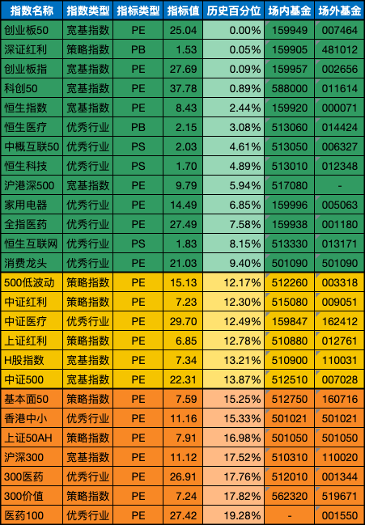

__微信公众号文章地址：[老罗基金估值-20231024](https://mp.weixin.qq.com/s/d9ew2cGOPtfs1xtfsQ8ncQ)__

```
老罗基金估值，每周二更新。专注于股权投资、阅读、学习与个人成长，知行合一、日拱一卒、投资人生。微信公众号【老罗投资】，文章均首发于公众号。
```

### 1. 近期操作

本周大盘继续下跌，主要指数如创业板50跌到了历史最低百分位，深证红利、创业板指和科创50也非常的便宜。

一些核心行业指数也罕见的跌到低估区间，例如消费龙头指数，21.03的PE，历史百分位9.40%，已经有了非常高的确定性，所以老罗本周也进行了相应的定投。

**今日定投4000元：**

+ (007464) 交银施罗德创业板50指数A，固定金额买入1000元。
+ (481012) 工银深证红利ETF联接A，固定金额买入500元。
+ (002656) 南方创业板ETF联接A，固定金额买入500元。
+ (011614) 工银科创50联接A，固定金额买入500元。
+ (000071) 华夏恒生ETF联接(QDII)A，固定金额买入500元。
+ (014424) 博时恒生医疗保健ETF联接(QDII)A，固定金额买入500元。
+ (501090) 华宝中证消费龙头指数(LOF)A，固定金额买入500元。

昨天是重阳节，94年前的重阳节(1929年10月)，人们用担架抬着教员离开永定河溪，教员当时身患疟疾。一路上，秋高气爽，山峦锦绣，黄菊遍野，流溪潺潺。傍晚时分，来到上杭，住在城南汀江岸边的一座临江小楼。九月九日重阳节，人们常常在这里登高赏菊。

这天正在养病的教员登上临江楼，凭栏远眺，但见天高云淡，秋雁南飞，远山逶迤，汀江远去，触景生情的教员，禁不住回首往事：秋收暴动，中央责怪他没有坚持攻打长沙，撤了他的政治局候补委员之职，传到井冈山，说成是开除了他的党籍，一度不能过组织生活；离开井冈山后，他在红四军党的七大上又落选，失去前委书记之职。往事历历，前局未定，移情于景的教员喟然长叹，挥毫写下了这首《采桑子•重阳》：

```
人生易老天难老，岁岁重阳。
今又重阳，但看黄花不用伤。
一年一度秋风劲，不似春光。
胜似春光，寥廓江天万里霜。
```

古代诗人在重阳节这天，常常吟咏生命，怀念故乡，移情老人，教员的词则格外地渗透着远非闲病之人所能到达的乐观和高昂。他一扫过去诗坛的悲秋情调，把人们引到一个革命家的内心世界，把秋日的菊花勾起的感伤和寂寞，投射到对开阔的大自然的凝视之中，心情显然又归于明朗。在1962年发表这首诗词时，他把“但看黄花不用伤”，改为了“战地黄花分外香”，进一步表现出战地秋景的绚丽和壮美。

我们能够从这首词中看出一点点悲观绝望的消极情绪吗？没有，一点也没有！这首诗充分展现了伟人的乐观和坚韧，没有丝毫悲观绝望情绪，伟人之所以成为伟人，必然拥有与众不同的特质。当人生处于低谷，要坚信有希望就一定能迎来黎明。

### 2. 相关数据

#### 2.1 巴菲特指数

股票市价总值/GDP：60.72%<span class="green">↘</span> (上周：63.94%)，
股票流通市值/GDP：52.82%<span class="green">↘</span> (上周：55.61%)。

中国巴菲特指数计算公式：年末境内上市股票市价总值 / 国内生产总值(GDP)。

巴菲特指数在70%水平以下买入胜率会很高，为100%时表明估值合理，114％至134％的区间为略微高估，超过134％即为严重高估，在200%左右购买股票等同于玩火自焚。

#### 2.2 格雷厄姆指数

上交所：3.10<span class="red">↗</span> (上周：3.01)，
深交所：1.74<span class="red">↗</span> (上周：1.68)，
全市场：2.23<span class="red">↗</span> (上周：2.17)。

格雷厄姆指数计算公式：盈利收益率 / 无风险利率(10年期国债利率)。当格雷厄姆指数大于 2 时，代表股票市场出现了比较好的投资机会。

#### 2.3 全市场趋势

上交所股票平均市盈率：11.86<span class="green">↘</span> (上周：12.35)，
深交所股票平均市盈率：21.14<span class="green">↘</span> (上周：22.11)，
沪深300滚动市盈率：11.01<span class="green">↘</span> (上周：11.45)，
10年期国债收益率：2.7177%<span class="red">↗</span> (上周：2.6882%)。

当前全市场处于 <strong style="color:green;">极度低估</strong> 状态，非常适合基金定投。

### 3. 基金估值



```
老罗基金估值，每周二更新。专注于股权投资、阅读、学习与个人成长，知行合一、日拱一卒、投资人生。微信公众号【老罗投资】，文章均首发于公众号。
免责声明：本文中提及的基金都有较大波动风险，投资需谨慎。
```

__微信公众号文章地址：[老罗基金估值-20231024](https://mp.weixin.qq.com/s/d9ew2cGOPtfs1xtfsQ8ncQ)__