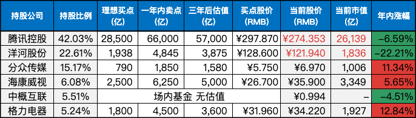

__微信公众号文章地址：[老罗实盘周记-20231028](https://mp.weixin.qq.com/s/0o_iC0iCjIEm1oyehGQq0Q)__

```
老罗实盘周记，每周六更新。专注于股权投资、阅读、学习与个人成长，知行合一、日拱一卒、投资人生。微信公众号【老罗投资】，文章均首发于公众号。
```

### 1. 本周交易

无

### 2. 目前持仓

当前持有的股票包括：腾讯控股 42.03%、洋河股份 22.61%、分众传媒 15.17%、海康微视 6.08%、中概互联 5.51%、格力电器 5.24%。

此外，还有少量的万科A、恒瑞医药、上海机场、宋城演义、京沪高铁等股票，其份额较少，仅作为观察仓不进行记录。

**注：港股已换算为人民币**



### 3. 上周数据


### 4. 持仓收益

本周：老罗的持仓 <span class="red">+3.37%</span>，沪深300指数 <span class="red">+1.48%</span>。实盘在经历连续七周的回撤后，终于止跌了。

截止到今日，老罗实盘今年收益率为 <span class="green">-2.85%</span>，沪深300指数今年收益率为 <span class="green">-7.99%</span>，继续跑赢沪深300指数。

### 5. 重要事项

#### 5.1 名下企业Q3财报陆续发布

**1. 海康威视 (10月21日)**

上周六海康发布财报，第三季度实现营收237亿元，同比增长5.5%；实现归母净利润35.1亿元，同比增长14%。前三季度累计实现营收613亿元，同比增长2.6%；实现归母净利润88.5亿元，同比增长0.12%。

在今年的环境下还能保持增涨已经属实不易，三季度的业绩有较明显的好转，而四季度是海康往年的收入占比最高的季度，预计全年利润能达到135亿区间 (Q4利润47亿左右)。

**2. 分众传媒 (10月25日)**

周三分众发布财报，第三季度实现营收31.6亿元，同比增长25%；实现归母净利润13.7亿元，同比增长88%。前三季度累计实现营收86.8亿元，同比增长18%；实现归母净利润36亿元，同比增长69%。

上周公司发布过三季报的预告，实际业绩基本与预告一致，预计全年利润能达到49亿区间。

**3. 洋河股份 (10月28日)**

周六洋河发布财报，第三季度实现营收84.1亿元，同比增长11%；实现归母净利润23.4亿元，同比增长7.5%。前三季度累计实现营收303亿元，同比增长14%；实现归母净利润102亿元，同比增长12%。

合同负债期末余额比期初下降59.86%；其他流动负债期末余额比期初下降48.84%，主要是期末预售经营商货款下降；销售费用与去年同期增涨40.07%，主要是本期加大了促销力度，促销费用提升导致；投资收益下降32.88%，主要是本期银行结构性存款减少，理财收益相应减少；公允价值变动收益同期下降152.36%，主要是交易性金融资产公允价值下降导致。
 
对比同行业的茅台、汾酒和古井贡酒第三季度的高增涨，洋河的增长不及预期，能明显看出销售费用增加但营收与利润都下滑了，生意并没有之前那么好做。

**4. 总结**

名下公司总体都在增长，有些经营持续改善中，有的业绩并未达到预期，当然这是因为行业的优等生实在是太优秀了，企业经营情况不是一下就能好转或是恶化，还需要持续不断地关注。
 
#### 5.2 港股将下调印花税

香港特区行政长官李家超在25日发表任内第二份施政报告，李家超表示，接受股票工作组的建议，将股票交易印花税从0.13%降至0.1%。周三香港恒生指数午间休盘涨1.18%，恒生科技指数涨2.89%。

在大A降印花税之后，港股同步降印花税本来就是预期之中，而且下调的幅度仅仅只是把21年8月提高三成的印花税取消。当时上调印花税的操作本身就比较迷惑，当时恒生指数已经从21年2月的31000高点下调了不少，加征印花税三成后市场更是一泻千里，港股成交量进一步萎缩。

#### 5.3 增发万亿国债

10月24日，十四届全国人大常委会第六次会议表决通过决议，明确中央财政将在今年四季度增发2023年国债1万亿元。增发的国债全部通过转移支付方式安排给地方，支持灾后恢复重建和弥补防灾减灾救灾短板。

在25日召开的例行吹风会上，财政部表示，考虑到本次增发的国债是纳入到中央财政赤字管理，将采取公开发行方式发行，和已经确定的年度国债发行进行统筹安排。增发国债由中央承担还本付息，并将于今明两年安排使用，2023年安排使用5000亿元，结转2024年使用5000亿元。这次增发1万亿元国债的主要目的，是落实中央政治局常委会会议的部署，支持灾后恢复重建和提升防灾减灾救灾能力的项目建设，是补短板、强弱项、惠民生的重要安排。

国债资金投入使用后，客观上也会有利于带动国内需求，能有效刺激经济回升向好。

#### 5.4 寄语

『纯真而不欠闻达，善良而不失坚强。把生命高举在尘俗之上，又溶化于社会之中，这应该是我们这一代的共同追求。』

一路走好。

### 6. 近期读书

本周读完两本书：

#### 6.1《沙海无门》

主角张三是个逃兵，另一个主角李四是西夏开国皇帝，逃兵张三只想活着回家能种上五亩薄田，霸主李四却渴望雄霸天下建国立业。

两人一同落难要横穿百里戈壁，在那种极端恶劣的环境下，人性真的难以经受考验。

老罗评分四颗星：⭐️⭐⭐⭐

#### 6.2《超越期待：松浦弥太郎的人生经营原则》

如何经营好自己和企业？商业的基本是超越期待，世上所有的商业都基于这个原则运行。

老罗评分三颗星：⭐️⭐⭐

### 7. 本周运动

本周户外快走一次，慢慢恢复中。

祝大家周末愉快！

```
老罗实盘周记，每周六更新。专注于股权投资、阅读、学习与个人成长，知行合一、日拱一卒、投资人生。微信公众号【老罗投资】，文章均首发于公众号。
免责声明：本公众号只作为本人的投资日志记录，本文中提及的个股都有腰斩或血本无归的风险，本人不做任何投资建议，投资请坚持独立思考。
```

__微信公众号文章地址：[老罗实盘周记-20231028](https://mp.weixin.qq.com/s/0o_iC0iCjIEm1oyehGQq0Q)__