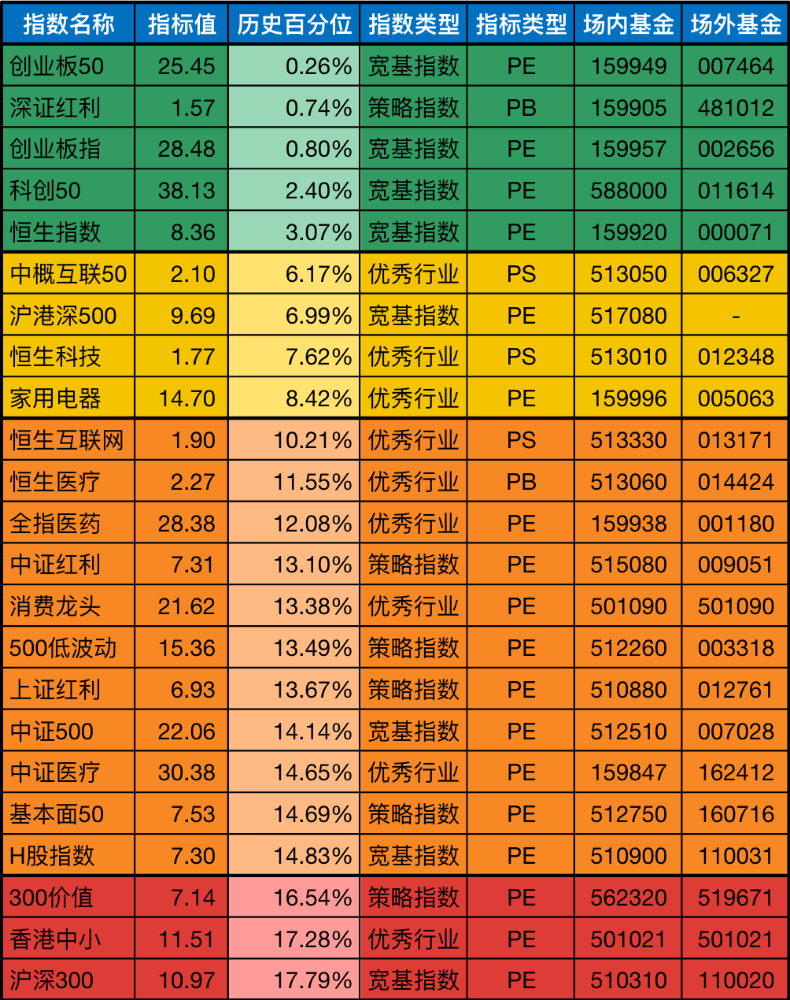

__微信公众号文章地址：[老罗基金估值-20231031](https://mp.weixin.qq.com/s/qH6EjQvai1rIdVktCUzpgw)__

```
老罗基金估值，每周二更新。专注于股权投资、阅读、学习与个人成长，知行合一、日拱一卒、投资人生。微信公众号【老罗投资】，文章均首发于公众号。
```

### 1. 近期操作

在周一，大A时隔两个月之后，成交量重回万亿大关，并且连续五个交易日上涨。虽然周二又一泻千里，但成交量依然达到了9000亿以上。

周二的下跌正好赶上老罗的定投日，可以用相同的金额买到更多的基金份额，凡事发生，必有利于我。

近一周涨多跌少，博时恒生医疗保健ETF联接(QDII)A与华宝中证消费龙头指数(LOF)A不是特别便宜，本周暂停了定投。

**今日定投3000元：**

+ (007464) 交银施罗德创业板50指数A，固定金额买入1000元。
+ (481012) 工银深证红利ETF联接A，固定金额买入500元。
+ (002656) 南方创业板ETF联接A，固定金额买入500元。
+ (011614) 工银科创50联接A，固定金额买入500元。
+ (000071) 华夏恒生ETF联接(QDII)A，固定金额买入500元。

### 2. 相关数据

#### 2.1 巴菲特指数

股票市价总值/GDP：62.48%<span class="red">↗</span> (上周：60.72%)，
股票流通市值/GDP：54.34%<span class="red">↗</span> (上周：52.82%)。

中国巴菲特指数计算公式：年末境内上市股票市价总值 / 国内生产总值(GDP)。

巴菲特指数在70%水平以下买入胜率会很高，为100%时表明估值合理，114％至134％的区间为略微高估，超过134％即为严重高估，在200%左右购买股票等同于玩火自焚。

#### 2.2 格雷厄姆指数

上交所：3.08<span class="green">↘</span> (上周：3.10)，
深交所：1.69<span class="green">↘</span> (上周：1.74)，
全市场：2.20<span class="green">↘</span> (上周：2.23)。

格雷厄姆指数计算公式：盈利收益率 / 无风险利率(10年期国债利率)。当格雷厄姆指数大于 2 时，代表股票市场出现了比较好的投资机会。

#### 2.3 全市场趋势

上交所股票平均市盈率：12.07<span class="red">↗</span> (上周：11.86)，
深交所股票平均市盈率：22.01<span class="red">↗</span> (上周：21.14)，
沪深300滚动市盈率：11.14<span class="red">↗</span> (上周：11.01)，
10年期国债收益率：2.5325%<span class="green">↘</span> (上周：2.7177%)。

当前全市场处于 <strong style="color:green;">极度低估</strong> 状态，非常适合基金定投。

### 3. 基金估值



```
老罗基金估值，每周二更新。专注于股权投资、阅读、学习与个人成长，知行合一、日拱一卒、投资人生。微信公众号【老罗投资】，文章均首发于公众号。
免责声明：本文中提及的基金都有较大波动风险，投资需谨慎。
```

__微信公众号文章地址：[老罗基金估值-20231031](https://mp.weixin.qq.com/s/qH6EjQvai1rIdVktCUzpgw)__