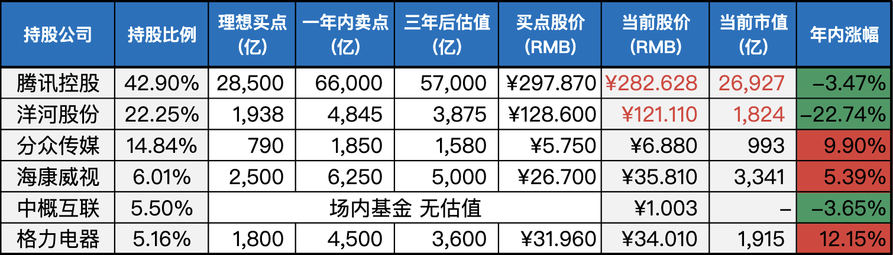
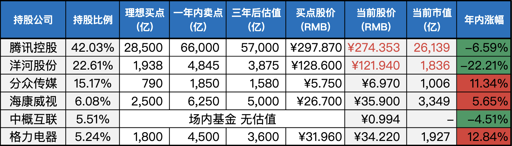

__微信公众号文章地址：[老罗实盘周记-20231104](https://mp.weixin.qq.com/s/cFDiPc71F7mvisnk_3KkJw)__

```
老罗实盘周记，每周六更新。专注于股权投资、阅读、学习与个人成长，知行合一、日拱一卒、投资人生。微信公众号【老罗投资】，文章均首发于公众号。
```

### 1. 本周交易

无

### 2. 目前持仓

当前持有的股票包括：腾讯控股 42.90%、洋河股份 22.25%、分众传媒 14.84%、海康微视 6.01%、中概互联 5.50%、格力电器 5.16%。

此外，还有少量的万科A、恒瑞医药、上海机场、宋城演义、京沪高铁等股票，其份额较少，仅作为观察仓不进行记录。

**注：港股已换算为人民币**



### 3. 上周数据



### 4. 持仓收益

本周：老罗的持仓 <span class="red">+1.16%</span>，沪深300指数 <span class="red">+0.61%</span>。

截止到今日，老罗实盘今年收益率为 <span class="green">-1.69%</span>，沪深300指数今年收益率为 <span class="green">-7.43%</span>，继续跑赢沪深300指数。

### 5. 重要事项

#### 5.1 茅台上调出厂价格

10月31日临近午夜，贵州茅台发布了一则公告，宣布自11月1日起将53%vol贵州茅台酒（包括飞天和五星系列）的出厂价格提高，平均幅度约为20%，这次调整不涉及到产品的市场指导价。

自2018年初实施价格调整以来，贵州茅台酒已有近6年未再提价。在这段时间里，有多次传言关于提价，最近的一次在今年的三季度左右，但当时正值白酒消费淡季。值得一提的是，这次出厂价格的平均上涨幅度高于2018年初的上一次调价。

这次提价主要涉及到了消费者熟知的『普茅』产品，包括五星53%vol 500mL贵州茅台酒、飞天53%vol 500mL贵州茅台酒，以及飞天系列的其他不同毫升规格产品，如飞天53%vol 50mL贵州茅台酒、飞天53%vol 200mL贵州茅台酒、飞天53%vol 375mL贵州茅台酒、飞天53%vol 1L贵州茅台酒等。而100毫升装的53度飞天茅台酒以及精品、珍品、尊品系列的价格则未受到此次调整的影响。

贵州茅台酒产品贡献了贵州茅台近85%的收入，其中大部分来自于53度飞天茅台酒等『普茅』产品。因此，这次提价将对贵州茅台在今年的第四季度和明年的业绩产生显著影响，提升其盈利。

然而需要明确的是，贵州茅台酒的出厂价格提高约20%并不等同于盈利直接增加20%。在2018年初的价格上涨之后，贵州茅台酒的毛利率从92.82%上升到93.74%，增加了0.92个百分点。当年的年报显示，2018年贵州茅台的营收同比增长了26%，而归母净利润同比增长了30%。

自2019年以来，贵州茅台的直销收入占比已经大幅增加，直销渠道按照高于出厂价格的市场指导价销售，这意味着直销渠道已经隐含地进行了提价。而此次的价格调整并不涉及市场指导价，因此贵州茅台上市公司的盈利提升主要来自于对经销商渠道的出厂价格提升，而上市公司通过直销渠道获得的利润不受此次提价的影响。在今年前三季度，贵州茅台收入的55%来自于批发渠道，因此提价预计将导致来自批发渠道的收入相应提高，从而增强盈利水平。

老罗的持仓中并没有茅台，但一直默默关注着这台A股BUG印钞机，原计划是股价跌到1200元左右会进行买入，但这轮涨价之后，1200的价格短时间(也许是永远)是看不到了。

价格上调的第一天，老罗在i茅台上也幸运的中了一瓶兔年茅台，今天休息也开心地去专营店去提货了，茅台品质依然优秀，又多了一瓶藏酒。

#### 5.2 格力电器三季报发布

10月31日格力电器发布财报，这也是名下企业中最晚发布财报的，压线发布。

格力第三季度实现营收560亿元，同比增长6.6%；实现归母净利润74.2亿元，同比增长8.5%。前三季度累计实现营收1558亿元，同比增长5%；实现归母净利润201亿元，同比增长9.8%。

今年格力营收、利润全是个位数的增长，预计全年利润能达到270亿区间，也基本符合预期。估值给到10倍的市盈率，市值也应该在2700亿左右，目前不到2000亿的估值，加上只有5%的仓位，风险可控。同样是电器，美的为什么能给到11倍市盈率，都不看好董小姐？

#### 5.3 美国暂停加息

当地时间11月1日，美国联邦储备委员会结束为期两天的货币政策会议，一如预期宣布维持当前5.25%-5.5%的联邦基金利率目标区间不变。

这也是美联储自去年3月开启本轮加息周期以来，连续第二次暂停加息。虽然美联储表示仍可能进一步加息，但微妙『鸽声』已经释放了谨慎信号，未来加息的可能性已经下降。

未来还加不加，谁也不知道，这事了解就好。

#### 5.4 公积金认房不认商贷

11月1日起，有商业贷款记录、无公积金贷款记录，且在北京市无房的公积金缴存职工家庭，可执行首套住房公积金贷款政策。10月31日，北京住房公积金管理中心发布《关于优化住房公积金个人住房贷款中住房套数认定标准的通知》，宣布住房套数认定将不再考虑商业贷款情况。

之前的9月1日，北京宣布落实『认房不认贷』政策，但该政策针对的是银行业金融机构的商业性个人住房贷款，北京住房公积金贷款政策仍执行『认房认贷』政策，其中『贷』指的是在人行征信系统中全国范围内的个人住房贷款记录，包括商业性住房贷款记录、住房公积金个人住房贷款记录。

房地产救市政策一个接着一个，对于刚需和需要改善住房条件的老百姓来说，也是一件好事，能节约不少成本。在北京这种一线城市，买房上车基本就得500万以上的成本，再加上房子受政策影响大，流动性差，在当前条件下，并不是最好的投资标的。

#### 5.5 家庭如何兴盛

父爱则母静，母静则子安，子安则家和，家和万事兴。 

父和则母慈，母慈则子孝，子孝则家齐，家齐国家治。

父懒则母苦，母苦则子惧，子惧则家衰。老无德，父无能，妻受苦，子劳苦，不孝有三，无后为大，舜不告而娶，为无后也。君子以为犹告也。

父爱、母静、子安是构建一个幸福美满家庭的基石。只有当家庭中的每个成员都尽力营造爱与和谐的环境时，家庭才能够走向繁荣昌盛。

### 6. 近期读书

本周读的书都比较轻松，一共读完四本书：

+ 《太白金星有点烦》另一视角解读西游，非常有意思。老罗评分四星半：⭐️⭐⭐⭐❤️
+ 《长安的荔枝》长安回望绣成堆，山顶千门次第开。一骑红尘妃子笑，无人知是荔枝来。老罗评分四星半：⭐️⭐⭐⭐❤️
+ 《半小时漫画-故宫》老罗评分四星：⭐️⭐⭐⭐
+ 《半小时漫画-中国地理：西藏、青海、云南、贵州》老罗评分四星：⭐️⭐⭐⭐

### 7. 本周运动

本周脚伤基本好了，下周开始恢复锻炼。

祝大家周末愉快！

```
老罗实盘周记，每周六更新。专注于股权投资、阅读、学习与个人成长，知行合一、日拱一卒、投资人生。微信公众号【老罗投资】，文章均首发于公众号。
免责声明：本公众号只作为本人的投资日志记录，本文中提及的个股都有腰斩或血本无归的风险，本人不做任何投资建议，投资请坚持独立思考。
```

__微信公众号文章地址：[老罗实盘周记-20231104](https://mp.weixin.qq.com/s/cFDiPc71F7mvisnk_3KkJw)__