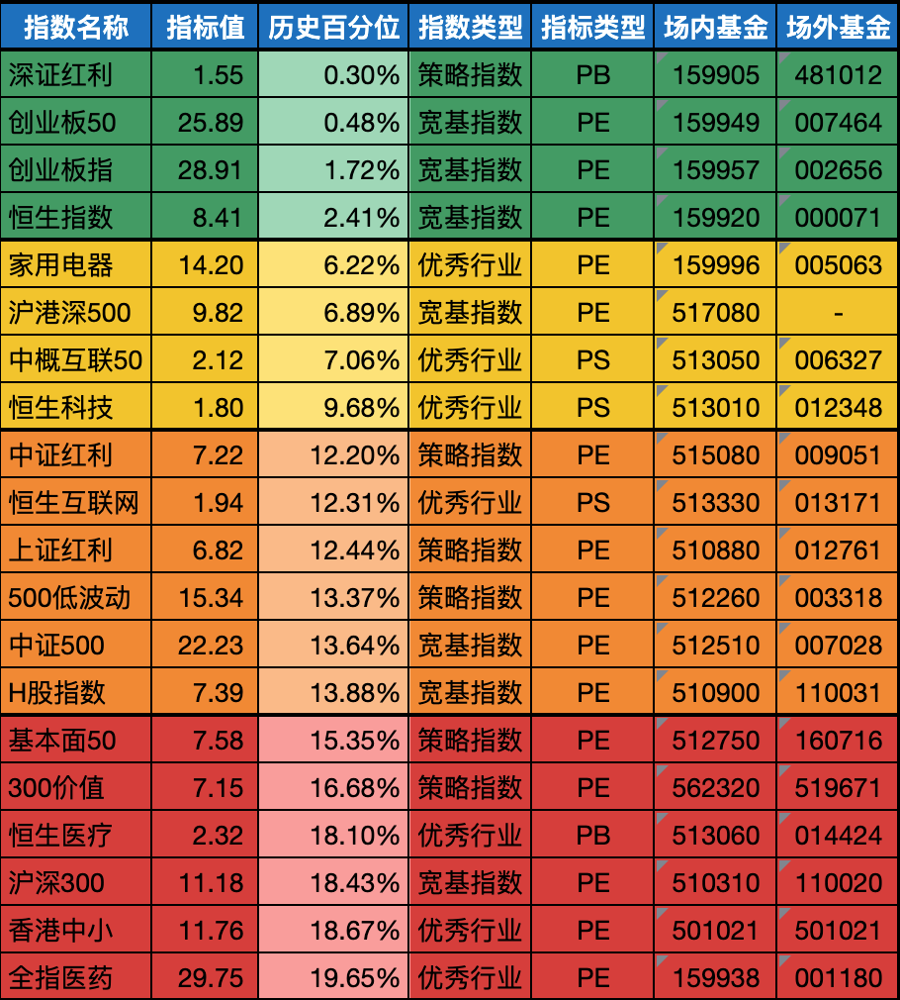

__微信公众号文章地址：[老罗基金估值-20231107](https://mp.weixin.qq.com/s/_P1jseU-HlPpXnWpOdD8fQ)__

```
老罗基金估值，每周二更新。专注于股权投资、阅读、学习与个人成长，知行合一、日拱一卒、投资人生。微信公众号【老罗投资】，文章均首发于公众号。
```

### 1. 近期操作

**今日定投2000元：**

+ (481012) 工银深证红利ETF联接A，固定金额买入500元。
+ (007464) 交银施罗德创业板50指数A，固定金额买入500元。
+ (002656) 南方创业板ETF联接A，固定金额买入500元。
+ (000071) 华夏恒生ETF联接(QDII)A，固定金额买入500元。

近一周大盘受各种利好影响，指数都有不同程度的上涨，极度便宜的指数基金还有以上四只，本周继续定投。

曾经看过一段话，大意是投资要想有所斩获，需要解决两方面的问题：一是如何面对波动，二是能对企业有正确的估值。其中第一条解决赚不赚钱的问题，第二条解决赚多少钱的问题。

投资中最困难的就是如何面对波动，每一次身处熊市，低谷还会持续多长时间，谁也无法预测，内心难免会有些煎熬。

A股历史上最长的大熊市长达三年，这也是投资必须使用闲钱的原因，如果是将来可能会使用的钱来投资，市场到了真正的底部时，可能会因外部因素被迫离场。闲钱投资才有可能理性穿越周期！

### 2. 相关数据

==当前全市场处于 <strong style="color:green;">极度低估</strong> 状态，非常适合基金定投。==

#### 2.1 巴菲特指数

+ 股票市价总值/GDP：63.56%<span class="red">↗</span> (上周：62.48%)
+ 股票流通市值/GDP：55.22%<span class="red">↗</span> (上周：54.34%)

中国巴菲特指数计算公式：年末境内上市股票市价总值 / 国内生产总值(GDP)。巴菲特指数在70%水平以下买入胜率会很高，为100%时表明估值合理，114％至134％的区间为略微高估，超过134％即为严重高估，在200%左右购买股票等同于玩火自焚。

#### 2.2 格雷厄姆指数

+ 上交所：3.08<span class="gray">→</span> (上周：3.08)
+ 深交所：1.67<span class="green">↘</span> (上周：1.69)
+ 全市场：2.24<span class="red">↗</span> (上周：2.20)

格雷厄姆指数计算公式：盈利收益率 / 无风险利率(10年期国债利率)。当格雷厄姆指数大于 2 时，代表股票市场出现了比较好的投资机会。

#### 2.3 全市场市盈率

+ 上交所股票平均市盈率：12.22<span class="red">↗</span> (上周：12.07)
+ 深交所股票平均市盈率：22.50<span class="red">↗</span> (上周：22.01)
+ 沪深300滚动市盈率：11.22<span class="red">↗</span> (上周：11.14)

市盈率是指每股现行市场价格与每股净利润之比，即PE=P/EPS，其中，PE是指市盈率，P是指每股现行市场价格，EPS是指每股净利润。平均市盈率越低，投资安全边际越大。

#### 2.4 十年期国债收益率

+ 十年期国债收益率：2.5329%<span class="red">↗</span> (上周：2.5325%)

### 3. 基金估值



```
老罗基金估值，每周二更新。专注于股权投资、阅读、学习与个人成长，知行合一、日拱一卒、投资人生。微信公众号【老罗投资】，文章均首发于公众号。
免责声明：本文中提及的基金都有较大波动风险，投资需谨慎。
```

__微信公众号文章地址：[老罗基金估值-20231107](https://mp.weixin.qq.com/s/_P1jseU-HlPpXnWpOdD8fQ)__