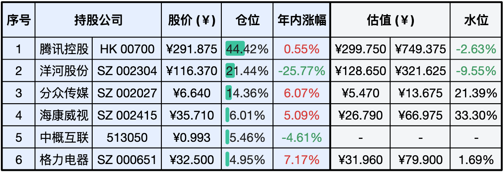
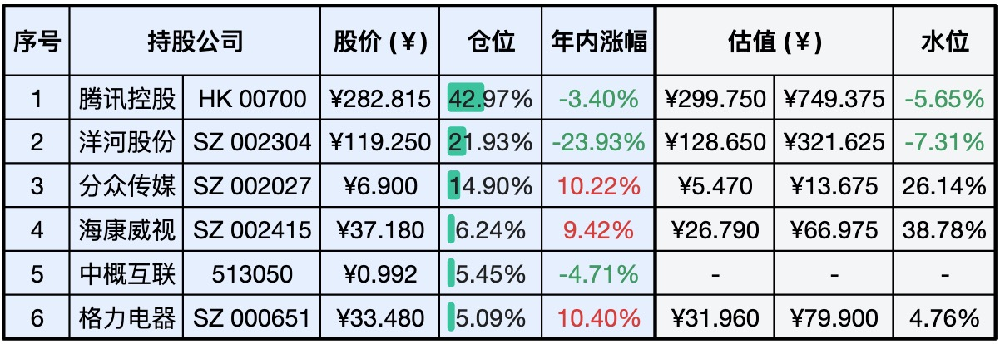

__微信公众号文章地址：[老罗实盘周记-20231118](https://mp.weixin.qq.com/s/f8reShnFseT5CZGXHXAFRw)__

```
老罗实盘周记，每周六更新。专注于股权投资、阅读、学习与个人成长，知行合一、日拱一卒、投资人生。微信公众号【老罗投资】，文章均首发于公众号。
```

### 1. 本周交易

无

### 2. 目前持仓

当前持有的股票包括：腾讯控股 44.42%、洋河股份 21.44%、分众传媒 14.36%、海康微视 6.01%、中概互联 5.46%、格力电器 4.95%。

此外，还有少量的万科A、恒瑞医药、上海机场、宋城演义、京沪高铁等股票，其份额较少，仅作为观察仓不进行记录。

**注：港股已换算为人民币**



### 3. 上周数据



### 4. 持仓收益

本周：老罗的持仓 <span class="green">-0.01%</span>，沪深300指数 <span class="green">-0.51%</span>，实盘本周先扬后抑，依然变化不大。

截止到今日，老罗实盘今年收益率为 <span class="green">-1.97%</span>，沪深300指数今年收益率为 <span class="green">-7.84%</span>，继续跑赢沪深300指数。

### 5. 重要事项

+ 腾讯Q3财报
+ 10月份社融数据
+ 下一步投资计划
+ 教育孩子的一点思考
+ 关于老罗基金估值停更

==只对持股和交易感兴趣的朋友，读到这里就可以退出了。后面是对上述事件的展开，无新内容。==

#### 5.1 腾讯Q3财报

<span class="green">5.1.1 收入</span>

腾讯三季度收入1546亿，同比增长10%。净利润361亿，同比下降9%，非国际报告准则下净利润449亿同比增长39%。净利润同比下降主要的原因除了投资上的波动，还有去年三季度出售了SEA的股权带来了一部分收入。

国际报告准则叫GAAP，非国际报告准则也叫Non-GAAP。先说一下GAAP，Generally Accepted Accounting Principle（GAAP的全称），即美国通用会计准则，是美股上市公司的提法。在美股上市的公司根据美国证券交易管理委员会（SEC）的规定，在披露定期财务及业绩报告的时候，需按照通用会计准则的规定披露财务数据。

而Non-GAAP则是公司依据自身情况在GAAP准则的基础上，将一些与公司日常经营不相关、或者偶然发生的重大影响进行调整剔除后的财务数据，目的是更加合理且可持续地展示公司的实际经营状况。

非国际会计准则和国际会计准则的主要差别是是否记入股权激励档期支出、投资收益、无形资产摊销、减值拨备，非国际会计准则能更准确的反映出公司真实的经营状况。

<span class="green">5.1.2 用户数据</span>

微信及WeChat合计：13.36亿，同比增长2%。

QQ用户：5.58亿，同比下降3%。

增值服务用户：2.45亿，同比增长7%。

视频号：总播放量同比增长超过 50%。

微信小程序：第三季度交易额超过1.5万亿人民币。

视频号和微信小程序的表现依然抢眼，视频号目前广告填充率并不高，将来会是广告收入重要的增量来源。小程序11亿的月活，即用即走的便捷性，已经深入到了生活中的方方面面(买景点博物馆门票、购物等)。

<span class="green">5.1.3 游戏业务</span>

三季度国际市场游戏收入人民币133亿元，同比增长14%，环比增幅为5%。本土市场游戏收入人民币327亿元，同比增长5%，环比增长3%。 

国际市场《PUBG Mobile》收入回升， 《胜利女神：妮姬》 、《VALORANT》和《Triple Match 3D》也为收入增长做出了贡献。腾讯海外增速还算不错，已经达到了国内游戏收入的一半。

国内市场主要因为三季度《命运方舟》、《无畏契约》和《冒险岛：枫之传说》的公测，以及《王者荣耀》和《DnF》等当家游戏的收入增加。《王者荣耀》依然是手机游戏中的第一，《英雄联盟手游》流水在Q3同比增长了20%。

<span class="green">5.1.4 广告业务</span>

腾讯网络广告业务第三季的收入为人民币257亿元，同比增长20%，主要是得益于视频号开始带来广告收入。

今年视频号推出了创作分成计划、视频号小任务、付费订阅待功能，帮助创作者增收，用户+创作者生态方面进入了正向循环。

<span class="green">5.1.5 金融业务及云服务</span>

金融科技及企业服务业务第三季度收入人民币520亿元，同比增长16%。金融科技服务收入维持双位数同比增长，主要受益于商业支付活动的增加和理财服务收入增长。

<span class="green">5.1.6 总结</span>

2023年随着经济环境慢慢复苏，政策方面也由压一压变为拉一拉，同时视频号、小程序等业务逐步步入正轨，老罗认为小企鹅再次回到了稳健增长的状态。

腾讯本季度的营业收入与利润都超出预期，在Q2时非国际会计准则下归母净利润已经创了历史新高，而第三季度继续保持着增长。增长不错但市场先生依然不买单，300人民币正常估值以下停留快半年了，明明很赚钱的公司，依然被投资者视而不见。

#### 5.2 10月份社融数据

初步统计，2023年前十个月社会融资规模增量累计为31.19万亿元，比上年同期多2.33万亿元。10月份社会融资规模增量为1.85万亿元，比上年同期多9108亿元。

其中对实体经济发放的人民币贷款增加4837亿元，同比多增232亿元；对实体经济发放的外币贷款折合人民币增加152亿元，同比多增876亿元；委托贷款减少429亿元，同比多减899亿元；信托贷款增加393亿元，同比多增454亿元；未贴现的银行承兑汇票减少2536亿元，同比多减380亿元；企业债券净融资1144亿元，同比少1269亿元；政府债券净融资1.56万亿元，同比多1.28万亿元；非金融企业境内股票融资321亿元，同比少467亿元。

10月份的贷款总体规模还是不错的，但其中的企业中长期贷款还是偏少，票据贴现和非银贷款比较多，反映出企业融资意愿依然比较弱，经济未完全恢复，企业生存依然比较艰难。

好消息是美国加息周期基本确定结束了，美国公布10月份CPI环比不变，同比增速降至3.2%；剔除食品、能源价格的核心通胀环比上升0.2%，同比增速略降至4.0%，均表明潜在的价格压力正在减弱。目前预计美联储最快明年3月开始降息，到7月预计会降息约两次。

美联储降息后，投资者不再能轻易拿到5%的无风险收益率，资金必然慢慢流向价值『洼地』。一切都会过去，一切都在慢慢变好。

#### 5.3 下一步投资计划

经过思考，老罗的下一步的计划：慢慢卖出格力电器与中概互联换洋河和腾讯。

卖出逻辑：

格力电器和中概互联的持仓比例并不是非常多，加到一起只占10%的比例。

格力电器增长目前都是个位数，再加上自如事件，让老罗对企业管理者有一些的担忧。

而中概互联的卖出理由在上一期的周记有所提及，加上本周马云减持阿里，进一步的加深了对中概互联的担心。买基金的优势劣势一目了然，好处是不用操心持仓比例，大概率不输，坏处是没得选择，对不喜欢的公司也无法剔除。


#### 5.4 教育孩子的一点思考

像苏轼、巴菲特这种极其卓越的人物，他们对子女的期望值都是很低的。为什么呢？因为有什么样的人生理想，靠自己实现就可以了，没必要将自己的理想寄托在子女身上。毕竟，改变谁都不容易。唯有改变自己，或是一条行得通的路。家长在教育孩子时，其实更应该做好自己的角色，给予孩子三方面的支持：

一、无条件的爱，对孩子的爱里面没有交换、没有恐吓，也没有威胁。

二、价值感，当一个人拥有价值感时，他会知道自己是值得被爱的，他的内心会充满能量，他对未来会充满期待，对人生拥有极高的热情。自尊水平也会较高，他能感觉到自己的重要性，自律性也会很强。

三、成长型心态，孩子在一天天的长大，家长也需要时刻跟上孩子成长的步伐，成为孩子成长道路上的助推器，固步自封和惯性思维或许会不经意间伤害到孩子。

做为家长，需要与孩子一起，终身学习，终身思考，终身成长。

#### 5.5 关于老罗基金估值停更

老罗基金估值停更主要有两方面的原因：

一是基金估值数据比较容易获取，文章没什么差异，阅读价值也不太高。

二是老罗重心会慢慢转向在二级市场直接投资公司，毕竟设定的目标是跑赢主要宽指，如果投资指数基金加上扣除管理费是稳输的买卖。未来可能只会投资医疗这种自己不太懂但收益不错的行业基金。

后续可能会写一些读书笔记类的文章，记录下阅读过的好书推荐给大家。会随性而为，不定期更新。

### 6. 近期读书

#### 6.1 《弗洛伊德与为什么鸭》

一本非常治愈的漫画书，有些烦恼的解决方法小孩子与大人其实是通用的，书比较通俗懂，闲时值得一看。

老罗评分四星半：⭐️⭐⭐⭐❤️

### 7. 本周运动

本周主要还是遛弯，一共5次，下周继续。

祝大家周末愉快！

```
老罗实盘周记，每周六更新。专注于股权投资、阅读、学习与个人成长，知行合一、日拱一卒、投资人生。微信公众号【老罗投资】，文章均首发于公众号。
免责声明：本公众号只作为本人的投资日志记录，本文中提及的个股都有腰斩或血本无归的风险，本人不做任何投资建议，投资请坚持独立思考。
```

__微信公众号文章地址：[老罗实盘周记-20231118](https://mp.weixin.qq.com/s/f8reShnFseT5CZGXHXAFRw)__