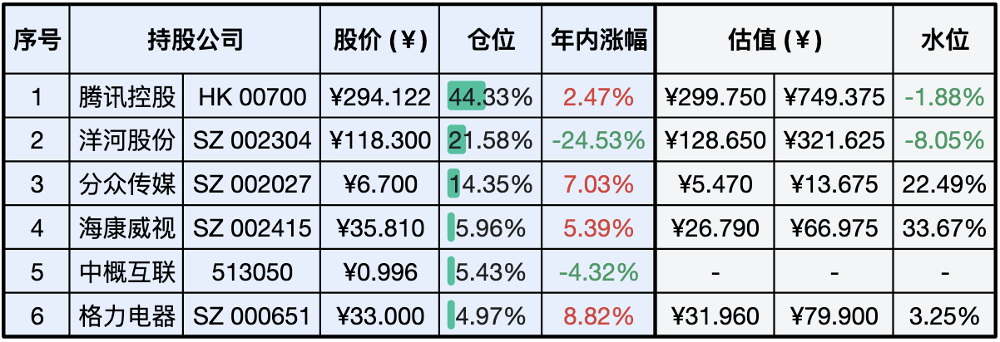
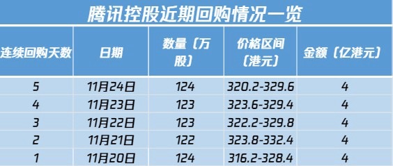
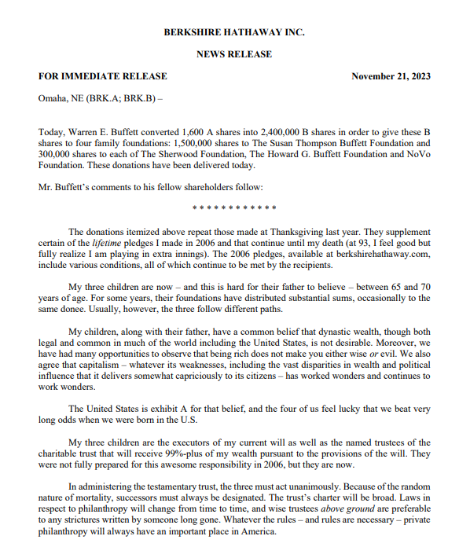

__微信公众号文章地址：[老罗实盘周记-20231125](https://mp.weixin.qq.com/s/tTSCmHZuCSvXO_zt5gZg6g)__

```
老罗实盘周记，每周六更新。专注于股权投资、阅读、学习与个人成长，知行合一、日拱一卒、投资人生。微信公众号【老罗投资】，文章均首发于公众号。
```

### 1. 本周交易

无

### 2. 目前持仓

当前持有的股票包括：腾讯控股 44.33%、洋河股份 21.58%、分众传媒 14.35%、海康微视 5.96%、中概互联 5.43%、格力电器 4.97%。

此外，还有少量的万科A、恒瑞医药、上海机场、宋城演义、京沪高铁等股票，其份额较少，仅作为观察仓不进行记录。

**注：港股已换算为人民币**



### 3. 上周数据


### 4. 持仓收益

本周：老罗的持仓 <span class="red">+0.89%</span>，沪深300指数 <span class="green">-0.84%</span>，实盘本周小幅上涨。

截止到今日，老罗实盘今年收益率为 <span class="green">-1.08%</span>，沪深300指数今年收益率为 <span class="green">-8.62%</span>，继续跑赢沪深300指数。

### 5. 重要事项

+ 腾讯控股恢复股票回购
+ 巴菲特公布遗嘱

==只对持股和交易感兴趣的朋友，读到这里就可以退出了。后面是对上述事件的展开，无新内容。==

#### 5.1 腾讯控股恢复股票回购

11月15日发布Q3财报之后，本周一开始腾讯恢复回购股票，日均花费4亿港币，日均回购数量在120万股左右，五天累计回购20亿港币。



在港股回购可以被视为一个积极的信号，通常被认为是好事，通过回购股票，公司可以将现有的利润分配给较少的股东，从而提高每股收益。这有利于现有股东，因为他们将拥有更大的公司利润份额，改善了股东价值。公司进行回购行为可能被视为管理层对公司未来前景的信心和对股东利益的关注，这有助于改善公司与股东的关系，增强投资者的信心。

腾讯今年的利润预计在1400亿港币以上，日入接近4亿港币，因为不会像以前一样投资其他公司，赚来的钱没有好的投资途径，并且在当前公司股价不高的情况下正好进行回购。

今年以来，腾讯控股已经累计进行了102次回购，合计回购1.14亿股，累计回购金额达到375亿港元，回购股票还有可提升空间，期待腾讯6亿重出江湖。

#### 5.2 巴菲特公布遗嘱

当地时间11月21日，伯克希尔哈撒韦公司在监管文件中披露，93岁高龄的沃伦·巴菲特罕见地向股东发出了一封信，公布自己的财产安排。信中，巴菲特称自己99%以上的财富将在去世后捐给慈善机构，而伯克希尔公司已经有合适的CEO继任者和合适的董事会。巴菲特还表示，他的三个孩子霍华德、苏珊和彼得是他遗嘱的执行人，并将成为慈善信托基金的受托人，该信托将获得他几乎所有的财富。

信中巴菲特表示：我去世后，我的资产如何处置将是公开的，没有那些『巧妙』的信托或是外国的实体用以规避公众的审查，只有一份简单的遗嘱，人们可以在美国道格拉斯县级法院进行查阅。此外，致股东信中的一段话，引发了人们对他可能退休的猜测。他在信中称：我已经93岁了，感觉很好，但我充分意识到我正在打加时赛。



巴神在93年高龄还能头脑清晰地做自己喜欢的工作，已实属不易，公布遗嘱确实属于理性之举。

但世间规律无法被打破，万事万物总有落幕的一天，只希望巴神能长命一百三十岁，让我们能更久地观赏这场精彩的『加时赛』。

### 6. 近期读书

#### 6.1 《圆圈正义：作为自由前提的信念》

本书收录了罗翔老师49篇随笔文章，探讨了法律、正义、道德、权力的理念与现实。人生短短数十载，匆匆一世似烟云。老罗评分四星：⭐️⭐⭐⭐

#### 6.2 《非人哉2》

本书一般，无事时打发时间。老罗评分三星：⭐️⭐⭐

#### 6.3 《巴菲特教你读财报》

作者玛丽·巴菲特是沃伦·巴菲特的儿媳，巴菲特家族的重要成员，资深投资战略顾问。这本书仅六万余字，属于财务分析类书籍中最浅显易懂的一本，读起来非常轻松。老罗评分四星半：⭐️⭐⭐⭐❤️

### 7. 本周运动

本周主要还是遛弯，一共3次，下周继续。

祝大家周末愉快！

```
老罗实盘周记，每周六更新。专注于股权投资、阅读、学习与个人成长，知行合一、日拱一卒、投资人生。微信公众号【老罗投资】，文章均首发于公众号。
免责声明：本公众号只作为本人的投资日志记录，本文中提及的个股都有腰斩或血本无归的风险，本人不做任何投资建议，投资请坚持独立思考。
```

__微信公众号文章地址：[老罗实盘周记-20231125](https://mp.weixin.qq.com/s/tTSCmHZuCSvXO_zt5gZg6g)__