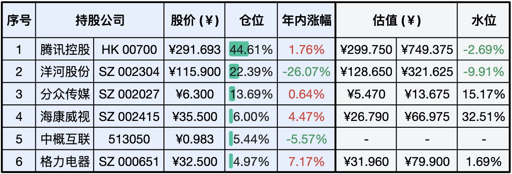
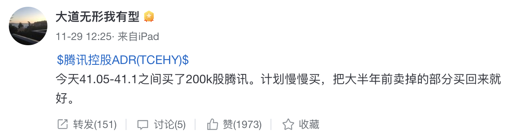
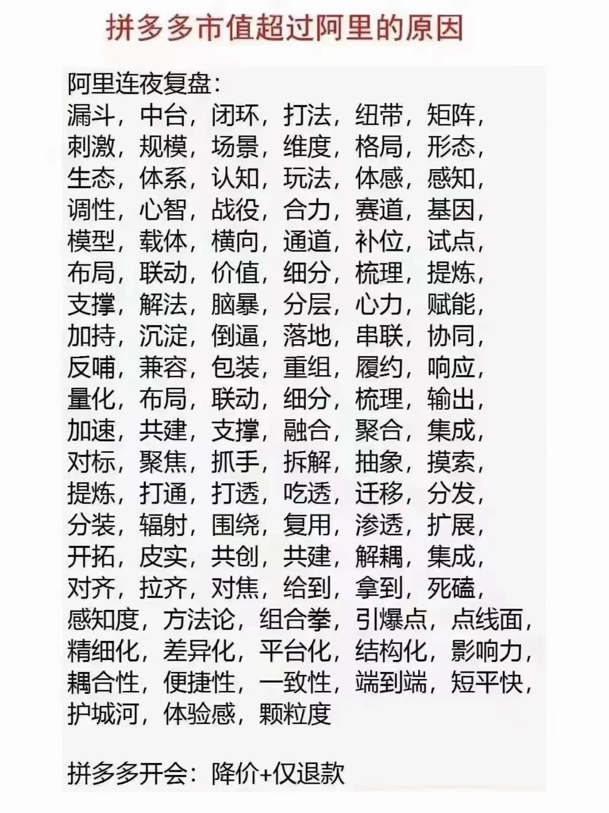

__微信公众号文章地址：[老罗实盘周记-20231202](https://mp.weixin.qq.com/s/AhHDTWUZc6VQ8w3YkU8N6Q)__

```
老罗实盘周记，每周六更新。专注于股权投资、阅读、学习与个人成长，知行合一、日拱一卒、投资人生。微信公众号【老罗投资】，文章均首发于公众号。
```

### 1. 本周交易

+ 本周五买入少量洋河股份(002304)，买入价格为 115.1 元人民币。

### 2. 目前持仓

当前持有的股票包括：腾讯控股 44.61%、洋河股份 22.39%、分众传媒 13.69%、海康微视 6.00%、中概互联 5.44%、格力电器 4.97%。

此外，还有少量的万科A、恒瑞医药、上海机场、宋城演义、京沪高铁等股票，其份额较少，仅作为观察仓不进行记录。

**注：港股已换算为人民币**



### 3. 上周数据


### 4. 持仓收益

本周：老罗的持仓 <span class="green">-1.57%</span>，沪深300指数 <span class="green">-1.56%</span>。

截止到今日，老罗实盘今年收益率为 <span class="green">-2.65%</span>，沪深300指数今年收益率为 <span class="green">-10.04%</span>，继续跑赢沪深300指数。

### 5. 重要事项

+ 段永平重新买回腾讯
+ 拼多多市值超过阿里巴巴
+ 字节跳动关闭朝夕光年
+ 查理·芒格长寿幸福的秘诀

==只对持股和交易感兴趣的朋友，读到这里就可以退出了。后面是对上述事件的展开，无新内容。==

#### 5.1 段永平重新买回腾讯

在今年年初清仓腾讯控股ADR后，本周段永平重新买回了腾讯，11月29日，段永平在雪球社区表示，在41.05美元-41.1美元之间买了20万股腾讯，大约耗资6000万人民币。他还表示将继续慢慢买，把大半年前卖掉的部分买回来。



段永平曾经在2022年多次买入腾讯，但就在腾讯控股2023年初持续反弹之际，他却在平台上表示，美股的腾讯基本上全部换到苹果了，港股的还没动。至于为何卖出腾讯控股ADR，段永平也多次给出了自己的解释，『看不懂腾讯的未来现金流』。

段永平在腾讯发布Q3财报后再次买回腾讯ADR，应该代表其对腾讯现阶段业绩表现的认可。在A股与H股，茅台和腾讯是唯二的存在，目前腾讯市值不高，持有腾讯的股权是一件胜率很高的事。

本周腾讯自身也在不遗余力地进行着回购动作，日均回购4亿港币，回购价格在320港币左右，发布财报后已经连续十个交易日进行了回购。

#### 5.2 拼多多市值超过阿里巴巴

在拼多多于11月28日发布其『亮眼』的2023年三季度财报后，其市值将超过阿里巴巴就出现在分析人士的预测之中。财报显示，拼多多今年第三季度收入为688亿元，同比增长94%；经营利润为167亿元，同比增60%。受此消息影响，拼多多当天美股收盘飙涨近20%，与阿里巴巴的市值差距仅约百亿美元。

而本周五美股收盘，拼多多总市值来到1930亿美元，阿里巴巴总市值为1884亿美元，拼多多市值超过阿里巴巴，成为在美上市市值最高的中概股。

当初被排挤出阿里的孙彤宇，被马云讥讽为不合群，永远唧唧歪歪的人，如果却完成了屠龙伟业，击败阿里巴巴。事实再次证明，一个管理团队，永远不能只有一个声音，这是要犯历史性错误的。

这两天在某书上看到一个段子，拼多多市值为什么能超过阿里？



阿里巴巴的大企业病确实严重，去年芒格清仓阿里巴巴时，也吐槽阿里巴巴只是一个『该死的零售公司』，本质上没有特别深的护城河。在用望远镜也找不到对手的年代，之前那套打法或许可行，但现阶段电商行业『群狼环伺』，阿里巴巴如果再不革新，压力只会越来越大。

拼多多只有1.3万员工，而阿里巴巴员工却高达22万，在人效比上差距巨大，可以预见阿里巴巴之后可能会有比较大的裁员动作。

#### 5.3 字节跳动关闭朝夕光年

字节跳动旗下游戏业务朝夕光年，将进行大规模业务收缩。对已上线的且表现良好的游戏，会在保证运营的情况下寻求剥离；对还未上线的项目，除少量创新项目及相关技术项目外，均会关停。

朝夕光年成立于2019年，是字节跳动旗下的游戏研发与发行业务品牌。与字节跳动重视全球化类似，朝夕光年也非常重视全球化。其在海外发行的《RO仙境传说：新世代的诞生》及漫威IP卡牌手游《MARVEL SNAP》均获得了一定成功。在国内市场，朝夕光年于今年7月上线的《晶核》被认为是朝夕光年自研游戏的第一个『爆款』。

在2023年年初的字节跳动年会上，CEO梁汝波曾提出，新一年的目标是聚焦和务实。对于主营业务信息平台与电商，要加强投入；对于游戏、教育、PICO等新兴业务，则要有想象力，保持平常心。

本质上还是由于公司管理层对游戏行业的态度所决定，张一鸣对游戏并不感兴趣。而且游戏行业对创造性的要求更高，对于字节跳动这种内容生产和内容算法推荐占主导的公司来说，在游戏行业可能真的占不到半点便宜。电商对其可能更具有优势，直播带货的兴起，对阿里的冲击也是巨大的。

#### 5.4 查理·芒格长寿幸福的秘诀

当地时间周二(11月28日)，伯克希尔·哈撒韦在其子公司美国商业资讯网站上发布声明，投资天才、沃伦·巴菲特的得力助手查理·芒格去世，享年99岁。

查理·芒格曾经说过：长寿幸福的秘诀？很简单，不嫉妒，不抱怨，不过度消费；面对什么困难，都保持乐观的心态，交靠谱的人，做本分的事。

长寿幸福是每一个人的追求，而人们往往在不知不觉中陷入到了各种陷阱之中。别人股票比自己挣得多，羡慕嫉妒恨；碰到不公平的事，怨天怨地；经不起短期的诱惑，买了一堆永远也用不到的东西......

我们现在一切都在追求高效、追求快节奏的社会里，我们往往被各种压力所困扰，常常忽视了自身的健康和快乐。到了30多岁，不管是身体还是心理或多或少已经出现亚健康状态了。

查理·芒格认为长寿快乐的秘诀，都是老一套，人人都能学会。道理很简单，大家也都懂，就是不容易做到。从现在开始，不再抱怨、嫉妒，理性消费，保持开心，与靠谱的人在一起，不纠结于烦恼，让这些秘诀成为我们生活的一部分。

### 6. 近期读书

#### 6.1 《全频带阻塞干扰》

刘慈欣写的战争故事，老罗看的俄罗斯版，据说还有中国版，有空找出来看看，评分四星⭐️⭐️⭐️⭐️

#### 6.2 《刘慈欣少儿科幻系列-光荣与梦想》

大刘的五个短篇的合集，包括《光荣与梦想》、《混沌蝴蝶》、《圆圆的肥皂泡》、《赡养上帝》、《坍缩》，评分四星⭐️⭐️⭐️⭐️

#### 6.3 《段永平传》

低调的实业家与投资家-段永平，评分四星半⭐️⭐️⭐️⭐❤️️

#### 6.4 《漫画科普：比知识有趣的冷知识》

7大门类，200个知识点，不错的一本漫画，评分三星半️⭐️⭐️⭐❤️️

### 7. 本周运动

本周主要还是遛弯，一共5次，下周继续。

祝大家周末愉快！

```
老罗实盘周记，每周六更新。专注于股权投资、阅读、学习与个人成长，知行合一、日拱一卒、投资人生。微信公众号【老罗投资】，文章均首发于公众号。
免责声明：本公众号只作为本人的投资日志记录，本文中提及的个股都有腰斩或血本无归的风险，本人不做任何投资建议，投资请坚持独立思考。
```

__微信公众号文章地址：[老罗实盘周记-20231202](https://mp.weixin.qq.com/s/AhHDTWUZc6VQ8w3YkU8N6Q)__