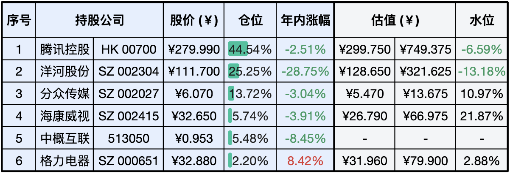

__微信公众号文章地址：[老罗实盘周记-20231209](https://mp.weixin.qq.com/s/Pwf4_X4b4ZX5MXnIgS0P_w)__

```
老罗实盘周记，每周六更新。专注于股权投资、阅读、学习与个人成长，知行合一、日拱一卒、投资人生。微信公众号【老罗投资】，文章均首发于公众号。
```

### 1. 本周交易

+ 本周二卖出部分格力电器(000651)，卖出价格为 32.83 元人民币。
+ 使用卖出格力电器的资金，在同天买入洋河股份(002304)，买入价格为 114.27 元人民币。

### 2. 目前持仓

当前持有的股票包括：腾讯控股 44.54%、洋河股份 25.25%、分众传媒 13.72%、海康微视 5.74%、中概互联 5.48%、格力电器 2.20%。

此外，还有少量的万科A、恒瑞医药、上海机场、宋城演义、京沪高铁等股票，其份额较少，仅作为观察仓不进行记录。

**注：港股已换算为人民币**



### 3. 上周数据


### 4. 持仓收益

本周：老罗的持仓 <span class="green">-4.58%</span>，沪深300指数 <span class="green">-2.40%</span>。

截止到今日，老罗实盘今年收益率为 <span class="green">-7.23%</span>，沪深300指数今年收益率为 <span class="green">-12.20%</span>，继续跑赢沪深300指数。

### 5. 重要事项

+ 阿里巴巴转让分众传媒股权
+ 穆迪下调中国主权信用评级展望
+ 投资大A是否可以实现财富自由

==只对持股和交易感兴趣的朋友，读到这里就可以退出了。后面是对上述事件的展开，无新内容。==

#### 5.1 阿里巴巴转让分众传媒股权

12月3日晚间，分众传媒公告，近日，公司持股5%以上股东阿里网络与杭州灏月签订了《股份转让协议》，约定阿里网络通过协议转让的方式向杭州灏月转让其持有的公司股份。

同期还有千方科技、美年健康、居然之家、圆通速递、美凯龙、丽人丽妆也分别发布权益变动报告书，给出的内容类似。阿里网络将把所持的上市公司股份转让给杭州灏月，交易完成后，阿里网络不再直接持有上市公司股份。

股权受访方杭州灏月为新设立公司，其成立于2023年10月24日，由淘宝（中国）软件有限公司持股57.59%，浙江天猫技术有限公司持股35.75%，以及Alibaba.com China Limited 持股6.66%。这与阿里网络的股东和持股比例完全一致。阿里网络不再持股，并不意味着阿里巴巴的完全退出，承继股份的杭州灏月仍然为阿里系企业。

这次的股权转让只是股东自身的业务调整，了解即可。

#### 5.2 穆迪下调中国主权信用评级展望

本周，穆迪将中国主权信用评级展望从『稳定』下调至『负面』，维持评级A1不变，这是自2017年5月以来穆迪首次下调中国主权信用评级展望。

在11月11日，穆迪也将美国的主权信用评级展望从『稳定』下调为『负面』，主要担忧的是在高利率的背景下，如果没有有效的财政政策措施来减少政府支出或增加收入，预计美国的财政赤字将保持非常大的状态，显著削弱债务可承受性。

评级下调短期会有影响，长期几乎可以忽略不计，我们要关注的重点依然还得是旗下公司的实际经营情况。

#### 5.3 投资大A是否可以实现财富自由

这一周大盘一直在3000点以下徘徊，整个市场的氛围都比较悲观，朋友们也整天唉声叹气，有人怀疑在大A价值投资是否行得通？是否是实现财富自由的一条可行路径？

查理·芒格曾经说过：『我对追求财富有很大的热情，但不是因为我想要法拉利，而是因为想要独立。很多人都将财富自由作为一辈子追求的目标，不过大部分人追求的只是财富，而真正宝贵的在于财富背后带来的独立和自由。』

追求财富时，不要把职业当成某一件具体的事情，这是人类发明的最危险的概念之一，也是大多数梦想和直觉的敌人。职业应该是一个抽象的概念，指的是一个人在日常的工作和生活中，不断探索、培训、实践、逐步进步的过程。

每天起床的时候，争取变得比你从前更聪明一点。认真的、出色地完成你的任务。慢慢地你会有所进步，但这种进步并不一定很快，但这样就能够为快速进步打好坚实基础。

每天慢慢向前挪一点，如果你足够长寿的话，大多数人会得到他们应得的东西。

### 6. 近期读书

#### 6.1 《大理寺日志贰动画美术设定集》

本书为《大理寺日志第二季》动画的美术设定集，动画里的一帧，对创作者来说可能就需要斟酌很久。评分三星半️⭐️⭐️⭐❤️️

### 7. 本周运动

本周主要还是遛弯，一共4次，下周继续。

祝大家周末愉快！

```
老罗实盘周记，每周六更新。专注于股权投资、阅读、学习与个人成长，知行合一、日拱一卒、投资人生。微信公众号【老罗投资】，文章均首发于公众号。
免责声明：本公众号只作为本人的投资日志记录，本文中提及的个股都有腰斩或血本无归的风险，本人不做任何投资建议，投资请坚持独立思考。
```

__微信公众号文章地址：[老罗实盘周记-20231209](https://mp.weixin.qq.com/s/Pwf4_X4b4ZX5MXnIgS0P_w)__