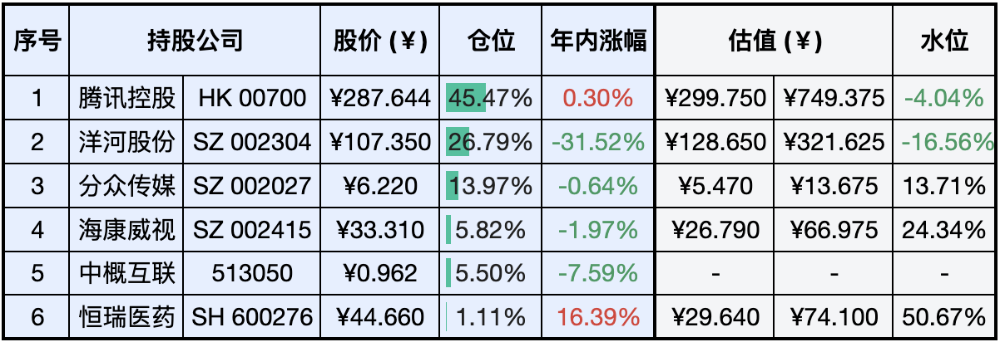
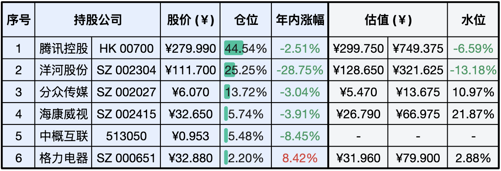

__微信公众号文章地址：[老罗实盘周记-20231216](https://mp.weixin.qq.com/s/_4Po11nKHHZ4ERfFYp5cUQ)__

```
老罗实盘周记，每周六更新。专注于股权投资、阅读、学习与个人成长，知行合一、日拱一卒、投资人生。微信公众号【老罗投资】，文章均首发于公众号。
```

### 1. 本周交易

+ 本周一清仓卖出万科A(000002)，卖出价格为 10.47 元人民币。
+ 本周四清仓卖出格力电器(000651)，卖出价格为 33.11 元人民币。
+ 使用卖出万科A和格力电器的资金，分别在周一、周四买入洋河股份(002304)，买入价格分别为 108.78 和 108.80 元人民币。

### 2. 目前持仓

当前持有的股票包括：腾讯控股 45.47%、洋河股份 26.79%、分众传媒 13.97%、海康微视 5.82%、中概互联 5.50%、恒瑞医药 1.11%。

此外，还有少量的上海机场、宋城演义、京沪高铁等股票，其份额较少，仅作为观察仓不进行记录。

**注：港股已换算为人民币**



### 3. 上周数据



### 4. 持仓收益

本周：老罗的持仓 <span class="red">+0.66%</span>，沪深300指数 <span class="green">-1.70%</span>。

截止到今日，老罗实盘今年收益率为 <span class="green">-6.57%</span>，沪深300指数今年收益率为 <span class="green">-13.69%</span>，继续跑赢沪深300指数。

### 5. 重要事项

+ 分众传媒披露股东回报计划
+ 视频号电商GMV超千亿元
+ 腾讯天美新游戏《元梦之星》上线
+ 但行好事莫问前程

==只对持股和交易感兴趣的朋友，读到这里就可以退出了。后面是对上述事件的展开，无新内容。==

#### 5.1 分众传媒披露股东回报计划

分众于12月12日发布了《分众传媒：公司股东分红回报规划(2024年度-2026年度)》，在其中规定了未来三年期间：『公司每年度按照不低于当年归属于上市公司股东的扣除非经常性损益的净利润的80%进行现金分红。』

按照较保守的估计，未来三年每年扣非净利润均值如果为50亿，则平均每年分红至少约40亿，对应当前分众的市值，股息率大概在4.5%左右。

这首先说明分众确实是一头能赚到真金白银的现金奶牛，不需要那么多的资金再投资进行扩张。其次也说明管理层愿意将盈利中的绝大部分分享给股东，在当前环境下，应该也是一种对股东负责任的行为。

这几个月分众也是跌跌不休，目前市值超出买入价格13%左右，继续持有即可，如果进一步下跌，老罗还会有买入操作，一直买到15%的仓位上限。

#### 5.2 视频号电商GMV超千亿元

微信视频号电商2023年的成交总额(GMV)预计在一千亿元左右。同时腾讯还将进一步扩大视频号电商业务的队伍，除了负责前端产品的视频号直播团队外，微信支付团队也将加入视频号电商的建设，参与各行业类目、达人、客户的拓展与运营，以及交易产品等基础功能的搭建。

视频号的日活跃用户数在2022年Q3超越快手后，商业化也被提上了日程。2022年7月，视频号分别上线了视频号小店和原生的信息流广告。

目前视频号是腾讯增长最快，也是最有机会在几年内提升收入的业务。如果微信用户养成在视频号购物的习惯，腾讯广告的收入规模也将随之提升。

在2023年Q2，微信的泛内循环广告收入（微信小程序、视频号、公众号和企业微信为落地页的广告）同比增长超过了30%，并贡献了超过一半的微信广告收入。

而抖音电商可能在今年突破2万亿元，快手电商也将突破万亿大关，视频号作为日活仅次于抖音的第二大短视频平台，提升空间巨大。

#### 5.3 腾讯天美新游戏《元梦之星》上线

周五腾讯天美的新手游《元梦之星》全平台上线，游戏中玩家可以使用多种装扮，和好友们挑战排位、积分、生存、竞速等玩法。

从9月份的首测开始，作为腾讯在派对游戏领域的重磅新品，《元梦之星》在过去两个多月里拿到了鹅厂生态内的海量宣发资源，这也许是国内手游市场自2017年的『吃鸡大战』以来最激烈的一场交锋。

激烈的原因很简单，蛋糕太过诱人。网易先发的《蛋仔派对》已经验证了这个赛道的潜力，其早在今年8月就宣布达成了双亿成就：月活用户突破1亿+UGC地图总数累计1亿张。而在12月8日，《蛋仔派对》再次对外透露其累计注册用户数量突破了5亿。

随着《元梦之星》的上线，一个最受关注的问题是腾讯能否再次凭借社交流量的渠道优势复刻《刺激战场》的后发先至。就当下的局面而言，腾讯游戏在过去几个季度的业绩相当疲软，所以今天的腾讯比当年的腾讯更迫切需要一场大胜仗。

老罗今天下载玩了一会，游戏还是很有意思的，《元梦之星》应该有希望成为腾讯又一款经典游戏。

#### 5.4 但行好事莫问前程

```
穷达皆由命，何劳发叹声。
但知行好事，莫要问前程。
冬去冰须泮，春来草自生。
请君观此理，天道甚分明。
```

译文：贫穷富贵都是天意，不需要长吁短叹。只管把握现在，做好当下的事情，而不要去管将来会怎样。冬天过去了冰雪就会消融，春天来了花草就会开放。你要是能参悟这个道理，就能把世间万事万物都看透彻了。

只管做好当下的事情，而不要去牵挂往后的发展。在人生的道路上，专注于眼前的事情，同时放下功利心态。每天比昨天都聪明一点，多读书，多实践，财富只是每天进步的副产品。

### 6. 近期读书

#### 6.1 《怪奇事物所.2》

挺有意思的一本书，包括78篇冷知识，插画的画风也不错，三星半⭐⭐⭐❤️。

#### 6.2 《毛泽东自述》

本书辑录了教员在1936、1939、1965和1970年同斯诺的四次谈话以及有关背景材料，五星⭐⭐⭐⭐⭐️推荐。

### 7. 本周运动

本周主要还是遛弯，一共4次，下周继续。

祝大家周末愉快！

```
老罗实盘周记，每周六更新。专注于股权投资、阅读、学习与个人成长，知行合一、日拱一卒、投资人生。微信公众号【老罗投资】，文章均首发于公众号。
免责声明：本公众号只作为本人的投资日志记录，本文中提及的个股都有腰斩或血本无归的风险，本人不做任何投资建议，投资请坚持独立思考。
```

__微信公众号文章地址：[老罗实盘周记-20231216](https://mp.weixin.qq.com/s/_4Po11nKHHZ4ERfFYp5cUQ)__