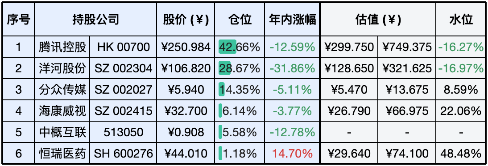
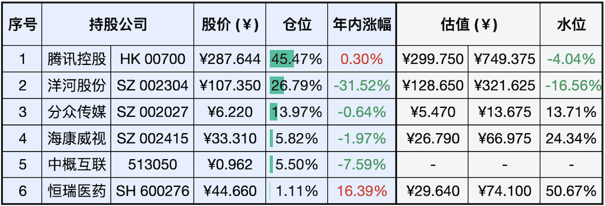
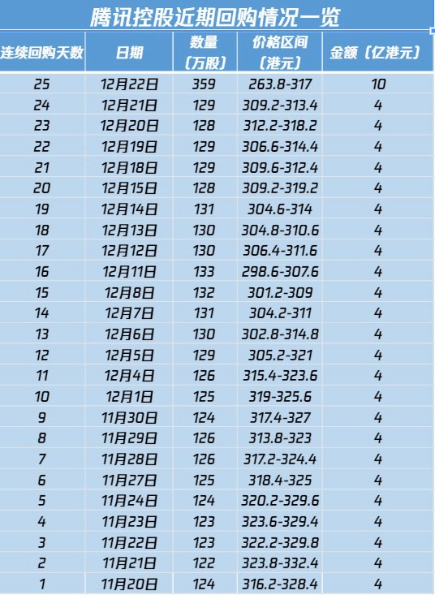

__微信公众号文章地址：[老罗实盘周记-20231223](https://mp.weixin.qq.com/s/u3qVvYsUgqdS52NDCk7ObQ)__

```
老罗实盘周记，每周六更新。专注于股权投资、阅读、学习与个人成长，知行合一、日拱一卒、投资人生。微信公众号【老罗投资】，文章均首发于公众号。
```

### 1. 本周交易

+ 无

### 2. 目前持仓

当前持有的股票包括：腾讯控股 42.66%、洋河股份 28.67%、分众传媒 14.35%、海康微视 6.14%、中概互联 5.58%、恒瑞医药 1.18%。

此外，还有少量的上海机场、宋城演义、京沪高铁等股票，其份额较少，仅作为观察仓不进行记录。

**注：港股已换算为人民币**



### 3. 上周数据



### 4. 持仓收益

本周：老罗的持仓 <span class="green">-7.10%</span>，沪深300指数 <span class="green">-0.13%</span>。

截止到今日，老罗实盘今年收益率为 <span class="green">-13.67%</span>，沪深300指数今年收益率为 <span class="green">-13.80%</span>，实盘收益与沪深300指数相差无几了。

### 5. 重要事项

+ 腾讯港股市值蒸发超3600亿
+ 存款利率下调
+ 下一步投资计划
+ 日拱一卒功不唐捐

==只对持股和交易感兴趣的朋友，读到这里就可以退出了。后面是对上述事件的展开，无新内容。==

#### 5.1 腾讯港股市值蒸发超3600亿

本周五，国家新闻出版署发布了一项征求意见稿《网络游戏管理办法（草案征求意见稿）》，对此社会上展开广泛讨论。

征求意见稿中明确规定，不得发布内容不符或证明文件不全的网络游戏广告；严禁网络游戏直播中出现高额打赏行为；要求所有网络游戏必须设置用户充值限额；限制过度使用和高消费行为；禁止在游戏中设置每日登录、首次充值、连续充值等具有诱导性质的奖励机制。

当天香港恒生指数收跌1.69%，恒生科技指数跌4.37%。游戏股重挫，网易跌超24%，腾讯控股跌超12%，哔哩哔哩跌超9%，快手跌超7%，金山软件跌超6%。腾讯港股市值一天蒸发超过3600亿港币。

应对股价的大幅下跌，腾讯在周五回购了10亿港币，也创造了近年来单日回购量的最高纪录。



因为腾讯在持有公司中占比第一，受此影响，本周实盘的跌幅破7。这属于典型的黑天鹅事件，老罗表示只能默默接受。失去信心容易，恢复信心就比较难啰。

#### 5.2 存款利率下调

12月22日，五家国有大型商业银行宣布对人民币存款挂牌利率进行了调整。这也是时隔3个月、继今年6月和9月后，主要商业银行迎来的年内第三次存款利率下调。与今年前两次存款利率调整相似，长期限存款利率的降幅最大。

针对定期存款，一年期及以内利率下调0.1个百分点，二年期利率下调0.2个百分点，三年期和五年期利率下调0.25个百分点。

周四得到这消息时，大家一阵欢欣鼓舞，有不少人断定第二天一定大涨，没想到周五就是当头一棒，哈哈，惊不惊喜？意不意外？

#### 5.3 下一步投资计划

目前腾讯和洋河都来了比较不错的买入价格，老罗计划下周筹措一些资金，如果腾讯的股价还能保持在250人民币左右，会再买入一些。

洋河之前买入较多，持仓比例已经超过上限，暂不买入。

分众传媒经过一阵的跌跌不休，离买入价格也不是特别远了，如果进一步下跌，也会考虑买入。

#### 5.4 日拱一卒功不唐捐

『日拱一卒，功不唐捐』的意思是：每天像个象棋的卒子那样前进一点，努力就绝对不会白费。完整的句子是『日拱一卒无有尽，功不唐捐终入海』就是锲而不舍、天道酬勤，勉励人们勤奋进取的意思。


『日拱一卒无有尽』中的卒是中国象棋里的卒，一次只能走一步，它不像车、马等一次可以走多步。这个『日拱一卒』，时间长了，再小的进步也会产生价值，这是基本的意义所在。意思是只要勤奋努力、坚持不懈，每天像个小卒一样前进一点点、进步一点点，终会有所成就。

『功不唐捐终入海』中的唐字这里意为白白的、徒然的。唐捐：虚耗、废弃的意思。功不唐捐是佛家语，意思是努力地为某件事所下的功夫不会白白地浪费。世界上的所有功德与努力，都是不会白白付出的，必然是有回报的。

功不唐捐出自《法华经》，若有众生、恭敬礼拜观世音菩萨，福不唐捐，是故众生皆应受持观世音菩萨名号。而里面的『福不唐捐』，后人逐渐写成了『功不唐捐』，也把经文里比较单纯指代的佛教功德的福，扩展成了可指代一切奋进努力的功。

人可以不给自己设定具体目标，因为目标只是你做事的副产品，只要你按照自己的信念，不断努力地去做事、不断地去尝试，就可以了，至于能做到哪一步，顺应自然就好。『日拱一卒，功不唐捐』就是这个意思，付出的努力不会白费。

### 6. 近期读书

#### 6.1 《一个人住的每一天》

《一个人住的每一天》是日本著名漫画家高木直子在杂志《尽情享受一个人的生活!》上发表的连载，加上一部分未发表的内容集结而成。

评分三星半⭐️⭐️⭐️❤️

#### 6.2 《指尖上的会计：一本书读懂会计那些事儿》

书里写的内容比较碎片化，走马观花，内容比较浅，更偏重于经验，理论知识较少。

评分三星⭐️⭐️⭐️

### 7. 本周运动

本周主要还是遛弯一共5次，爬楼1次，下周继续。

祝大家周末愉快！

```
老罗实盘周记，每周六更新。专注于股权投资、阅读、学习与个人成长，知行合一、日拱一卒、投资人生。微信公众号【老罗投资】，文章均首发于公众号。
免责声明：本公众号只作为本人的投资日志记录，本文中提及的个股都有腰斩或血本无归的风险，本人不做任何投资建议，投资请坚持独立思考。
```

__微信公众号文章地址：[老罗实盘周记-20231223](https://mp.weixin.qq.com/s/u3qVvYsUgqdS52NDCk7ObQ)__