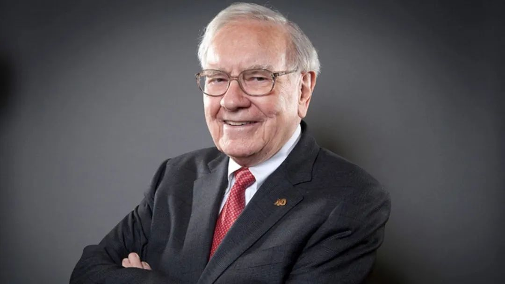

__微信公众号文章地址：[沃伦•巴菲特宣布退休，即将离开伯克希尔](https://mp.weixin.qq.com/s/tzw1Z_mNkU3WrWICDX92FA)__

上周末，《华尔街日报》爆出重磅新闻：沃伦·巴菲特将离开伯克希尔，下一任首席执行官将由格雷格·阿贝尔担任。这意味着，巴菲特正式退休了。

天下没有不散的筵席，估计芒格离开之后，对他触动很大，巴菲特今年93岁，也该享享清福了。巴菲特管理伯克希尔58年，在1965年，巴菲特买下了伯克希尔，后来又把它从一家纺织公司改造成一家投资公司。

在巴菲特的卓越管理下，伯克希尔成为横跨消费、能源、保险的大型跨国公司。女人和孩子的钱都被巴菲特赚走了。DQ冰淇淋、益达口香糖、可口可乐、德芙、士力架、奥利奥、apple等品牌背后，很多都和伯克希尔公司有关。伯克希尔还有美国第二大财险公司GEICO、全球知名的伯克希尔再保公司、美国最大的铁路公司伯灵顿铁路等。

今后的伯克希尔年会注定看不到巴芒的演出了，很有幸见证了一段传奇的落幕......

__微信公众号文章地址：[沃伦•巴菲特宣布退休，即将离开伯克希尔](https://mp.weixin.qq.com/s/tzw1Z_mNkU3WrWICDX92FA)__