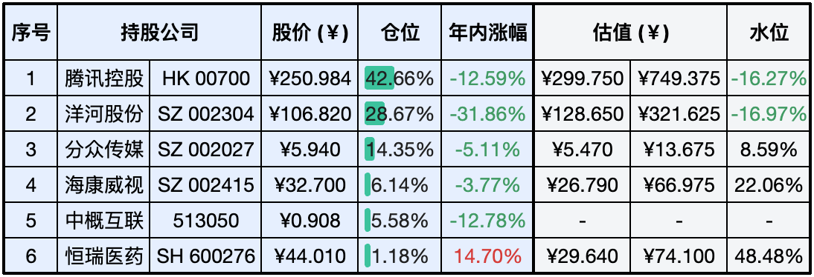

__微信公众号文章地址：[老罗实盘周记-20231230-年终总结](https://mp.weixin.qq.com/s/6Da3TkpWJsxHs_wckHoGUg)__

```
老罗实盘周记，每周六更新。专注于股权投资、阅读、学习与个人成长，知行合一、日拱一卒、投资人生。微信公众号【老罗投资】，文章均首发于公众号。
```

### 1. 本周交易

+ 无

### 2. 目前持仓

当前持有的股票包括：腾讯控股 41.46%、洋河股份 26.91%、分众传媒 13.93%、海康微视 5.95%、中概互联 5.26%、恒瑞医药 1.11%。

此外，还有部分现金，加上少量的上海机场、宋城演义、京沪高铁等股票，其份额较少，仅作为观察仓不进行记录。

**注：港股已换算为人民币**


### 3. 上周数据



### 4. 持仓收益

本周：老罗的持仓 <span class="red">+4.88%</span>，沪深300指数 <span class="red">+2.81%</span>。

老罗实盘2023年全年收益率为 <span class="green">-8.79%</span>，沪深300指数全年收益率为 <span class="green">-11.38%</span>，连续三年跑赢沪深300指数。

### 5. 重要事项

+ 年内交易统计
+ 沪深300指数达成连续三年下跌成就
+ 腾讯继续回购，本周再现腾十亿

==只对持股和交易感兴趣的朋友，读到这里就可以退出了。后面是对上述事件的展开，无新内容。==

#### 5.1 年内交易统计

全年累计卖出6次：

+ 4月1日周记，卖出腾讯分红的美团股票，卖出价格分别为132.10港币与132.30港币。
+ 6月3日周记，卖出部分银华日利货币基金。
+ 7月8日周记，清仓银华日利货币基金。
+ 12月9日周记，卖出部分格力电器，卖出价格为32.83元人民币。
+ 12月16日周记，清仓卖出万科A，卖出价格为 10.47 元人民币。
+ 12月16日周记，清仓卖出格力电器，卖出价格为 33.11 元人民币。

全年累计买入16次：

+ 2月11日周记，买入银华日利ETF货币基金，买入价格为100.285人民币。
+ 4月1日周记，买入银华日利货币基金，买入价格为100.498人民币。
+ 4月8日周记，买入银华日利货币基金，买入价格：100.528人民币。
+ 4月15日周记，买入洋河股份，买入价格为150元人民币。
+ 4月29日周记，买入不到1%仓位的分众传媒，买入价格为6.00人民币。
+ 5月6日周记，买入银华日利货币基金，买入价格为100.717人民币。
+ 5月20日调记，买入1%仓位的洋河股份，买入价格为140.00元人民币。
+ 6月3日周记，买入2%仓位的洋河股份，买入价格为135.92元人民。
+ 7月8日周记，分三批买入了近10%仓位的洋河股份，成交价格分别为132元、130.7元和130元。
+ 8月26日周记，买入上海机场，买入价格39.07元人民币，观察仓。
+ 10月14日周记，买入洋河股份，买入价格分别为128.6元和125.1元。
+ 10月21日周记，买入洋河股份，周一买入价格120.1元人民币，周五买入价格115.1元人民币。
+ 10月21日周记，买入腾讯控股，买入价格为298元港币。
+ 12月2日周记，买入洋河股份，买入价格为115.1元人民币。
+ 12月9日周记，买入洋河股份，买入价格为114.27元人民币。
+ 12月16日周记，买入洋河股份，买入价格分别为108.78和108.80元人民币。

今年还是以买入为主，其中的大项是在洋河便宜时增加了15%左右的仓位，腾讯、分众因为仓位过高或是不算便宜，只是稍微增加了一些。

其间也清仓了万科A，格力电器这种慢慢变得复杂看不懂的公司。美团是腾讯年初的分红，因为看不懂美团，到手后就直接卖出了。

货币基金原本想是作为资金的一个临时去处，后来发现还不如直接用招商证券的天添利来得方便，也就清仓作罢了。

#### 5.2 沪深300指数达成连续三年下跌成就

近年来中国股市的表现确实有些低迷，以沪深300指数为例，已经连续下跌了三年，21年下跌5.20%，22年下跌21.63%，23年下跌11.38%。这也是该指数成立以来，首次达成三年下跌成就。从市盈率的角度来看，当前沪深300的市盈率为10.96，已经接近了历史低点，接近2018年底部的市盈率水平，市净率则更为悲观，已经接近了2014年底部的水平。

29日最后一个交易日，上证指数、深证成指、创业板指分别收在2974.93点、9524.69点、1891.37点，全年分别下跌3.7%、13.54%、19.41%。年内共打响4次3000点保卫战，不过大盘最终未能收复3000点，这也是2013年以来上证指数第三度收在3000点以下位置。当前A股整体估值已经来到一个比较有吸引力的位置，如此低的市盈率风险已经非常小了，这个时候往往有不错的投资机会。

而港股市场已经连续下跌了四年，在全球128个主要股指里，沪深300指数近三年收益率为-31.1%，排在全球倒数第二，排倒数第一的是恒生指数的-38.8%。但老话说得好『风浪越大，鱼越贵』，随着全球降息周期的到来，资金必然会流向价值洼地，港股与大A未来可期。

#### 5.3 腾讯继续回购，本周再现腾十亿

本周港股只有三个交易日，因为圣诞节假期，港股周一和周二休市，居然比美国人还多休一天？续上周五首现『腾十亿』之后，腾讯依然给力，连续三个交易日打出十亿港币进行回购。

老罗本周也筹集了点资金打算加仓，奈何错误定价很快就会被修复，本周腾讯涨得较多，如果之后跌到250人民币左右，还会进行买入操作。


游戏版号方面，周一国家新闻出版署发布了新批准的105款国产游戏版号，单次审批数量首次突破百款，所涵盖的游戏企业范围也更广，有多家游戏大厂都在此次获批，其中包括腾讯的《逆战：未来》。

这次新批版号，是继12月22日新批准一批进口网络游戏版号后，国家新闻出版署又批准发布的一批国产网络游戏版号，展示了主管部门积极支持网络游戏发展的态度，应该也是对上周五意见稿的一个纠偏。

### 6. 近期读书

#### 6.1 《半小时漫画中国地理2：四川、重庆、湖南、湖北》

这一本书介绍了川渝、两湖地区，读起来轻松有趣。

评分四星⭐️⭐️⭐️⭐️

#### 6.2 《上野千鹤子的私房谈话：像女性主义者那样解决问题》

上野千鹤子，社会学者，东京大学名誉教授。针对读者提出的问题，从女性主义者的角度出发，鼓励女性冲破羞耻，大声说出自己的烦恼。

男性也值得一读，可以学习从女性视角解决问题。评分三星半⭐️⭐️⭐️❤️

#### 6.3 《铲史官漫画：超有趣的病毒简史》

信息量不算太大，零食读物，很短的时间即可读完。

评分四星⭐️⭐️⭐️⭐️

#### 6.4 2023年读书统计

截止到12月30日，全年共读完了 172 本书，基本上是一周看三本书的节奏。其中有一些书非常不错，记录一下方便查找(按阅读时间排序)：

+ 一本书读懂财报
+ 宇宙
+ 巴菲特幕后智囊-查理·芒格传
+ 金钱博弈
+ 实践论
+ 相信
+ 如何开一家小而美的店
+ 挽救计划
+ 认知觉醒
+ 微习惯
+ 福格行为模型
+ 一定要告诉孩子的18堂商业思维课
+ 芒格之道-查理芒格股东会讲话1987-2022 <span class="red">(投资者必读)</span>
+ 陪孩子终身成长
+ 少年发声
+ 百万富翁快车道
+ 走出戈壁
+ 毛泽东自述

### 7. 本周运动

本周主要还是遛弯一共3次，爬楼2次，下周继续。

### 8. 2024新年快乐

岁月倥偬，时光蹁跹，转眼2023年就要结束了，22年的总结还如同在昨日一般。世上唯一不能复制的是时间，不能重演的是人生。时光如梭，一晃而过，余生很短，别辜负时光，应珍惜当下。

愿2024年大家的生活如诗如画，幸福永驻，笑颜常开。

```
老罗实盘周记，每周六更新。专注于股权投资、阅读、学习与个人成长，知行合一、日拱一卒、投资人生。微信公众号【老罗投资】，文章均首发于公众号。
免责声明：本公众号只作为本人的投资日志记录，本文中提及的个股都有腰斩或血本无归的风险，本人不做任何投资建议，投资请坚持独立思考。
```

__微信公众号文章地址：[老罗实盘周记-20231230-年终总结](https://mp.weixin.qq.com/s/6Da3TkpWJsxHs_wckHoGUg)__