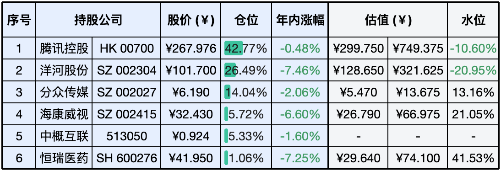
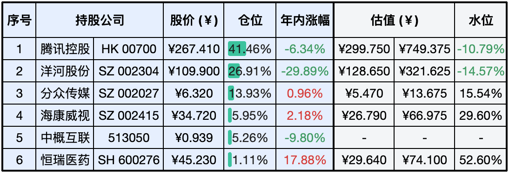
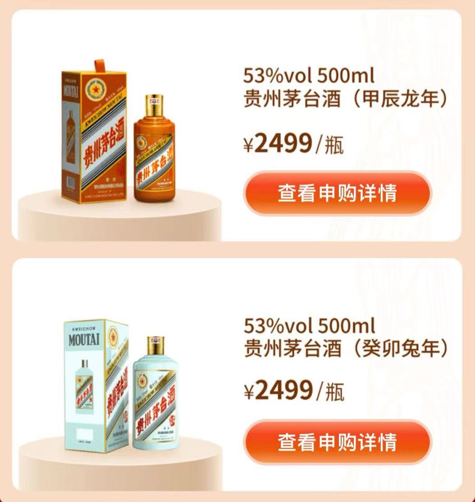

__微信公众号文章地址：[老罗实盘周记-20240106](https://mp.weixin.qq.com/s/C9ihB9uXBctm-iODqV_wBw)__

```
老罗实盘周记，每周六更新。专注于股权投资、阅读、学习与个人成长，知行合一、日拱一卒、投资人生。微信公众号【老罗投资】，文章均首发于公众号。
```

### 1. 本周交易

+ 周五(1月5日)买入洋河股份(002304)，买入价格为102.00元人民币。

### 2. 目前持仓

当前持有的股票包括：腾讯控股 42.77%、洋河股份 26.49%、分众传媒 14.04%、海康微视 5.72%、中概互联 5.33%、恒瑞医药 1.06%。

此外，还有部分现金，加上少量的上海机场、宋城演义、京沪高铁等股票，其份额较少，仅作为观察仓不进行记录。

**注：港股已换算为人民币**



### 3. 上周数据



### 4. 持仓收益

本周：老罗的持仓 <span class="green">-2.78%</span>，沪深300指数 <span class="green">-2.97%</span>。

截止到今日，老罗实盘今年收益率为 <span class="green">-2.78%</span>，沪深300指数今年收益率为 <span class="green">-2.97%</span>。

新年第一周并没有开门红，投资者信心依然不足。

### 5. 重要事项

+ 腾讯新年继续回购
+ 关于洋河
+ 龙茅正式发售

==只对持股和交易感兴趣的朋友，读到这里就可以退出了。后面是对上述事件的展开，无新内容。==

#### 5.1 腾讯新年继续回购

腾讯1月5日回购342万股，共耗资约10亿港币，这也是Q3财报发布后连续第32个交易日回购，新年的四个交易日，每天回购额都达到了10亿港币。恒生指数已经连续四年下跌，创历史记录，现在港股便宜公司不少，但投资人信心不足，这个时候企业回购自家公司股票是最明智的选择。

其实任何股票都只有一个真正的买家，那就是公司自己。这种观点强调了公司回购自己股票的重要性，当公司回购自己的股票时，它实际上是以公司资金从市场上购买自己的股份，使得这些股份不再公开交易。这样一来，公司的股本减少，每股股份所代表的所有权比例相应增加。

如果公司认为其股票被低估，回购股票是一种聪明的资本策略。通过回购股票公司可以提高每股股份的价值，为现有的股东带来更大的收益。这种做法对于那些有<span class="red">稳定盈利能力</span>和有<span class="red">持续增长前景</span>的公司来说尤为适用。

希望腾讯当前的股价能多保持一段时间，让腾十亿来得更猛烈一些。

#### 5.2 关于洋河

到1月5日收盘，洋河股份报101.70元，新年第一周，连续4个交易日下跌，期间累计跌幅达到了7.46%。老罗在周五下了两个限价单，到中午时102.00元那单成交了。洋河近期跌幅确实较大，一年来的跌幅已经超过30%，现在的股价101.70元，已经低于之前管理层股权激励的价格103.73元。

洋河最大的负面是历史问题，老管理层股权出了状况，同时新员工持股计划获得的股权大跌，目前企业内部情绪低落，员工积极性不高。叠加近期白酒行业整体都不太景气，如何破圈突围而出，这是要考验洋河管理层能力的时候了。

#### 5.3 龙茅正式发售

贵州茅台酒（甲辰龙年）今晚正式发布，i茅台也推出了专场活动，申购价格为2499元/瓶，价格与兔年茅台持平。申购结果将于1月7日18:00进行公示。

去年老罗11月分才开始申购，只中了一瓶『兔毛』，希望新年能中几瓶『龙毛』沾沾好运。



### 6. 近期读书

#### 6.1 《党委会的工作方法》

这本书是教员在中共七届二中全会上所作的重要总结性讲话的一部分，新年第一天阅读，受益匪浅。

评分五星⭐️⭐️⭐️⭐️⭐️

#### 6.2 《看得见的拥抱系列》

《看得见的拥抱系列》一共有三本，分别是：《看得见的拥抱》、《每天都想陪伴你》、《当鲨鱼温柔袭击》，很有趣的漫画，适合放松时一读。

评分四星⭐️⭐️⭐️⭐️

### 7. 本周运动

本周遛弯一共4次，爬楼1次，下周继续。

祝大家周末愉快。

```
老罗实盘周记，每周六更新。专注于股权投资、阅读、学习与个人成长，知行合一、日拱一卒、投资人生。微信公众号【老罗投资】，文章均首发于公众号。
免责声明：本公众号只作为本人的投资日志记录，本文中提及的个股都有腰斩或血本无归的风险，本人不做任何投资建议，投资请坚持独立思考。
```

__微信公众号文章地址：[老罗实盘周记-20240106](https://mp.weixin.qq.com/s/C9ihB9uXBctm-iODqV_wBw)__