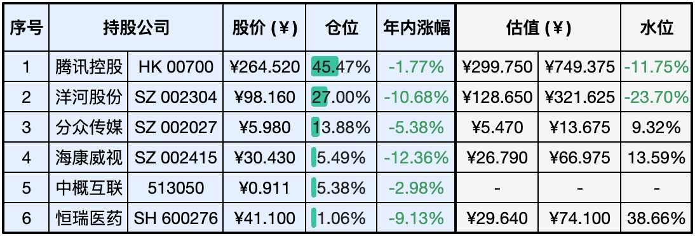
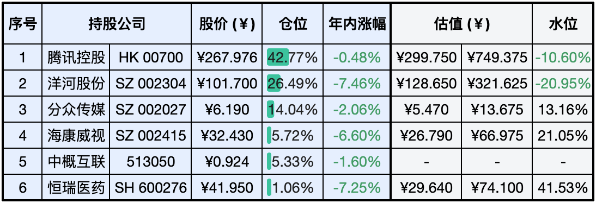

__微信公众号文章地址：[老罗实盘周记-20240114](https://mp.weixin.qq.com/s/bzp8aSjL7BYmlpOQl3KlzA)__

```
老罗实盘周记，每周六更新。专注于股权投资、阅读、学习与个人成长，知行合一、日拱一卒、投资人生。微信公众号【老罗投资】，文章均首发于公众号。
```

### 1. 本周交易

本周六临时有事未更新实盘，改成周日发布。

+ 周一(1月8日)买入洋河股份(002304)，买入价格为99.90元人民币。
+ 周三(1月10日)买入腾讯控股(00700)，买入价格为291.80元港币。

### 2. 目前持仓

当前持有的股票包括：腾讯控股 45.47%、洋河股份 27.00%、分众传媒 13.88%、海康微视 5.49%、中概互联 5.38%、恒瑞医药 1.06%。

此外，还有部分现金，加上少量的上海机场、宋城演义、京沪高铁等股票，其份额较少，仅作为观察仓不进行记录。

**注：港股已换算为人民币**



### 3. 上周数据



### 4. 持仓收益

本周：老罗的持仓 <span class="green">-2.38%</span>，沪深300指数 <span class="green">-1.35%</span>。

截止到今日，老罗实盘今年收益率为 <span class="green">-5.16%</span>，沪深300指数今年收益率为 <span class="green">-4.28%</span>，今年第一次跑输沪深300指数。

### 5. 重要事项

+ 尘埃落定
+ 腾讯回购由每天10亿减为5亿
+ 世上最好的放生就是放过自己

==只对持股和交易感兴趣的朋友，读到这里就可以退出了。后面是对上述事件的展开，无新内容。==

#### 5.1 尘埃落定

本周最重要的事莫过于海峡对面的『大选』了，周六结果尘埃落定。这一次和以往不同，由蓝绿PK变成三足鼎立，其中绿激进、蓝务实、白中立。

虽然这次绿获胜了，但蓝白加在一起也超过了60%，说明岛内大多数人其实并不敢触碰底线，他们也清楚自己到底有几斤几两，现在还能蹦哒蹦哒，真要逼急了，就让他们去太平洋海底蹦哒。

#### 5.2 腾讯回购由每天10亿减为5亿

减少回购金额也是预料之中，毕竟每天消耗10亿港币进行回购，全年回购需要的金额就得超过千亿人民币了，加上每年分红所需要的资金，确实会存在压力。

回购金额减少到5亿每天，正好说明腾讯管理层有做好长期回购的打算与准备，细水长流嘛。

#### 5.3 世上最好的放生就是放过自己

```
暴躁，是因为你自身无能。
恐惧，是因为你害所失去。
烦乱，是因为你思路不清。
懒散，是因为你目标不明。
焦虑，是因为你想得太多。
压力，是因为你预期太高。
劳苦，是因为你方法不对。
```

在人生旅途中，我们时常面临各种艰难险阻，疲惫不堪。然而若一味沉浸于过去的痛苦和遗憾，我们无法向前迈进。因此学会宽恕自己，放下过去的负担，我们才能勇敢地面对未来的挑战。

不要让往事纠缠，因为它们已经过去；不要与现实较劲，因为你还要继续生活。珍惜眼前的人和事，抓住每一个当下机会，让生命更加丰富多彩。若走不出执念的囚禁，无论走到哪里，都只是个囚徒。

人生犹如一段旅程，我们会遇到各种风景和人物，既有美好，也有苦涩。无论好与坏，那都是我们人生的一部分，都值得我们去体验和领悟。人生不过是一场过客，没有什么是不能放下的。

### 6. 近期读书

#### 6.1 《千古奇文枕边书》

全书共收录中国先秦到明清的64篇奇文，属于非常值得一读的好书。

评分四星半⭐️⭐️⭐️⭐️❤️

### 7. 本周运动

本周遛弯一共5次，下周继续。

祝大家周末愉快。

```
老罗实盘周记，每周六更新。专注于股权投资、阅读、学习与个人成长，知行合一、日拱一卒、投资人生。微信公众号【老罗投资】，文章均首发于公众号。
免责声明：本公众号只作为本人的投资日志记录，本文中提及的个股都有腰斩或血本无归的风险，本人不做任何投资建议，投资请坚持独立思考。
```

__微信公众号文章地址：[老罗实盘周记-20240114](https://mp.weixin.qq.com/s/bzp8aSjL7BYmlpOQl3KlzA)__