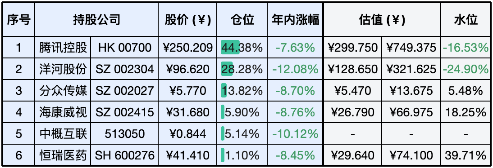

__微信公众号文章地址：[老罗实盘周记-20240120](https://mp.weixin.qq.com/s/10PmUYi-tiB-u2WR7vr4wQ)__

```
老罗实盘周记，每周六更新。专注于股权投资、阅读、学习与个人成长，知行合一、日拱一卒、投资人生。微信公众号【老罗投资】，文章均首发于公众号。
```

### 1. 本周交易

+ 周五(1月19日)买入洋河股份(002304)，买入价格为96.66元人民币。

### 2. 目前持仓

当前持有的股票包括：腾讯控股 44.38%、洋河股份 28.28%、分众传媒 13.82%、海康微视 5.90%、中概互联 5.14%、恒瑞医药 1.10%。

此外，还有部分现金，加上少量的上海机场、宋城演义、京沪高铁等股票，其份额较少，仅作为观察仓不进行记录。

**注：港股已换算为人民币**



### 3. 上周数据


### 4. 持仓收益

本周：老罗的持仓 <span class="green">-2.92%</span>，沪深300指数 <span class="green">-0.44%</span>。

截止到今日，老罗实盘今年收益率为 <span class="green">-8.08%</span>，沪深300指数今年收益率为 <span class="green">-4.70%</span>，今年第二周跑输沪深300指数。

### 5. 重要事项

+ 2023年我国GDP增长5.2%
+ 腾讯下周将停止回购
+ 思危，思退，思变

==只对持股和交易感兴趣的朋友，读到这里就可以退出了。后面是对上述事件的展开，无新内容。==

#### 5.1 2023年我国GDP增长5.2%

国家统计局17日发布数据，初步核算，2023年国内生产总值126.0582万亿元，按不变价格计算，比上年增长5.2%。分季度看，一季度国内生产总值同比增长4.5%，二季度增长6.3%，三季度增长4.9%，四季度增长5.2%。从环比看，四季度国内生产总值增长1.0%。

全年增长5.2%，也是达成了年初制定增长5%左右的目标。但由于今年人民币贬值较多，23年人民币与美元的平均汇率为7.0467，22年为6.7261，同比贬值4.55%，基本上抹平了GDP增长。126万亿人民币按当前汇率换算是17.5万亿美元，与第一名鹰酱27万亿美元的差距进一步的拉大了。

2023年的年初大家都满怀着期待，但没有料到今年的困难会那么多，经济复苏会那么地艰难。好在路途虽然拥堵，但最终我们总会到达目的地。

#### 5.2 腾讯停止回购

2024年开年已来，港股回购金额已经超过190亿港元，仅腾讯一家，就耗资近百亿进行回购，在港股企业中排名首位。

但由于在三月份要发布23年的年报，港交所规定在年报前2个月和中报季报前1个月是静默期，不能进行回购，所以从本周五开始，腾讯的回购就已经停止了。可能是要进入静默期的缘故，担心没有回购后空头更加肆无忌惮，本周有些『聪明人』提前进行了卖出，这也应该是本周腾讯跌幅较大的一个原因。

说实话持有腾讯的这几年，体验确实很差，老罗从450多港币起买入，一路的下跌，最惨的时候都跌破了200港币。看到持有的股票腰斩，心理上一点波动也没有，确实也是不太现实。价值投资者最重要的素质就是两点，一是能正确地面对波动，二是对企业未来现金流的正确估值，第一条决定赚不赚钱，第二条决定赚多少钱。腾讯家大业大，现金流充足，每年都能赚到大量的真金白银，但无奈疯疯癫癫的市场先生就是不喜欢这只胖鹅。

目前271港币的价格吸引力已经颇大，有闲余资金老罗还会考虑买入。

#### 5.3 思危，思退，思变

太监冯保本是首席太监吕芳的亲信，他跟随吕芳多年。当看到天降瑞雪，他为了获得在嘉靖面前露脸的机会，抢着去向嘉靖报祥瑞。他的这一举动，让吕芳的死对头、司礼监秉笔太监陈洪抓住了把柄，轻飘飘一句『我以为皇上一高兴，就让你进司礼监了』就让他在雪地里跪了一夜。

吕芳很心疼冯保，等众人走后，他单独教导冯保，说出了《大明王朝1566》中的经典『为官三思』。三思就是：思危，思退，思变。

懂得未雨绸缪，就能躲开危机，目光放长远，才能走的更顺畅，这就叫思危。任何事物发展到巅峰，都会向反面发展，在将满未满之际，选择退一步，避免满则溢的情况发生，这就叫思退。顺之则胜，逆之则败，聪明的人虚怀若谷，改变自己，顺应变化，这就叫思变。

居安则思危，欲进则思退，欲通则思变，人生才能得安，得进，得退。三思不是患得患失，而是一种从容，一种睿智，一种积极乐观的人生态度。

### 6. 近期读书

#### 6.1 《君主论》

《君主论》由马基雅维利于1513年写成，从意大利流传到世界各国，盛名不衰迄今已五个世纪。小小的一本书，阐述的人性本质、权力体系、国际关系，不仅清晰论断了五百年前的意大利半岛局势，也与当今各国的政治形势息息相关，还可以用来解读权力的游戏。它从西方到东方，引发了政界、宗教界、学术界的巨大反响，被列入影响人类历史的十大著作之一，与《圣经》《资本论》相提并论。

评分三星半 ⭐️⭐️⭐️❤️

#### 6.2 《政府工作报告》

2023年3月5日，李克强总理代表国务院在十四届全国人民代表大会第一次会议上所作的《政府工作报告》，李公千古。

评分五星 ⭐️⭐️⭐️⭐️⭐️

#### 6.3 《漫画科普：比知识有趣的冷知识2》

这是一套启发思维的科普类图书，也是一套画面精良的知识绘本，通过有趣的漫画内容，将鲜为人知的冷知识绘制出来，是一个包罗万象的知识合集。

评分三星半 ⭐️⭐️⭐️❤️

### 7. 本周运动

本周遛弯一共5次，下周继续。

祝大家周末愉快。

```
老罗实盘周记，每周六更新。专注于股权投资、阅读、学习与个人成长，知行合一、日拱一卒、投资人生。微信公众号【老罗投资】，文章均首发于公众号。
免责声明：本公众号只作为本人的投资日志记录，本文中提及的个股都有腰斩或血本无归的风险，本人不做任何投资建议，投资请坚持独立思考。
```

__微信公众号文章地址：[老罗实盘周记-20240120](https://mp.weixin.qq.com/s/10PmUYi-tiB-u2WR7vr4wQ)__