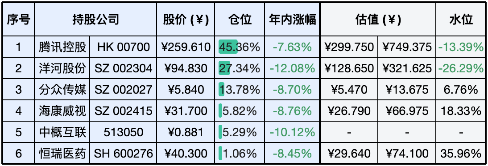
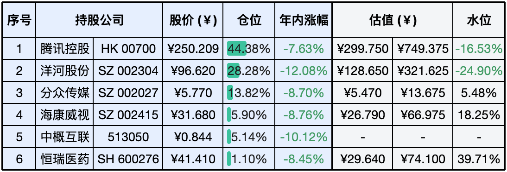

__微信公众号文章地址：[老罗实盘周记-20240127](https://mp.weixin.qq.com/s/AFPLv5vGKxsYR3wiypTdHw)__

```
老罗实盘周记，每周六更新。专注于股权投资、阅读、学习与个人成长，知行合一、日拱一卒、投资人生。微信公众号【老罗投资】，文章均首发于公众号。
```

### 1. 本周交易

+ 无

### 2. 目前持仓

当前持有的股票包括：腾讯控股 45.36%、洋河股份 27.34%、分众传媒 13.78%、海康微视 5.82%、中概互联 5.29%、恒瑞医药 1.06%。

此外，还有部分现金，加上少量的上海机场、宋城演义、京沪高铁等股票，其份额较少，仅作为观察仓不进行记录。

**注：港股已换算为人民币**



### 3. 上周数据



### 4. 持仓收益

本周：老罗的持仓 <span class="red">+1.40%</span>，沪深300指数 <span class="red">+1.96%</span>，本周终于止跌了。

截止到今日，老罗实盘今年收益率为 <span class="green">-6.68%</span>，沪深300指数今年收益率为 <span class="green">-2.84%</span>，今年第三周跑输沪深300指数。

### 5. 重要事项

+ 降准降息
+ 证监会副主席回应股市波动
+ 拒绝内耗

==只对持股和交易感兴趣的朋友，读到这里就可以退出了。后面是对上述事件的展开，无新内容。==

#### 5.1 降准降息

在1月24日的国新办新闻发布会上，中国人民银行行长潘功胜宣布了一项重大决策：人民银行决定于2月5日将存款准备金率降低0.5个百分点，此举预计为市场注入长期流动性约1万亿元。同时，1月25日，人民银行进一步下调支农支小再贷款及再贴现利率0.25个百分点，致力于推动社会综合融资成本实现稳中有降。

尽管市场对于降准已有所预期，但此次政策的力度、幅度以及释放的资金规模均显著超出市场预期，显示了政策制定者的决心和魄力。这次降准不仅为市场注入了强劲动力，提振了当前较为低迷的市场信心，同时也为即将到来的春节提供了有力的流动性支撑。

进入24年，许多人明显感受到赚钱的难度加大，众多公司为了应对这一挑战，纷纷采取裁员措施以追求『降本增效』。然而，成本降低是否真的带来了效益的提升，仍要打上一个大大的问号。在这种背景下，过度的内部竞争和不断加剧的焦虑情绪只会进一步削弱人们对未来的信心，只会越来越内卷，导致消费意愿下降，从而使经济陷入恶性循环。

此次降准政策的核心目标正是推动消费和扩大内需，以加快经济的复苏步伐。通过提升市场活力和增加就业机会，人们的收入水平有望得到提高，进而激发消费潜力。随着政策的逐步落地和效果的显现，我们有理由相信，在今年内将能够看到积极的变化和成效。

#### 5.2 证监会副主席回应股市波动

在周三的一场媒体采访中，中国证监会副主席王建军针对近期股市的波动和中小投资者的保护问题发表了看法。他强调，只有当广大投资者真正感受到实实在在的收益时，资本市场的平稳健康发展才能打下坚实的基础，进而有效地稳定市场和增强投资者的信心。

对于普通投资者而言，普遍关注的是当前大A股市场存在的『重融资轻投资』现象，认为这种环境对投资者并不友好。如果普通投资者无法从市场中获得收益，不能与企业共同成长，那么股市的融资功能必然会受到严重影响。

随着中国经济的持续快速发展，大A股市场也在不断完善中。老罗相信，投资A股本质上是对中国经济发展的信任和投票，也就是赌国运，随着时间的推移，大A股市场将越来越公平、规范，为投资者提供更好的投资环境。

#### 5.3 拒绝内耗

作家余华曾经说过：精神内耗，说白了就是自己心里的戏太多。言未出，结局已演千百遍；身未动，心中已过万重山；行未果，假想苦难愁不展；事已闭，过往仍在脑中演。

拒绝内耗，方能觅得生活的宁静。洞悉世事，即得智慧之光；淡泊名利，则享悠然之态；豁达乐观，便拥有快乐之源。人生之累，多源于思绪纷繁：沉溺过往，忧虑未来，纠结眼前，徒增烦恼。成长之道，在于学会接受：接受曲终人散，接受变幻无常，接受孤独挫折，接受突如其来的无力感。

世间并无永远快乐之人，唯有洞察秋毫之智者。以发展的眼光，缜密的思维审视烦恼，方知痛苦之源非他人，而是自我。翻篇过往，需要莫大勇气。余生珍贵，应当远离消耗你之人。生活既要全力以赴，也要随遇而安；既要坚定决心，也要保持愉悦。因为这就是生活：一半在于理解，一半在于释怀。

### 6. 近期读书

本周阅读的书都还没看完，下周再更吧。

### 7. 本周运动

本周遛弯一共4次，下周继续。

祝大家周末愉快。

```
老罗实盘周记，每周六更新。专注于股权投资、阅读、学习与个人成长，知行合一、日拱一卒、投资人生。微信公众号【老罗投资】，文章均首发于公众号。
免责声明：本公众号只作为本人的投资日志记录，本文中提及的个股都有腰斩或血本无归的风险，本人不做任何投资建议，投资请坚持独立思考。
```

__微信公众号文章地址：[老罗实盘周记-20240127](https://mp.weixin.qq.com/s/AFPLv5vGKxsYR3wiypTdHw)__