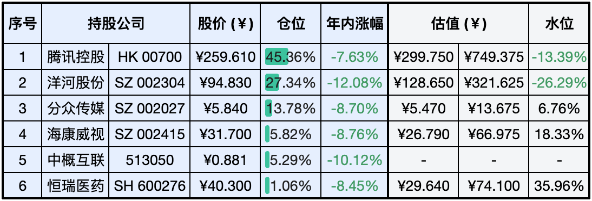

__微信公众号文章地址：[老罗实盘周记-20240203-南方小年](https://mp.weixin.qq.com/s/nBTfIvRmkVzC95w-Seoekw)__

```
老罗实盘周记，每周六更新。专注于股权投资、阅读、学习与个人成长，知行合一、日拱一卒、投资人生。微信公众号【老罗投资】，文章均首发于公众号。
```

今天是南方小年，小年一过，就算是正式开始过年了，辛苦一年的人们也应该好好准备下了，打点行装，备备年货。下周A股周一到周五正常开市，包括除夕当天，下周的实盘依然在周六(大年初一)更新。

### 1. 本周交易

+ 无

### 2. 目前持仓

当前持有的股票包括：腾讯控股 46.05%、洋河股份 26.82%、分众传媒 13.71%、海康微视 5.85%、中概互联 5.22%、恒瑞医药 0.97%。

此外，还有部分现金，加上少量的上海机场、宋城演义、京沪高铁等股票，其份额较少，仅作为观察仓不进行记录。

**注：港股已换算为人民币**


### 3. 上周数据



### 4. 持仓收益

本周：老罗的持仓 <span class="green">-2.11%</span>，沪深300指数 <span class="green">-4.63%</span>，这周跌得有点惨。

截止到今日，老罗实盘今年收益率为 <span class="green">-8.79%</span>，沪深300指数今年收益率为 <span class="green">-7.33%</span>，今年第四周跑输沪深300指数。

### 5. 本周事项

+ 腾讯年会
+ 分众发布23年业绩预告
+ 贵有贵的道理

==只对持股和交易感兴趣的朋友，读到这里就可以退出了。后面是对上述事件的展开，无新内容。==

#### 5.1 腾讯年会

本周，腾讯召开了公司年会。年会上，腾讯公司董事会主席、首席执行官马化腾表示，视频号要大力发展直播电商，微信这颗老树要发新芽，游戏不能躺在功劳簿上。马化腾要求腾讯每一个业务都要想：第一，能不能长青；第二，有没有新芽。环境在变，即便大厂也不能躺赢。只是目前所面临的困境，往往不是一个答案能够回答的。长远看来，大厂们需要让原有的业务焕发新活力之外，还得想办法寻找增量市场。

马化腾在年会上强调，微信作为腾讯旗下最活跃、生态最强大的平台，已经拥有12年的历史。他指出，QQ在经历由盛转衰后，也用了12年时间进行转型。因此，如何让微信这棵『老树』发新芽是腾讯面临的重要问题。同时，他提到QQ作为腾讯的元老级社交应用，目前正经历下滑，而微信虽然仍在增长，但增速已接近天花板。2023年前三季度财报显示，微信及WeChat合并月活账户数为13.36亿，同比增长2%，环比增长0.7%；而QQ月活跃账户数为5.58亿，同比下降3%，环比下降2%。尽管如此，马化腾强调微信仍有许多新业务正在酝酿中，如小程序、小游戏和搜索等。他指出，如何将这些产品和服务持续发展并保持常青化是腾讯需要深思的问题。

马化腾对视频号给予了高度评价，称其为『全鹅厂的希望』。在过去一年中，视频号不负众望，为腾讯在短视频领域的失利局面找到了新的突破口。视频号并非盲目跟随市场潮流，而是结合腾讯自身的熟人社交特点进行创新。根据2023年二季度财报首次披露，视频号的广告收入达到了30亿元。虽然第三季度财报未披露具体数据，但视频号和小游戏等新兴业务已成为公司高利润率的重要收入来源，这表明微信生态的商业化正在为腾讯带来可观的利润增量。然而，仅靠目前的成绩还不够，腾讯用户群体的消费能力很强，但公司多年来在电商领域的知识和经验有所欠缺。因此，他为视频号设定了新的发展方向，即全力发展直播电商业务。他认为电商和广告是相辅相成的，通过直播电商的形式可以更好地利用和开发用户消费潜力。

马化腾在年会上特别提到了腾讯的『现金牛』和核心业务——游戏。他坦言，过去一年中，尽管腾讯也推出了新品，但与竞争对手相比，并没有取得显著优势，甚至有些新品的市场表现并未达到预期。对此，马化腾提出了明确的期望：在软件和游戏研发领域，要深入钻研、稳扎稳打，明确自身的主营业务并集中力量发展，这样才能提升竞争力。同时，他也警示团队，腾讯游戏不能沉溺于过去的辉煌，必须保持清醒和进取。此外，他还强调了游戏出海对于腾讯国际化战略的重要性，认为这是公司目前实现国际化发展的最大机遇。

鹅厂赚钱能力依然强悍，但管理层无时无刻强调着危机与挑战。居安思危，思则有备，有备无患。

#### 5.2 分众发布23年业绩预告

分众传媒业绩预告：全年归母净利润48-49.8亿，扣非净利润43.5-45.3亿，四季度归母净利润12.88亿，同比增长95%，扣非净利润11.83亿，同比增长167%。

分众传媒在2023年的业绩增长主要得益于国内广告市场的回暖。作为国内最大的生活圈媒体平台，分众在品牌传播领域具有独特的价值，并逐渐获得更多品牌广告主的认可。此外，公司通过数字化手段和新技术的应用，不断提升服务质量和运营效率，这也是推动业绩增长的重要因素。因此，2023年分众的营业收入和毛利率均实现稳步增长，相较于去年实现了较大幅度的业绩增长。

目前的股价随大盘一同下跌，估值水位也接近买入区间了，可以进一步关注。

#### 5.3 贵有贵的道理

在24年的第一个月，大盘持续下跌，老罗的持仓除了腾讯外，其余均录得两位数的跌幅。仅看股价，腾讯显然是这些公司中『最贵』的，但为什么在泥沙俱下时，受到的影响却最小？

作为价值投资者，我们应聚焦于企业未来的成长和资本回报率。持续比较各类资产，将资源投向潜在回报率更高的资产。终将明白，贵有贵的道理。我特别赞同芒格的观点：优秀的企业，合理的价格。我们需要耐心等待，一旦出现难得的机会，就果断下重注。其余时间，只需要耐心守候。

我们买入的公司，必须具备能推动利润长期大幅增长的策略，同时具备一定的市场垄断性。这意味着新的竞争者难以分享到市场增长的红利，即所谓的『护城河理论』。它们的股价可能并不便宜，但以合理的价格买入优质公司，长期回报会超越投资价格低廉的平庸公司。

### 6. 本周读书

#### 6.1 《花小烙漫画：原来科普知识这么有趣》

B站UP主『画渣花小烙』第一部漫画科普书，包括50余个自然、历史、人体等奇怪的知识。

评分四星⭐️⭐️⭐️⭐️

#### 6.2 《漫画科普：比知识有趣的冷知识》

上上周看完了第2册，这周将第1册翻了翻，也挺有意思。

评分四星⭐️⭐️⭐️⭐️

#### 6.3 《投资成长型股票的十条法则》

如何从成千上万只上市股票中筛选出优质成长型的公司，可能是由于翻译比较烂，读起来不是很顺畅。

评分三星半⭐️⭐️⭐️❤️

### 7. 本周运动

本周遛弯一共5次，下周继续。

祝大家南方小年快乐！

```
老罗实盘周记，每周六更新。专注于股权投资、阅读、学习与个人成长，知行合一、日拱一卒、投资人生。微信公众号【老罗投资】，文章均首发于公众号。
免责声明：本公众号只作为本人的投资日志记录，本文中提及的个股都有腰斩或血本无归的风险，本人不做任何投资建议，投资请坚持独立思考。
```

__微信公众号文章地址：[老罗实盘周记-20240203-南方小年](https://mp.weixin.qq.com/s/nBTfIvRmkVzC95w-Seoekw)__