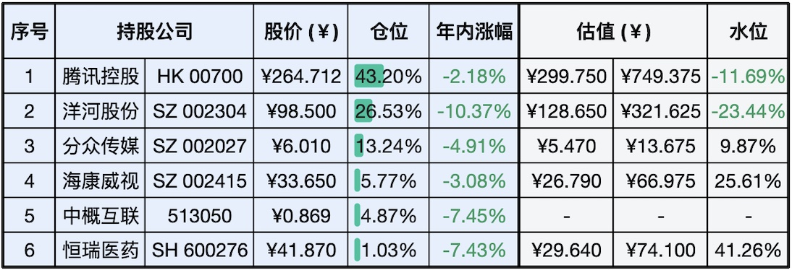

__微信公众号文章地址：[老罗实盘周记-20240210-龙运当头](https://mp.weixin.qq.com/s/I71fEE15wql7lyUCergPGw)__

```
老罗实盘周记，每周六更新。专注于股权投资、阅读、学习与个人成长，知行合一、日拱一卒、投资人生。微信公众号【老罗投资】，文章均首发于公众号。
```

### 1. 本周交易

+ 无

### 2. 目前持仓

当前持有的股票包括：腾讯控股 43.20%、洋河股份 26.53%、分众传媒 13.24%、海康微视 5.77%、中概互联 4.87%、恒瑞医药 1.03%。

此外，本周新入少量现金，计划春节后择机买入，加上少量的上海机场、宋城演义、京沪高铁等股票，其份额较少，仅作为观察仓不进行记录。

**注：港股已换算为人民币**



### 3. 上周数据


### 4. 持仓收益

本周：老罗的持仓 <span class="red">+4.63%</span>，沪深300指数 <span class="red">+5.83%</span>，本周真的是跌宕起伏。

截止到今日，老罗实盘今年收益率为 <span class="green">-4.16%</span>，沪深300指数今年收益率为 <span class="green">-1.93%</span>，今年第五周跑输沪深300指数。

### 5. 本周事项

+ 周一千股跌停
+ 证监会换帅
+ 分众传媒发布子公司增资扩股暨关联交易的公告
+ 除夕夜用户抢微信红包50.8亿个

==只对持股和交易感兴趣的朋友，读到这里就可以退出了。后面是对上述事件的展开，无新内容。==

#### 5.1 周一千股跌停

周一大盘大跌，中证1000、创业板综指盘中一度跌超8%，超千股跌停。午后出现大幅拉升，但尾盘再度回落。其实也没有什么利空，但大家情绪就是那么恐慌，一片哀嚎。

有意思的是，第二天就出现了大反转，主要股指全线大涨。其中上证指数涨逾3%，盘中一度收复了2800点关口。大盘全线大涨，主要得益于政策密集发布，包括中央汇金投资有限责任公司入市增持和证监会暂停新增转融券规模等政策，提振了市场多头的信心。

老罗这周主要重心在筹备春节相关的事项，加上手上也没有现金进行买入，周一这种不错的买入时机又完美的错过了。

#### 5.2 证监会换帅

2月7日，证监会迎来了新的掌门人，任命吴清同志为中国证券监督管理委员会党委书记，免去易会满同志的中国证券监督管理委员会党委书记职务。

春节前换帅，说明已经到了不得不换的时候了，按以往经验来看，换帅后大盘会有一波比较大的反弹。但历史经验往往是用来打脸的，让我们拭目以待新掌门如何施政。

#### 5.3 分众传媒发布子公司增资扩股暨关联交易的公告

分众传媒拟向公司全资子公司Focus Media Overseas Investment III Limited（简称「FMOIL III」）增资2,207万元人民币。

本次增资完成后，公司将持有FMOIL III70%的股份，江南春间接持有FMOIL III30%的股份（其中15%的股份拟用于海外业务扩展团队成员的激励），FMOIL III仍为公司控股子公司，仍纳入公司合并报表范围。

增资说明江总对海外市场还是有预期的，在国内遥遥领先的情况下，出海是拉动增长的一个重要方向。

因为金额不算太大，对公司的影响并不明显，了解即可。

#### 5.4 除夕夜用户抢微信红包50.8亿个

微信官方公众号今天披露了2024年除夕夜微信相关数据，其中提到今年除夕夜用户共抢到微信红包50.8亿个。发送拜年红包1.9 亿次，加上各种各样定制红包封面活动，这波微信红包的成绩还是相当的不错。

大家今年除夕都抢到了多少红包呢？

### 6. 本周读书

本周放假，读书速度明显变慢，没有一本读完。

### 7. 本周运动

本周遛弯3次，春节期间走亲戚就当是运动了。

新的一年，祝大家龙运当头，龙腾虎跃、龙马精神、龙精虎猛、生龙活虎、龙雏凤种、龙凤呈祥、龙德在田、龙雕凤咀、龙断可登、龙楼凤阁、龙楼凤阙、龙翰凤雏、龙虎风云、龙驹凤雏、龙举云兴！

```
老罗实盘周记，每周六更新。专注于股权投资、阅读、学习与个人成长，知行合一、日拱一卒、投资人生。微信公众号【老罗投资】，文章均首发于公众号。
免责声明：本公众号只作为本人的投资日志记录，本文中提及的个股都有腰斩或血本无归的风险，本人不做任何投资建议，投资请坚持独立思考。
```

__微信公众号文章地址：[老罗实盘周记-20240210-龙运当头](https://mp.weixin.qq.com/s/I71fEE15wql7lyUCergPGw)__