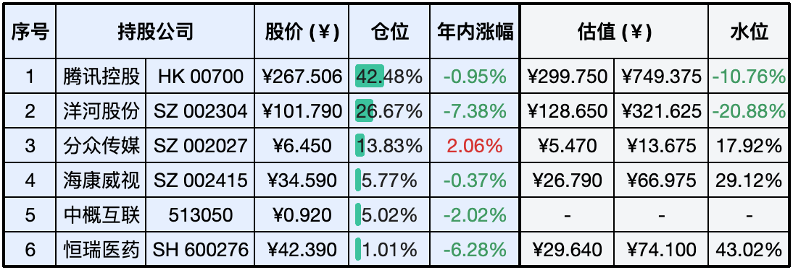
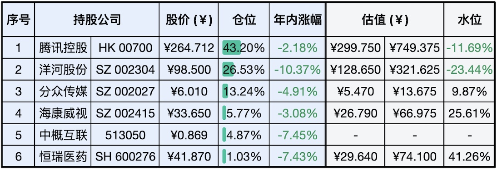

__微信公众号文章地址：[老罗实盘周记-20240224-元宵佳节](https://mp.weixin.qq.com/s/T6nzxnZ2n8JfFVLPobQdIQ)__

```
老罗实盘周记，每周六更新。专注于股权投资、阅读、学习与个人成长，知行合一、日拱一卒、投资人生。微信公众号【老罗投资】，文章均首发于公众号。
```

### 1. 本周交易

+ 无

### 2. 目前持仓

当前持有的股票包括：腾讯控股 42.48%、洋河股份 26.67%、分众传媒 13.83%、海康微视 5.77%、中概互联 5.02%、恒瑞医药 1.01%。

此外还有少量现金，加上少量的上海机场、宋城演义、京沪高铁等股票，其份额较少，仅作为观察仓不进行记录。

**注：港股已换算为人民币**



### 3. 上周数据



### 4. 持仓收益

本周：老罗的持仓 <span class="red">+2.78%</span>，沪深300指数 <span class="red">+3.71%</span>，经过罕见的八连阳，上证指数在周五也成功收复3000点。

截止到今日，老罗实盘今年收益率为 <span class="green">-1.38%</span>，沪深300指数今年收益率为 <span class="red">+1.71%</span>，今年第六周跑输沪深300指数。

### 5. 本周事项

+ 上证指数八连阳收复3000点
+ 换帅后证监会首场发布会
+ 财富就是知识

==只对持股和交易感兴趣的朋友，读到这里就可以退出了。后面是对上述事件的展开，无新内容。==

#### 5.1 上证指数八连阳收复3000点

到本周五，沪指非常罕见的八连阳，最终也收复了3000点，3000点保卫战第一阶段也终告一段落。

不仅是A股表现不错，环顾全球，日经225也在本周突破了39000点创历史新高，超越了1989年末经济泡沫时期的纪录高位38957点，日经225指数今年涨幅已经超过了16%。

伯克希尔·哈撒韦A的股价在本周也上涨到了62万美元一股，周五盘中最高曾达到632820美元一股，继续稳坐世界第一股价。

美股、日股虽然表现亮眼，但明显已经到高估区间，累计的风险也越来越大，作为稳健的投资人，应该对投资美股、日股持谨慎态度。在美联储利率这么高的情况下都不能浇灭投资者的投资热情，巴菲特指标已超过200%，这次的泡沫吹得有点大了。

#### 5.2 换帅后证监会首场发布会

23日，中国证监会召开新闻发布会。这是证监会在甲辰龙年举行的首场新闻发布会，也是新任证监会主席吴清履新主席后，证监会举行的首场发布会，释放重磅政策信号。

发布会主要有几个要点：

1. 目前没有IPO倒查10年的安排
2. 加大对欺诈发行、财务造假、大股东违规占用的打击
3. 欺诈造假的公司只是少数
4. 对操纵市场、内幕交易行为进行精准识别、严厉打击
5. 案件处罚结果过轻？处罚力度会越来越大

新帅上任后的三把火很快就烧起来了，新主席春节期间没有放假，在除夕当天就开出了14张罚单，处理多名从业人员违法炒股。

同时证监会表示对IPO排队企业也要进行了严查，很多排队企业直接放弃了上市计划。这种赚不到什么钱，不上市就无法经营的企业，还是尽早破产为好。

#### 5.3 财富就是知识

微信张小龙曾经提到过一个观点：『财富就是知识』。我们以前会认为财富是资源、资产、土地、房子等等，但在现在和未来的社会里，财富的本质就是知识，是知识所创造的价值。

譬如一辆100万美元的跑车，如果撞毁变成一堆废铁，这堆废铁大概只能卖1万美元，也就是说，这辆法拉利里有99万美元是由『如何把铁组装成汽车』的知识所创造的价值。我们现在生活的社会，近100年来人类创造的财富要远远超过100年之前的总和，这些财富不是自然界赋予的，是人类用不断增长的知识、不断的创新创造的。

如果财富就是知识，那么增长财富的方法就是不间断的学习。推动人类经济增长的不是人们更努力的工作，更不是剥削和压榨，而是人们更加聪明的工作，总会有人创造新的突破，引入新的知识，才让经济的增长延续。

新的一年老罗还需继续精进，不断学习，提升认知。

### 6. 本周读书

#### 6.1 《我是不白吃：苏东坡传》

北宋大文豪、画家、书法家、大吃货、发明了N多美味的食物。虽然一生仕途不顺，但内心始终乐天豁达，用积级的心态面对人生的低谷。

评分四星⭐️⭐️⭐️⭐️

#### 6.2 《不白吃漫画食物简史》

休闲娱乐时一读，一小时读完，了解了不少食物的知识。

评分三星半⭐️⭐️⭐️❤️

#### 6.3 《抢占心智》

不得不说江总对自己的企业有充分的认知，分众传媒从事的广告传媒注定属于二流的企业，不可能像茅台、腾讯这种BUG级的公司躺着赚钱，江总在书中对这点也很坦诚，直言不讳。但分众的优势是有一流的管理者，最专精、最了解广告传媒行业的管理者。把自己的钱交给这样的管理者打理，很放心！

评分四星半⭐️⭐️⭐️⭐️❤️

### 7. 本周运动

本周遛弯5次，春节期间吃吃喝喝体重涨了不少，这周通过戒糖+戒酒+锻炼体重减了4斤。元宵节一过，这年也算过完了，为了自己的身体健康，需要好好减肥了。

祝大家周末愉快！

```
老罗实盘周记，每周六更新。专注于股权投资、阅读、学习与个人成长，知行合一、日拱一卒、投资人生。微信公众号【老罗投资】，文章均首发于公众号。
免责声明：本公众号只作为本人的投资日志记录，本文中提及的个股都有腰斩或血本无归的风险，本人不做任何投资建议，投资请坚持独立思考。
```

__微信公众号文章地址：[老罗实盘周记-20240224-元宵佳节](https://mp.weixin.qq.com/s/T6nzxnZ2n8JfFVLPobQdIQ)__