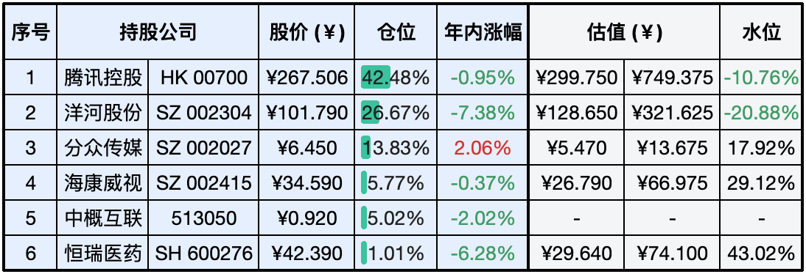

__微信公众号文章地址：[老罗实盘周记-20240302](https://mp.weixin.qq.com/s/mNdDM6mEbVkk7WFSA5C1ow)__

```
老罗实盘周记，每周六更新。专注于股权投资、阅读、学习与个人成长，知行合一、日拱一卒、投资人生。微信公众号【老罗投资】，文章均首发于公众号。
```

### 1. 本周交易

+ 无

### 2. 目前持仓

当前持有的股票包括：腾讯控股 41.53%、洋河股份 27.12%、分众传媒 13.84%、海康微视 6.09%、中概互联 5.02%、恒瑞医药 1.04%。

此外还有少量现金，加上少量的上海机场、宋城演义、京沪高铁等股票，其份额较少，仅作为观察仓不进行记录。

前几天老罗新冠三阳，身体不适，现在还头晕得厉害，本周的实盘告个假，只记录持仓与收益数据。

**注：港股已换算为人民币**


### 3. 上周数据



### 4. 持仓收益

本周：老罗的持仓 <span class="green">-2.31%</span>，沪深300指数 <span class="red">+1.38%</span>。

截止到今日，老罗实盘今年收益率为 <span class="green">-3.69%</span>，沪深300指数今年收益率为 <span class="red">+3.11%</span>，今年第七周跑输沪深300指数。

### 5. 本周运动

本周遛弯3次，生病期间暂停锻炼。

祝大家周末愉快，身体健康！

```
老罗实盘周记，每周六更新。专注于股权投资、阅读、学习与个人成长，知行合一、日拱一卒、投资人生。微信公众号【老罗投资】，文章均首发于公众号。
免责声明：本公众号只作为本人的投资日志记录，本文中提及的个股都有腰斩或血本无归的风险，本人不做任何投资建议，投资请坚持独立思考。
```

__微信公众号文章地址：[老罗实盘周记-20240302](https://mp.weixin.qq.com/s/mNdDM6mEbVkk7WFSA5C1ow)__