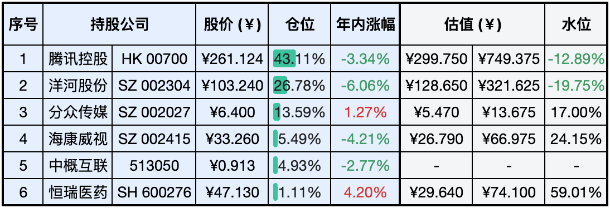

__微信公众号文章地址：[老罗实盘周记-20240316](https://mp.weixin.qq.com/s/WjKwX1q-XJ7hSdxfbneY3A)__

```
老罗实盘周记，每周六更新。专注于股权投资、阅读、学习与个人成长，知行合一、日拱一卒、投资人生。微信公众号【老罗投资】，文章均首发于公众号。
```

### 1. 本周交易

+ 无

### 2. 目前持仓

当前持有的股票包括：腾讯控股 43.11%、洋河股份 26.78%、分众传媒 13.59%、海康微视 5.49%、中概互联 4.93%、恒瑞医药 1.11%。

此外还有少量现金，加上少量的上海机场、宋城演义、京沪高铁等股票，其份额较少，仅作为观察仓不进行记录。

**注：港股已换算为人民币**



### 3. 上周数据


### 4. 持仓收益

本周：老罗的持仓 <span class="red">+3.81%</span>，沪深300指数 <span class="red">+0.71%</span>。 

截止到今日，老罗实盘今年收益率为 <span class="green">-2.12%</span>，沪深300指数今年收益率为 <span class="red">+4.05%</span>，今年第九周跑输沪深300指数。

### 5. 本周事项

+ A股第一只突破2000亿的股票基金出现了
+ 洋河召开临时股东大会
+ 万科债务危机
+ 专注做一件事

==只对持股和交易感兴趣的朋友，读到这里就可以退出了。后面是对上述事件的展开，无新内容。==

#### 5.1 A股第一只突破2000亿的股票基金出现

A股第一只突破2000亿的股票基金出现了，是追踪沪深300的指数基金华泰柏瑞沪深300ETF。而且仅仅在7个月之前，这个基金的规模才千亿，在过去半年多点的时间，规模就爆发式增长。

3月12日晚间，上交所官网数据显示，华泰柏瑞沪深300ETF最新份额达5579508.77万份，以当日收盘净值3.5895计算，该ETF管理规模为2002.76亿元，创下历史新高，成为我国首个突破2000亿元大关的股票ETF产品。

如果自己没有跑赢市场平均水平的能力，在价格合适的时候定投沪深300指数基金，应该是最适合普通投资者的方式之一，在时间跨度足够长的情况下，可以轻松达到8-12%的平均年化收益率。

#### 5.2 洋河召开临时股东大会

洋河股3月15日发布公告称，2024年4月2日15:30，公司将在江苏省宿迁市洋河酒都大道118号公司总部办公楼一楼多功能厅召开2024年第一次临时股东大会。

本次股东大会将审议《关于选举第八届董事会非独立董事的议案》等议案，2024年3月28日收市后登记在册的股东可现场参会投票，或通过交易所投票系统行使表决权。

临时股东大会主要的议案就是关于董事会换届选举，董事长张联东也出现在册，打破了之前他无法连任的传言，如果投票通过，还能继续干三年。

洋河近期的负面消息不少，也直接体现在了股价上，有些之前一直支持洋河的投资者也因为这些负面消息选择了卖出洋河。老罗认为洋河当前的赚钱能力依然不错，市盈率也很低，后续还会躺平不动，继续关注企业的经营情况。

#### 5.3 万科债务危机

眼见他起高楼，眼见他宴宾客，眼见他楼塌了。这句话一次次的应验了，近期地产行业x绝对的龙头万科也爆出财务危机。

之前有消息传言，万科正与以保险公司为主的贷款机构商谈非标债务延期，与新华资产100亿元的债务展期被拒绝，近期也有几笔债务到期需要偿还。

目前万科总资产1.76万亿，负债1.35万亿，负债率达到了76%以上，虽说这负债率在地产行业中已经算不错的了，但对比其他行业，确实是高得有点吓人。 想想前几年房地产行业的繁荣，如今却是墙倒众人推，破鼓万人捶，实在是让人唏嘘。

老罗在去年12月在万科10.47元时清仓了万科『[老罗实盘周记-20231216](../../2023/12/20231216.md)』，总共持有一年半时间，亏损36%+。再次说明虽然是行业龙头，虽然股价已经是膝盖斩，PE低得不能再低了，也不代表你捡到了便宜货，抄底的同时，下面可能还有地下室，还有B2层，深不见底。好在万科的持仓份额并不算多，只有1%左右的仓位，整体损失并不是很大。

这笔投资已经被老罗认定为投资之路上所交的学费，绝对不要有抄底思维，不要以历史股价作为买入原因，不要买负债率高的行业，这种行业就是财富毁灭机。

除了地产，银行、保险、航空等都属于高难度行业，要么是赚的利润不能成为实打实的现金，要么是财务调整空间巨大，很难真正地搞清楚，这些都属于投资者应该回避的行业。明明有一尺的小水坑可以轻松跃过，我们为什么偏偏要找一望无际的大湖跳呢？

#### 5.4 专注做一件事

巴菲特认为每个人一生只需要专注于做好一件事就足够了。将一件简单的事情做到最好、做到精湛、做到细致，并在某个领域取得卓越的成绩，这才是成功之道。

不简单就在于把简单的事情做到极致，专注于一件事情是最容易的，因为它不需要兼顾太多。做好一件事情则是最难的，因为它需要坚持不懈。因此，只有专心致志地做好一件事情，才能获得最终的成功。

人生只在于一个精字，而不在于一个多字。在广袤的世界中，有几人能够样样精通呢？四海之大，有几人欤？因此，完成、做好、做成一件事情显得尤为重要。

专注于学习企业经营，理解和投资优秀的公司，与好企业共同成长，这应该是老罗将来唯一需要重点关注的事情。

### 6. 本周读书

#### 6.1 《吃透中国史.唐》

可以大致了解唐朝历史，有趣简单易懂，作为初学者的入门读物不错。

评分三星半⭐️⭐️⭐️❤️

#### 6.2 《美食的十万个为什么》

民以食为天，美食的各种小知识，如何才能不白吃，这本书可以看看。

评分三星半⭐️⭐️⭐️❤️

### 7. 本周运动

本周遛弯5次，控糖、控酒后体重稳定下降中。

祝大家周末愉快，身体健康！

```
老罗实盘周记，每周六更新。专注于股权投资、阅读、学习与个人成长，知行合一、日拱一卒、投资人生。微信公众号【老罗投资】，文章均首发于公众号。
免责声明：本公众号只作为本人的投资日志记录，本文中提及的个股都有腰斩或血本无归的风险，本人不做任何投资建议，投资请坚持独立思考。
```

__微信公众号文章地址：[老罗实盘周记-20240316](https://mp.weixin.qq.com/s/WjKwX1q-XJ7hSdxfbneY3A)__