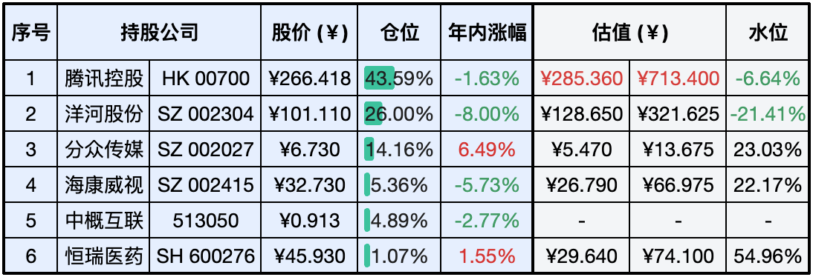
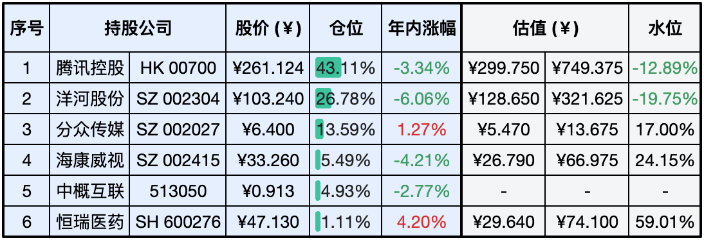

__微信公众号文章地址：[老罗实盘周记-20240323](https://mp.weixin.qq.com/s/CnqOMtluz22VExz3g9DniQ)__

```
老罗实盘周记，每周六更新。专注于股权投资、阅读、学习与个人成长，知行合一、日拱一卒、投资人生。微信公众号【老罗投资】，文章均首发于公众号。
```

### 1. 本周交易

+ 无

### 2. 目前持仓

当前持有的股票包括：腾讯控股 43.59%、洋河股份 26.00%、分众传媒 14.16%、海康微视 5.36%、中概互联 4.89%、恒瑞医药 1.07%。

此外还有少量现金，加上少量的上海机场、宋城演义、京沪高铁等股票，其份额较少，仅作为观察仓不进行记录。

**注：港股已换算为人民币**



### 3. 上周数据



### 4. 持仓收益

本周：老罗的持仓 <span class="red">+0.91%</span>，沪深300指数 <span class="green">-0.70%</span>。 

截止到今日，老罗实盘今年收益率为 <span class="green">-1.21%</span>，沪深300指数今年收益率为 <span class="red">+3.32%</span>，今年第十周跑输沪深300指数，但差距在慢慢缩小。

### 5. 本周事项

+ 腾讯年报发布
+ 日本告别负利率时代
+ 恒大造假被罚

==只对持股和交易感兴趣的朋友，读到这里就可以退出了。后面是对上述事件的展开，无新内容。==

#### 5.1 腾讯年报发布

3月20日，腾讯控股发布截至12月31日的2023年第四季度及全年财报。 腾讯2023年Q4总收入为人民币1551.96亿元，同比增长7%；净利润270.25亿元，同比下降75%；经调整后净利润为426.81亿元，同比增长44%。 2023年全年方面，总收入为人民币6090.15亿元，同比增长10%；净利润1152.16亿元，同比下降39%；经调整后净利润为1576.88亿元，同比增长36%。

腾讯控股表示，建议派发的末期股息为每股3.40港元，较上一年度的2.40港元有所增长，增幅为42%。折合每股分红3.10人民币左右，但港股通有20%的分红税，最后每股到手约2.50人民币。 董事会已批准2024年不少于1000亿港元的回购计划，这是腾讯首次在财报中披露当年的回购计划。财报显示，2023年腾讯回购金额达到了490亿港元，超过去十年回购金额总和。

小游戏、广告、金融科技23年发展不错，有较大的增长，表现不错。 重要的收入来源游戏只有个位数的增长，也能理解马化腾说游戏是躺在过去的功劳簿上，今年游戏还需要继续努力。 投资没什么亮点，这几年也在减少投资方面的投入，今年披露的是分红约320亿港币，回购最少1000亿港币，这也是不准备再做大规模投资的打算，当前整个投资组合公允价值大约是9000亿。

今年并没有分掉拼多多股票，腾讯做为第二大股东的持股比例是14.7%，价值240亿美元。可能在电商领域，腾讯还是比较看好拼多多的发展，暂时就不回馈股东了。

最后是腾讯估值调整，保守按年增长12%计算，市盈率也按保守25倍计算，三年后预估净利润2160亿人民币，2160*25=52500亿人民币，买点下调为285.36人民币，卖点下调为713.4人民币。

#### 5.2 日本告别负利率时代

3月19日日本银行宣布将短期利率上调10个基点至0%，这是日本央行自2007年以来首次加息。这意味着日本告别了历时八年之久的负利率时代，成为全球最后一个放弃负利率政策的主要经济体。

日本2023年去除生鲜食品后的CPI同比上涨3.1%，创41年来新高。截至去年12月，日本核心CPI连续28个月同比上涨，连续21个月超过日本央行2%的通胀控制目标。所以加息是针对通胀的正常操作，毕竟负利率不可能一直持续。

#### 5.3 恒大造假被罚

恒大两年虚增收入5640亿元、虚增利润919亿元，创下世界纪录。

3月18日，上交所官网披露的债券公告显示，因公司债券涉嫌财务造假、欺诈发行等，证监会拟决定对恒大地产处以41.75亿元的罚款，并决定对该公司时任董事长许家印、中国恒大集团时任董事局副主席兼总裁夏海钧采取终身证券市场禁入措施。

针对恒大地产披露2019年、2020年年报存在虚假记载的违法行为、公开发行公司债券涉嫌欺诈发行的行为、未按照规定报送有关报告或者履行信息披露义务的行为，综合上述三项，证监会决定责令恒大地产改正，给予警告，并处以41.75亿元的罚款。对许家印给予警告，并处以4700万元的罚款；对夏海钧给予警告，并处以1500万元的罚款。

证监会还表示，许家印决策并组织实施财务造假，手段特别恶劣，情节特别严重，夏海钧组织安排编制虚假财务报告，手段特别恶劣，情节特别严重，根据《证券法》相关规定，证监会拟决定对许家印、夏海钧采取终身证券市场禁入措施。

相较于许家印家族这12年通过巨额分红分走的600亿，4700万的罚款确实有点不痛不痒。同时恒大地产现在总市值21.52亿港币，这41.75亿元的罚款会如何缴纳？

### 6. 本周读书

#### 6.1 《来一斤母爱-十年之约》

以作者的经历为线索，以绘本的方式讲述与母亲之间的点点滴滴，表达了作者对母亲的思念与感情，母爱是最伟大的爱。

评分四星⭐️⭐️⭐️⭐️

### 7. 本周运动

本周遛弯6次，体重继续慢慢下降中。

祝大家周末愉快，身体健康！

```
老罗实盘周记，每周六更新。专注于股权投资、阅读、学习与个人成长，知行合一、日拱一卒、投资人生。微信公众号【老罗投资】，文章均首发于公众号。
免责声明：本公众号只作为本人的投资日志记录，本文中提及的个股都有腰斩或血本无归的风险，本人不做任何投资建议，投资请坚持独立思考。
```

__微信公众号文章地址：[老罗实盘周记-20240323](https://mp.weixin.qq.com/s/CnqOMtluz22VExz3g9DniQ)__