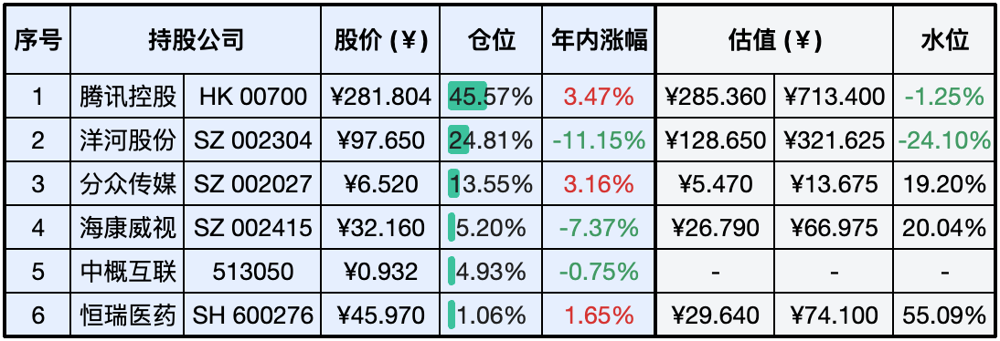

__微信公众号文章地址：[老罗实盘周记-20240330](https://mp.weixin.qq.com/s/uudoU2eJqOUBJZCHNz7cHA)__

```
老罗实盘周记，每周六更新。专注于股权投资、阅读、学习与个人成长，知行合一、日拱一卒、投资人生。微信公众号【老罗投资】，文章均首发于公众号。
```

### 1. 本周交易

+ 无

### 2. 目前持仓

当前持有的股票包括：腾讯控股 45.57%、洋河股份 24.81%、分众传媒 13.55%、海康微视 5.20%、中概互联 4.93%、恒瑞医药 1.06%。

此外还有少量现金，加上少量的上海机场、宋城演义、京沪高铁等股票，其份额较少，仅作为观察仓不进行记录。

**注：港股已换算为人民币**



### 3. 上周数据


### 4. 持仓收益

本周：老罗的持仓 <span class="red">+1.23%</span>，沪深300指数 <span class="green">-0.21%</span>。 

截止到今日，老罗实盘今年收益率为 <span class="red">+0.02%</span>，沪深300指数今年收益率为 <span class="red">+3.10%</span>，今年第11周跑输沪深300指数，本周终于转为盈利。

### 5. 本周事项

+ 腾讯回购
+ 央行重启购债？
+ 人要学会吃三种苦

==只对持股和交易感兴趣的朋友，读到这里就可以退出了。后面是对上述事件的展开，无新内容。==

#### 5.1 腾讯回购

从上周五开始，腾讯重启连续大额回购，6个交易日回购60亿港元，今年以来回购总额已经超过158亿港元，24年港股的回购总金额已经超过450亿港元，当前的港股确实是太便宜了。

在上周发布2023年全年业绩后，腾讯宣布2024年回购规模至少翻倍，从2023年的494.33亿港元增加至2024年的超1000亿港元。 腾讯大手笔回购的底气，在于充裕的现金流，2023年腾讯经营活动所得现金流量净额为2219.62亿元，同比增长52%，截至2023年末，腾讯账上的现金及现金等价物超过1700亿元。老罗认为只要腾讯股价不超过400港元，回购应该会持续进行下去，希望胖鹅能回购到更多的份额。

#### 5.2 央行重启购债？

近期有关央行将重新启动购买国债的传闻疯传，并引发了市场对中国将进行大规模货币宽松甚至财政赤字货币化的猜测。央行购买国债有两层含义，一是直接在一级市场购买，二是在二级市场购买，前者为现行银行法明令禁止，后者则是央行的货币政策工具之一。

银行法第二十九条规定，中国人民银行不得对政府财政透支，不得直接认购、包销国债和其他政府债券。银行法第二十三条明确，中国人民银行为执行货币政策，可以在公开市场上买卖国债、其他政府债券和金融债券及外汇。

当前央行在二级市场上买入国债并不存在法律障碍，事实上类似的操作也早有先例。不过即使重启，也不应该被视为量化宽松(QE)政策的启动，而是意在丰富货币政策工具箱，以增强市场流动性调节的灵活性，加强对国债收益率的直接影响。央行在二级市场购买国债是央行投放基础货币的一种手段，既不是被动地弥补财政赤字，更不是什么央行大放水。

上周央行行长提到货币政策工具箱依然丰富，后续仍然有降准空间，老罗认为降准这种温和又有效的措施还可以使用，应该还没有到需要量化宽松的阶段。

#### 5.3 人要学会吃三种苦

第一种苦：要专注于自身、吃学习的苦。学习虽然很苦，但依然是通向未来美好生活最容易走的一条道路，拒绝外界的诱惑，把空闲时间都用来提升自己，下狠功夫学一门比别人突出的技能。要相信那些熬过的夜，流过的汗，最终将带你穿越黑暗，去向光明的远方。

第二种苦：要延迟满足、吃深耕的苦。人们眼中的天才之所以卓越不凡，并不是因为天资高人一等，而是付出了持续不断的努力。任何一个价值千金的技能都不是一朝就能够得到的，而是通过刻意专注，长期坚持才习得的。

第三种苦：要忍耐克制、吃自律的苦。在这个浮躁的时代，只有自律的人才能脱颖而出，所有的成就和收获，都伴随着节制和自律的苦。吃自律的苦，并不是要强迫自己做不愿做的事，而是要选择正确的方向，调动自己的内驱力，越是懂得忍耐克制，越是能摆脱外界的束缚，越是自律，越能精准把握自己的人生。

大多数人对吃苦的含义可能理解得太浅显，吃苦的本质是长时间为了某个目标而聚焦的能力，在这个过程中放弃娱乐生活，放弃无效社交，放弃无意义的消费，以及在过程中不被他人理解的孤独，它本质上是一种自控力、自制力和持续深度思考的能力。

### 6. 本周读书

#### 6.1 《沉睡的线条世界》

本书以日常趣味短漫的形式，分享一个个平凡又治愈的小故事。

评分三星⭐️⭐️⭐️️

### 7. 本周运动

本周遛弯6次，一个月减重6斤，大基数体重管住嘴就能有效减重。

祝大家周末愉快，身体健康！

```
老罗实盘周记，每周六更新。专注于股权投资、阅读、学习与个人成长，知行合一、日拱一卒、投资人生。微信公众号【老罗投资】，文章均首发于公众号。
免责声明：本公众号只作为本人的投资日志记录，本文中提及的个股都有腰斩或血本无归的风险，本人不做任何投资建议，投资请坚持独立思考。
```

__微信公众号文章地址：[老罗实盘周记-20240330](https://mp.weixin.qq.com/s/uudoU2eJqOUBJZCHNz7cHA)__