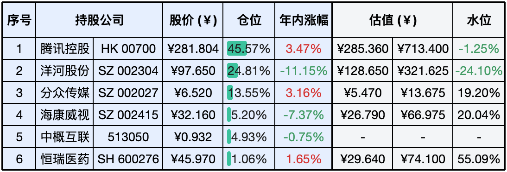

__微信公众号文章地址：[老罗实盘周记-20240406](https://mp.weixin.qq.com/s/bnwt-Lf2l1XA6yqicKXzbw)__

```
老罗实盘周记，每周六更新。专注于股权投资、阅读、学习与个人成长，知行合一、日拱一卒、投资人生。微信公众号【老罗投资】，文章均首发于公众号。
```

### 1. 本周交易

+ 无

### 2. 目前持仓

当前持有的股票包括：腾讯控股 45.53%、洋河股份 24.88%、分众传媒 13.92%、海康微视 5.03%、中概互联 4.84%、恒瑞医药 1.01%。

此外还有少量现金，加上少量的上海机场、宋城演义、京沪高铁等股票，其份额较少，仅作为观察仓不进行记录。

**注：港股已换算为人民币**


### 3. 上周数据



### 4. 持仓收益

本周：老罗的持仓 <span class="red">+2.18%</span>，沪深300指数 <span class="red">+0.86%</span>。 

截止到今日，老罗实盘今年收益率为 <span class="red">+2.20%</span>，沪深300指数今年收益率为 <span class="red">+3.98%</span>，今年第12周跑输沪深300指数，不过与沪深300的差距进一步缩小了。

### 5. 本周事项

+ 中美元首通话
+ 美国财长耶伦访华
+ 茅台发布年报

==只对持股和交易感兴趣的朋友，读到这里就可以退出了。后面是对上述事件的展开，无新内容。==

#### 5.1 中美元首通话

据新华社4月2日晚间公布的消息，当天中美两国元首进行了一次电话沟通，就当前两国关系以及关心的问题进行了沟通。这种级别的外事报道向来用词力求准确，而新华社用应约两字来形容此次通话，说明这则跨洋电话是拜登主动打来的。

从通话后的通稿来看，拜登在这次通话中罕见地给中方做出了六个承诺，强调美方不寻求进行新冷战、不寻求改变中国体制、不寻求通过强化同盟关系反对中国、不支持台独、不寻求遏制中国发展、不寻求同中国脱钩。这六个承诺从拜登这位美国总统口中说出来，本应该被各界相信的，但美国似乎并没有这么做，这六个承诺中的每一项都能找到反例。

与09年何其相似的一幕，为了缓解债务危机，当年的奥观海许下了那么多承诺，但得了好处之后就翻脸不认人，第一个任期还没结束，那些承诺就不认账了，老美的这些话听听就好，任谁也不会再上第二回当了。

#### 5.2 美国财长耶伦访华

美国财政部长耶伦4日抵达广州，这是她在不到一年的时间里第二次访华。耶伦5日在中国进行访问时表示，人们越来越担心中国产能过剩对全球经济造成影响。拜登政府越来越担心中国电动汽车、太阳能电池板和其他产品可能存在产能过剩问题。耶伦回避发出设置新贸易壁垒的威胁。而美国财政部预计，耶伦与中方的会谈不会导致中方政策发生重大转变。

中国官方媒体反驳美国对中国制造业产能的担忧，称这是旨在敲打中国的双重标准：西方国家几百年来一直这样做，但涉及中国时，这就变成了威胁世界的产能过剩问题。

做为世界第二大经济体，产业升级肯定是必然之路，最近中国强势的新能源、光伏、通信等行业，西方人一直认为是他们的蛋糕，别的国家绝对不许染指。耶伦的这些言论，意思是中国只能做做小家电、T恤衫呗，但洋大人，世界已经变了。

#### 5.3 茅台发布年报

贵州茅台4月3日晚间披露年报，2023年实现营业收入1476.94亿元，同比增长19.01%；净利润747.34亿元，同比增长19.16%；基本每股收益59.49元。公司拟每10股派发现金红利308.76元（含税）。贵州茅台表示，2024年主要目标是：实现营业总收入较上年度增长15%左右，完成固定资产投资61.79亿元。

茅台依然是A股BUG一般的存在，不需要太多的投入，超高的利润率，对管理层几乎没有任何要求，这种好生意应该是每个投资者重点关注的，茅台如果跌到1400元以下，老罗就会进行买入。

近期清明节放假，老罗开了一瓶茅台品尝，还特意做了一个小实验，先喝一杯茅台，再喝一杯北京非常经典的红星二锅头，明显感觉喝完茅台后二锅头就难以下咽了，虽然是纯粮二锅头，但有一股很大的酒精味，口感很差，不知道是否心理作用，可能真的是由俭入奢易，由奢入俭难？

### 6. 本周读书

#### 6.1 《我与地坛》

史铁生的文字真的非常优美细腻，他的文字给人力量，让人思考，值得一读的好书。

评分四星⭐️⭐️⭐️️⭐️️

### 7. 本周运动

本周遛弯4次，体重一直没称，假期里喝了几次酒，估计体重有所反弹。

祝大家假期顺利，身体健康！

```
老罗实盘周记，每周六更新。专注于股权投资、阅读、学习与个人成长，知行合一、日拱一卒、投资人生。微信公众号【老罗投资】，文章均首发于公众号。
免责声明：本公众号只作为本人的投资日志记录，本文中提及的个股都有腰斩或血本无归的风险，本人不做任何投资建议，投资请坚持独立思考。
```

__微信公众号文章地址：[老罗实盘周记-20240406](https://mp.weixin.qq.com/s/bnwt-Lf2l1XA6yqicKXzbw)__